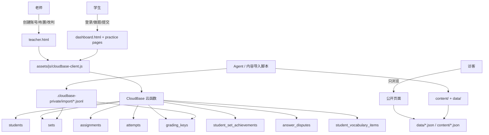
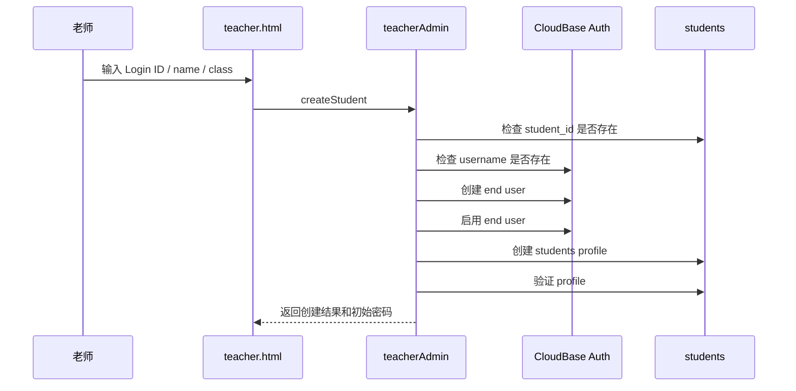
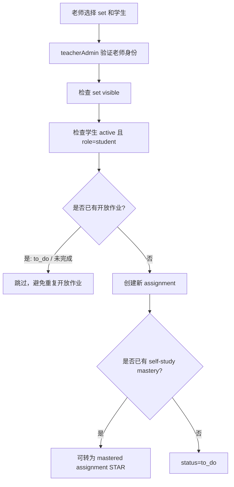
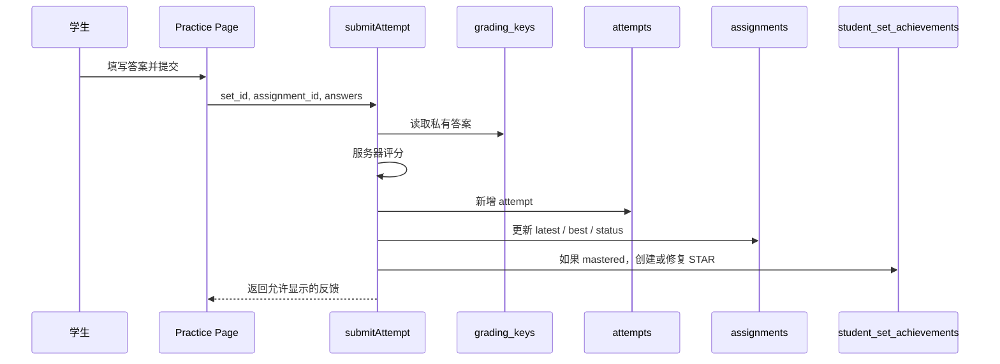
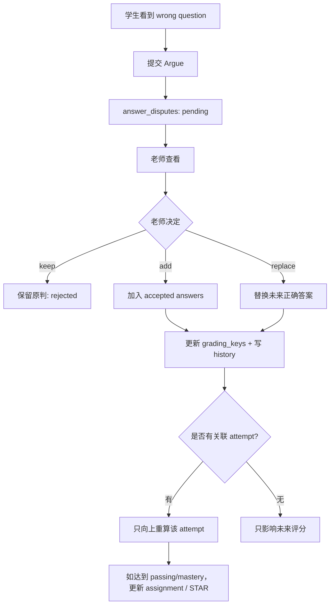

# Mr. Cat Academy 产品需求与后端架构说明

> 本文档是给人看的，也给未来 Agent 用来理解产品意图。
> 它记录“这个系统到底要做什么、为什么这么做、核心数据怎么流动、后端规则是什么”。
> 它不同于 `AGENTS.md`：`AGENTS.md` 是 Agent 的操作契约；本文档是产品和架构需求的校对版。

## 0. 文档状态

- 当前版本：2026-06-16 初版
- 当前阶段：开发早期，允许较大后端架构调整
- 主要读者：项目 owner、协作老师、未来接手的 Agent、必要时的开发者
- 维护原则：需求或架构规则变化时，先更新本文档，再同步到 `AGENTS.md`、后端代码和部署说明

### 变更记录

| 日期 | 变化 | 说明 |
| --- | --- | --- |
| 2026-06-16 | 初版 | 根据现有文档、CloudBase 后端、内容管线和当前开放问题整理成人类可读 PRD |

## 1. 一句话目标

Mr. Cat Academy 不是单纯的做题网页，而是一个轻量级学习管理系统。

它要让老师继续像老师一样工作：给 Markdown、PDF、真题材料、课堂想法或自然语言修改意见；系统和 Agent 负责把这些内容变成网站练习、私有答案、可布置作业、可计分提交和可追踪学习记录。

## 2. 产品定位

### 2.1 这个系统是什么

这是一个面向小规模教学场景的静态网站 + CloudBase 后端系统。

它需要支持：

- 老师管理学生账号
- 老师给学生或班级布置练习
- 学生登录后看到自己的作业
- 学生也可以在 Explore / Library 自主练习
- 提交后由服务器评分
- 每一次可计分提交都永久保留
- 老师能查看进度、处理学生对判分的争议
- 老师修正答案规则后，未来评分使用新规则
- 学生可以保存自己的生词或短语

### 2.2 这个系统不是什么

当前阶段不做完整 LMS。

暂不追求：

- 多老师组织权限体系
- 家长账号
- 排行榜和竞赛
- 支付和课程购买
- 消息系统
- 邮件、短信、微信登录
- 复杂报表 BI
- 大规模自动排课

系统应保持目的明确：给一个老师稳定管理内容、学生、作业、评分和学习记录。

## 3. 核心用户与使用场景

### 3.1 老师

老师需要：

- 创建学生账号
- 重置学生密码
- 启用或停用学生账号
- 给一个学生、多个学生或一个班级布置练习
- 查看学生完成情况和最近提交
- 在 Library 中预览练习和查看答案
- 处理学生 Argue 请求
- 修改答案接受规则
- 保持内容更新，但不需要手写 JSON 或数据库记录

### 3.2 学生

学生需要：

- 用老师给的 Login ID 和密码登录
- 第一次或重置后修改密码
- 在 Dashboard 看到待完成和已完成练习
- 打开作业并提交答案
- 不及格时继续 Try Again
- 通过后可以选择继续挑战更高分，或查看答案
- 达到 mastery 后获得 STAR
- 在 Explore 中自主练习
- 对自己被判错的问题发起 Argue
- 保存选中的单词或短语到 My Words

### 3.3 访客

访客可以：

- 浏览公开学习内容
- 打开练习页面查看内容

访客不能：

- 填答案
- 提交
- 保存个人词汇
- 读取任何 CloudBase 私有数据

### 3.4 Agent

Agent 的角色是把老师的自然材料变成系统可用内容和代码改动。

Agent 需要：

- 理解本文档中的产品规则
- 遵守 `AGENTS.md` 中的安全和操作规则
- 更新公开内容、私有 grading 数据、目录、部署包和文档
- 不要求老师手动改 JSON、数据库或链接

## 4. 当前学习内容范围

### 4.1 主干内容类型

当前主干内容包括：

- BBC Six Minute English Listening
- IELTS Reading
- IELTS Listening
- Vocabulary

以后可以扩展：

- Grammar
- Writing
- DSE Reading / Writing / Listening / Speaking
- 中考 / 高考相关内容

新增主干内容类型前，需要先更新本文档。

### 4.2 内容来源方式

内容来源分两类：

| 类型 | 例子 | 老师提供什么 | 系统生成什么 |
| --- | --- | --- | --- |
| 持续更新型 | BBC | Markdown 文稿、音频、修改意见 | 网站 JSON、目录元信息、私有答案 |
| 一次整理型 | IELTS Reading / Listening | PDF、题本、音频、答案图 | 网站 JSON、音频引用、私有答案 |
| 结构化词库 | Vocabulary | 词库、单词表、例句 | 词汇单元、测试组、私有答案 |
| 临时材料 | 课堂讲义 | 临时主题或活动 | 可独立存在的 HTML 页面 |

BBC 这类内容应尽量保留老师可读 Markdown 源。IELTS 这类内容可以直接从原始材料生成网站数据。

## 5. 高层架构

系统由三层组成：

1. 静态网站层：HTML、CSS、JavaScript、公开 JSON、音频和图片
2. CloudBase 云函数层：所有鉴权、评分、作业、进度和老师操作都在这里执行
3. CloudBase 数据库层：所有私有数据、学生数据、提交记录和答案规则



## 6. 数据公开边界

### 6.1 可以公开放在 GitHub / 静态网站中的数据

可以公开：

- 文章、听力文本、题目、选项
- 公开目录元信息
- 音频和图片资源
- 练习页面结构
- CloudBase 环境 ID

### 6.2 不能公开的数据

不能放进 GitHub 或前端代码：

- 学生密码
- 初始密码或重置密码
- Tencent Cloud 密钥
- 管理员 token
- 私有 grading key
- 正确答案
- accepted variants
- 解析、证据和评分规则

### 6.3 当前迁移状态

当前仓库中部分旧 `data/*.json` 仍然包含 `answer`、`evidence`、`explanation` 等字段。这是历史迁移状态，不代表长期设计。

长期规则是：

- 新增或修订的答案应进入 CloudBase `grading_keys`
- 公开 runtime 数据只保留题目和展示内容
- `.cloudbase-private/` 生成的导入文件不得提交

## 7. 主要数据对象

本节只写人能读懂的简化模型。精确字段以 `docs/04_DATA_MODEL.md`、当前 CloudBase 函数和真实代码为准；`CLOUDBASE_ARCHITECTURE.md` 只作为旧的详细参考。如果规则冲突，应先更新本文档和数据模型文档。

### 7.1 students

用途：保存老师和学生 profile。

核心字段：

- `auth_uid`：CloudBase Authentication 用户 ID，所有权限判断使用它
- `student_id`：学生登录 ID，给人看的唯一 Login ID
- `name`：学生姓名
- `class_group`：班级
- `curriculum_track`：课程体系，例如 DSE、IELTS 等
- `role`：`student` 或 `teacher`
- `active`：是否可用
- `must_change_password`：是否需要改密码

规则：

- `student_id` 必须唯一
- `auth_uid` 必须唯一
- 学生姓名可以重复
- 浏览器不能传一个 `student_id` 来冒充身份
- 老师权限也来自 `students` 中的 active teacher profile

### 7.2 sets

用途：可布置、可练习的公开资源目录。

核心字段：

- `set_id`：稳定练习 ID，例如 `BBC-250717`、`C7-T1-P2`、`NGSL-A`
- `section_id`：栏目
- `title`：标题
- `type` / `course`：类型或课程
- `link`：打开哪个练习页面
- `passing_percentage`：通过线，默认 50
- `mastery_percentage`：掌握线，默认 90
- `feedback_policy`：反馈策略
- `visible`：是否显示

规则：

- Student Explore / Library 依赖 `sets`
- 直接 URL 能打开不代表 `sets` 已导入
- 没有 matching `grading_keys` 时，页面能打开但不能评分

### 7.3 assignments

用途：一条作业记录，表示一个练习被布置给一个学生。

核心字段：

- `assignment_id`：唯一作业实例 ID
- `student_uid`：学生 auth UID
- `set_id`：练习 ID
- `status`：`to_do`、`passed`、`mastered`
- `passing_percentage`
- `mastery_percentage`
- `attempt_count`
- `latest_attempt_id`
- `best_attempt_id`
- `latest_percentage`
- `best_percentage`
- `answer_revealed`
- `mastery_locked`
- `assigned_at`
- `completed_at`
- `mastered_at`

规则：

- 同一个学生可以被重复布置同一个 `set_id`
- 每次重新布置必须创建新的 `assignment_id`
- 旧作业和旧提交不能被覆盖
- 已完成或已 STAR 的历史记录不应阻止未来重新布置
- 只应阻止同一学生同一 set 同时存在未完成开放作业

### 7.4 attempts

用途：每一次可计分提交的不可变记录。

核心字段：

- `attempt_id`
- `student_uid`
- `student_id_snapshot`
- `set_id`
- `assignment_id`，自主练习时为 `null`
- `mode`
- `answers`
- `question_results`
- `correct_count`
- `question_count`
- `raw_percentage`
- `display_percentage`
- `passed`
- `mastered`
- `grading_version`
- `submitted_at`
- `duration_seconds`
- `practice_context`

规则：

- attempt 是事实记录，不能覆盖
- Try Again 会创建新 attempt
- 失败 attempt 也必须保存
- 自主 Explore attempt 使用 `assignment_id: null`
- 历史 review 默认不应泄露正确答案和解析，除非对应作业已经 reveal answers

### 7.5 grading_keys

用途：私有答案、解释、accepted variants 和评分规则。

核心字段：

- `set_id`
- `grading_version`
- `answers`
- `explanations`
- `scoring_rules`
- `updated_at`

规则：

- 只有云函数能读
- 浏览器不能直接访问
- 老师 Argue 处理后的修改以 CloudBase 中的 `grading_keys` 为权威
- 后续内容导入不能盲目覆盖老师线上修过的答案

### 7.6 student_set_achievements

用途：永久 STAR 记录。

核心字段：

- `achievement_id`
- `student_uid`
- `set_id`
- `assignment_id`，自主练习 STAR 为 `null`
- `source`
- `protected: true`
- `first_earned_at`
- `best_attempt_id`
- `best_percentage`

规则：

- STAR 是后端事实，不能依赖 localStorage
- STAR 一旦创建，普通业务不能删除、撤销或降级
- 后续低分、改答案、改通过线都不能取消已有 STAR
- assignment STAR 应按 `assignment_id` 记录
- self-study STAR 用 `assignment_id: null`

### 7.7 answer_disputes

用途：学生或老师发起的单题判分争议。

核心字段：

- `dispute_id`
- `requester_role`
- `student_uid`
- `set_id`
- `attempt_id`
- `assignment_id`
- `question_id`
- `submitted_answer`
- `answer_snapshot`
- `explanation_snapshot`
- `question_text_snapshot`
- `status`
- `decision`
- `teacher_note`

规则：

- 学生只能争议自己某次 recorded attempt 中被判错的问题
- 同一个 `attempt_id + question_id` 只能争议一次
- 老师预览也可以发起 teacher-originated dispute
- teacher-originated dispute 可以没有 `attempt_id`
- 没有 `attempt_id` 的 dispute 只能改未来评分规则，不能触发学生 attempt regrade

### 7.8 grading_key_history

用途：记录老师每一次改答案规则的历史。

规则：

- `add` 或 `replace` 答案时必须写入
- 记录修改前、修改后、老师 UID、dispute ID、版本变化
- 不能公开
- 不能随意删除

### 7.9 student_vocabulary_items

用途：学生个人保存的单词或短语。

规则：

- 只属于学生本人
- 通过 `studentVocabulary` 云函数读写
- 浏览器不能直接写数据库
- 访客和老师预览不能保存个人词汇
- 这类数据不属于 assignment、attempt 或 grading key

## 8. 云函数职责

### 8.1 getCurrentStudent

用途：登录后读取安全 profile。

要求：

- 从 CloudBase authenticated context 获取 UID
- 查询 `students.auth_uid`
- 只返回安全 profile 字段
- 不返回密码或私有数据

### 8.2 getResources

用途：返回可见资源目录。

要求：

- 读取 `sets.visible: true`
- 不返回 grading key
- 给学生 Explore / Library 使用

### 8.3 getDashboard

用途：学生 Dashboard 聚合。

包括：

- 当前学生 assignments
- assignment 状态和 best attempt
- self-study STAR
- teacher replies
- answer reveal
- historical attempt review
- claimStar 兼容兜底
- dispute submit / list

要求：

- 只返回当前 authenticated student 的数据
- 不允许看别人的作业或 attempt
- 历史 review 默认不返回正确答案和解析
- reveal answers 后才允许历史 review 返回 explanation

### 8.4 submitAttempt

用途：唯一可信评分入口。

流程：

1. 验证学生身份
2. 验证 set 可见
3. 加载私有 grading key
4. 如果是 assignment，验证 assignment 属于该学生
5. 服务器评分
6. 创建 attempt
7. 更新 assignment summary
8. 如果 mastered，创建或修复 STAR
9. 返回允许学生看到的反馈

要求：

- 浏览器提交的是答案，不是分数
- 所有可计分提交都要记录
- 状态不能因为后续低分而向下回退
- Vocabulary 1-4 组选 Test Mode 不记录 attempt
- Vocabulary 5 组及以上才记录

### 8.5 teacherAdmin

用途：老师端高权限操作入口。

包括：

- 验证 teacher profile
- 创建学生 auth user + students profile
- 更新学生信息
- reset password
- enable / disable student
- list sets
- assignment candidates
- create assignments
- teacher preview answer key
- list assignments / attempts / progress
- list / submit / resolve disputes
- update grading keys
- write grading key history

要求：

- 每个 action 都必须服务端验证老师身份
- 不能信任浏览器传来的 role
- 创建学生时要同时检查 CloudBase Authentication 和 `students.student_id`
- profile 创建失败时回滚 auth user
- 不要返回不必要的私有答案

### 8.6 changePassword

用途：学生已登录状态下修改自己的密码。

要求：

- 使用 authenticated UID
- 不读取或保存旧密码
- 新密码必须满足 CloudBase 当前复杂度要求
- 成功后清除 `must_change_password`

### 8.7 studentVocabulary

用途：学生个人词汇本。

要求：

- 只允许 active student
- 不允许 teacher 和 visitor
- 所有权来自 authenticated UID
- 一个学生重复保存同一 normalized text 时增加次数，不创建重复记录

### 8.8 resetStudentPassword

当前状态：独立函数已禁用，真正 reset 走 `teacherAdmin`。

后续选择：

- 保持禁用并从“活跃函数”文档中移除
- 或恢复为一个只做 reset 的 teacher-only 小函数

## 9. 核心业务流程

### 9.1 创建学生



失败回滚规则：

- 如果 Auth user 创建成功但 students profile 创建失败，必须删除刚创建的 Auth user
- 不允许创建只有 Auth 没有 profile 的半成品账号

### 9.2 布置作业



当前目标规则：

- 已完成或已 STAR 不能阻止未来重新布置
- 只阻止重复开放作业
- 重新布置后必须是新的 `assignment_id`

### 9.3 学生提交作业



### 9.4 Try Again

规则：

- 不删除旧 attempt
- 不覆盖旧分数
- 新提交创建新 attempt
- assignment 的 latest 指向最新提交
- assignment 的 best 保留最高表现
- 状态只能维持或提升，不能被低分撤销

### 9.5 Reveal Answers 和 Mastery Lock

当前规则：

- 学生低于 passing：只能看到分数，不看完整答案
- 学生达到 passing：可以选择看答案，也可以继续 Try Again
- 如果未 mastered 就看答案，assignment 设置 `answer_revealed: true` 和 `mastery_locked: true`
- mastery locked 后，即使后续 raw score 达到 mastery，显示和状态也不能成为 mastered
- 如果已经 mastered，再看答案不撤销 mastery

### 9.6 STAR

STAR 是后端成就记录。

创建时机：

- assignment attempt 达到 mastery
- self-study attempt 达到 mastery
- dashboard 加载时发现历史 mastered attempt 但缺 STAR，可修复
- Argue 改判后使某次 attempt 达到 mastery，也应创建或修复 STAR

保护规则：

- STAR 不因后续低分取消
- STAR 不因 reveal answers 取消
- STAR 不因修改通过线取消
- STAR 不因答案规则变化取消
- 只能改进 best attempt 和 best percentage

### 9.7 Argue



要求：

- 不自动重评其他学生历史 attempt
- 不降低任何历史 attempt
- 老师批准后的 grading key 是未来评分权威
- 学生端 Dashboard reply 是临时提醒，原题 Argue 状态才是永久查看入口

## 10. 前端产品原则

前端可以小步调整，但要服务后端事实。

### 10.1 学生端

当前学生 Dashboard 分成：

- `TO DO`
- `FINISHED`

后端可以保留：

- `to_do`
- `passed`
- `mastered`

前端把 `passed` 和 `mastered` 合并到 `FINISHED`。不要重新拆成 `PASSED` / `MASTERED` 三卡，除非产品明确改回。

### 10.2 老师端

老师端重点不是漂亮，而是高效：

- Assign
- Library
- Students
- Argue

老师端要能快速回答：

- 谁还没做？
- 谁卡住了？
- 谁已经完成？
- 哪个题有争议？
- 哪个答案规则需要改？

### 10.3 访客模式

访客体验应尽量接近学生浏览体验，但不能进入数据写入流程。

### 10.4 Teacher Preview

老师从 Library 打开练习时：

- 使用同一练习页面
- 带 `teacher=1`
- Show Answers 走 `teacherAdmin.getAnswerKeyForSet`
- 不调用学生 reveal answer
- 不锁学生 mastery

## 11. 目前已确认的后端问题和架构待办

这些是当前最适合早期修正的地方。

### P0：状态必须单调（源码已修复，待部署验证）

原问题：

- 已通过作业可能被后续低分重试改回 `to_do`

当前源码目标：

- `to_do -> passed -> mastered` 只能向上
- later failed attempt 只更新 latest，不降低 completed status
- latest 和 best 分开看

### P0：完成后应允许重新布置（源码已修复，待部署验证）

原问题：

- 当前 teacher candidates 和 `teacherAdmin.createAssignments` 会阻止 completed / STAR work

当前源码目标：

- 只阻止开放中的同一 set 作业
- passed/mastered/done 历史不阻止新 assignment
- UI 应显示“Completed before, can reassign”之类状态，而不是禁选

### P0：Argue 改判后要补 STAR（源码已修复，待部署验证）

原问题：

- 当前 Argue 改判只更新 attempt / assignment，没有统一调用 assignment STAR 创建逻辑

当前源码目标：

- 改判向上后，如果达到 mastery，必须创建或修复 STAR
- teacher-originated dispute 无 attempt 时不能触发 regrade

### P1：学生函数统一 role guard（部分源码已修复，待 shared 化）

原问题：

- `studentVocabulary` 已限制 role=student
- `submitAttempt` 和 `getDashboard` 主要检查 active profile，但应明确排除 teacher

当前状态：

- `submitAttempt` 和 `getDashboard` 已增加 role guard

后续目标：

- 所有学生端写入或 dashboard 数据读取都使用统一 `requireStudent`
- 老师预览走 teacher-only 路径

### P1：共享后端领域逻辑

问题：

- passing/mastery/status/star 逻辑分散在多个函数
- 同一规则被复制，后续改动容易漏

目标：

在 `cloudfunctions/_shared/` 下提取：

- `auth.js`
- `grading.js`
- `assignment-state.js`
- `stars.js`
- `disputes.js`
- `dates.js`

每个云函数部署包仍可独立上传，但包含同一份 shared 代码。

### P1：CloudBase grading key 与本地导入 reconcile

问题：

- 本地 `prepare-cloudbase-data.js` 可重新生成 `grading_version: "1"`
- 可能覆盖老师在 CloudBase 中通过 Argue 改过的答案

目标：

- 增加“导出线上 grading_keys / history -> 本地对比 -> 人确认 -> 生成导入”的流程
- 不允许盲目覆盖线上高版本 grading key

### P1：后端 smoke tests

目标：

建立轻量测试，不依赖真实 CloudBase，也能验证纯规则：

- 状态只上升
- reveal answer lock
- reassignment eligibility
- vocabulary 1-4 / 5+ 规则
- Argue add / replace
- STAR monotonic

### P2：文档去旧规则

问题：

- 部分文档仍有 `done/failed`、三卡 Dashboard、STAR 阻止布置等历史描述

目标：

- 本文档作为产品真源
- `AGENTS.md` 作为操作真源
- 旧文档要逐步删掉或标记过期段落

## 12. 推荐的后端简化结构

当前不建议立刻换技术栈，也不建议上复杂框架。

推荐保持：

- 静态 HTML/JS
- CloudBase 云函数
- CloudBase 数据库 ADMINONLY

但要把后端业务规则集中起来。

推荐结构：

```text
cloudfunctions/
  _shared/
    auth.js
    grading.js
    assignment-state.js
    stars.js
    disputes.js
    db.js
  submitAttempt/
    index.js
  getDashboard/
    index.js
  teacherAdmin/
    index.js
  studentVocabulary/
    index.js
  ...
```

### 12.1 为什么这样更简单

这样做的好处：

- 不改变部署平台
- 不改变现有页面
- 不需要引入大型后端服务
- 不需要老师学习新工具
- 以后改 passing/mastery/STAR/Argue 时只改一处
- 能更容易写单元测试

### 12.2 暂不推荐的方向

暂不建议：

- 把网站重写成 React / Next.js
- 把 CloudBase 换成自建服务器
- 引入复杂 ORM
- 过早做多租户权限模型
- 给每个题型创建独立后端函数

这些会增加维护成本，但不直接解决当前最大问题。

## 13. 内容导入与部署流程

### 13.1 新增正式内容

默认流程：

1. 判断内容类型
2. 读取模板和现有示例
3. 生成或更新 `content/` 元信息
4. 生成或更新 `data/` runtime 数据
5. 私有答案进入 `.cloudbase-private/source` 或生成的 private import
6. 运行 catalog 生成
7. 运行 CloudBase 数据准备脚本
8. 校验 JSON、题号、答案数量、链接
9. 导入 CloudBase `sets`
10. 导入 CloudBase `grading_keys`
11. 发布静态站点

### 13.2 修改答案或解析

如果是老师通过 Argue 修改：

- CloudBase `grading_keys` 是权威
- 必须写 `grading_key_history`
- 本地内容后续要 reconcile，不得覆盖

如果是老师直接要求修内容：

- 同步修改公开题目展示
- 同步修改私有 grading key
- 如果有 Markdown 源，也尽量同步修改

### 13.3 部署注意

静态网站发布和 CloudBase 函数部署是两回事。

常见情况：

- 页面能打开，但提交报 `GRADING_KEY_NOT_FOUND`：缺 `grading_keys`
- 首页能看到，但学生 Explore 不显示：缺 `sets`
- 本地代码修了，但线上还报旧错：CloudBase 函数 ZIP 没部署

## 14. 权限和安全规则

必须保持：

- 所有数据库集合 `ADMINONLY`
- 浏览器不直接读写私有集合
- 所有身份从 CloudBase authenticated context 获取
- 老师权限从 active teacher profile 获取
- 学生只能读写自己的数据
- visitor 不能写任何学生数据
- teacher preview 不能误触发学生 reveal / mastery lock

禁止：

- 前端传 role 来获得权限
- 前端传 student_id 来访问数据
- 在 Git 中保存密码、密钥、私有答案
- 为了调试放开数据库权限

## 15. 当前产品判断

当前最重要的不是前端视觉。

当前最重要的是：

1. 身份和权限边界清楚
2. 提交记录不可变
3. assignment 状态规则稳定
4. STAR 永久保护
5. grading key 私有且可追溯修改
6. 内容导入不会覆盖老师线上修正
7. Agent 能稳定接手，不需要每次重新理解系统

前端可以继续小修小改。只要后端事实稳定，前端展示可以逐步打磨。

## 16. 以后改需求时怎么写

任何后端或架构需求变化，建议按这个格式更新本文档：

```text
日期：
变化类型：产品规则 / 数据模型 / 云函数 / 内容流程 / 权限 / 部署
旧规则：
新规则：
影响范围：
需要修改的文件：
需要 CloudBase 操作：
需要验证的场景：
```

例子：

```text
日期：2026-06-16
变化类型：产品规则
旧规则：完成过的 set 不能再次布置
新规则：只要没有开放中的同 set assignment，老师可以再次布置
影响范围：teacherAdmin.createAssignments、teacher.js candidate UI、AGENTS.md
需要 CloudBase 操作：部署 teacherAdmin
需要验证的场景：学生完成 BBC-250717 后，老师能再次布置 BBC-250717，生成新 assignment_id
```

## 17. 待 owner 确认的问题

这些问题不阻塞当前后端修复，但需要后续产品确认。

1. STAR 数量是否要在学生端区分 assignment STAR 和 self-study STAR，还是统一显示一个总数？
2. 老师端 Progress 是否需要按班级、学生、课程体系过滤？
3. Argue 批准后，是否需要给老师一个“同步本地内容源”的提醒？
4. 历史公开 JSON 中已有答案是否要逐步清理，还是只保证未来新增内容不再公开答案？
5. 临时课堂 HTML 什么时候正式升格为主结构内容？

## 18. 当前结论

当前架构方向正确：静态网站 + CloudBase 后端足够支撑这个系统。

现在需要尽早做的不是换平台，而是把后端规则收束：

- 状态机统一
- STAR 逻辑统一
- Argue regrade 统一
- 学生和老师鉴权统一
- grading key 导入和线上修正建立 reconcile 流程

只要这些稳定，后面新增 BBC、IELTS、Vocabulary、DSE 或更多练习类型，都会更容易维护。
