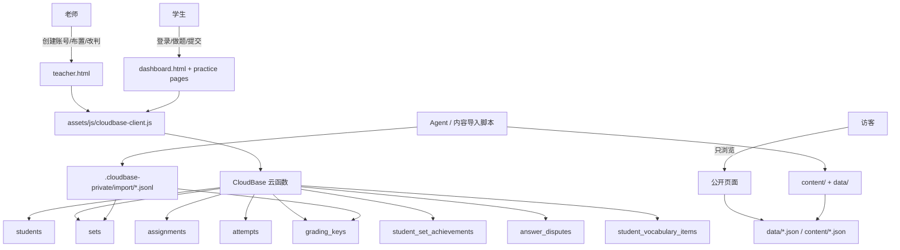
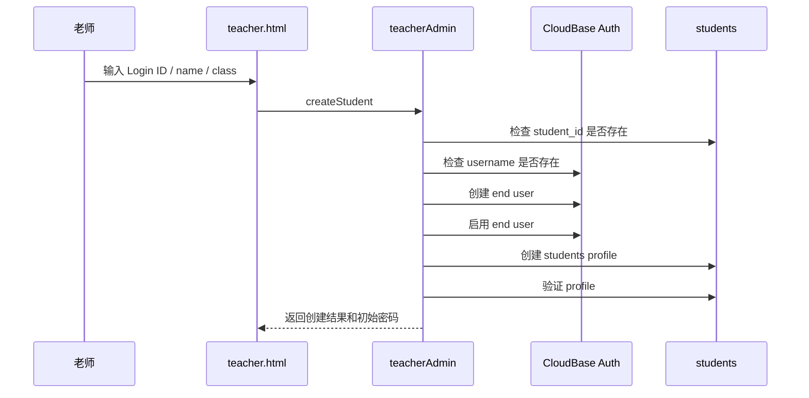
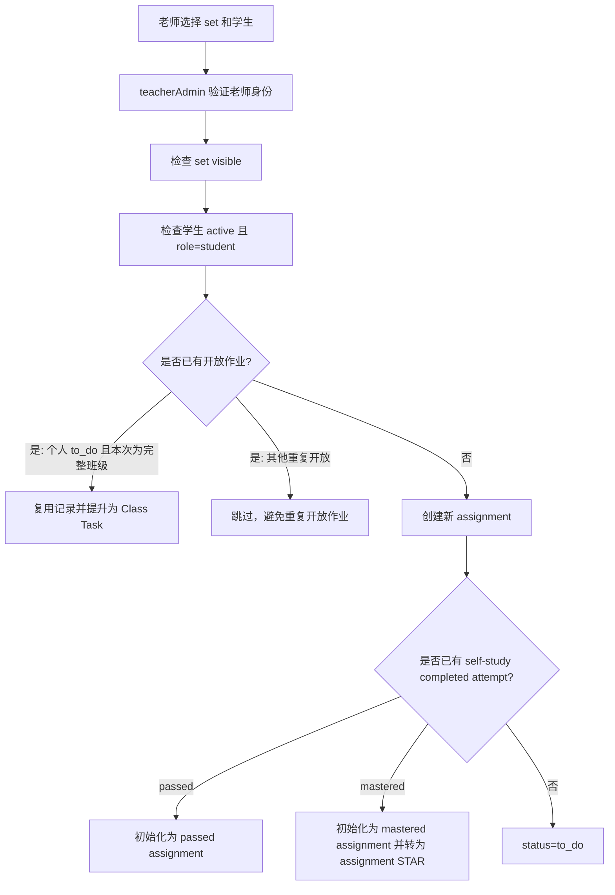
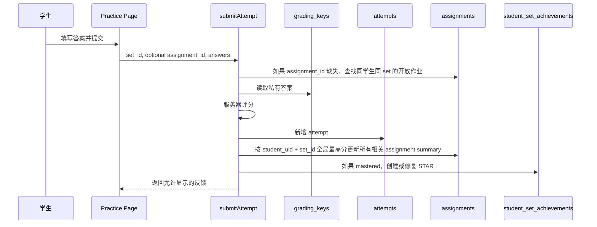
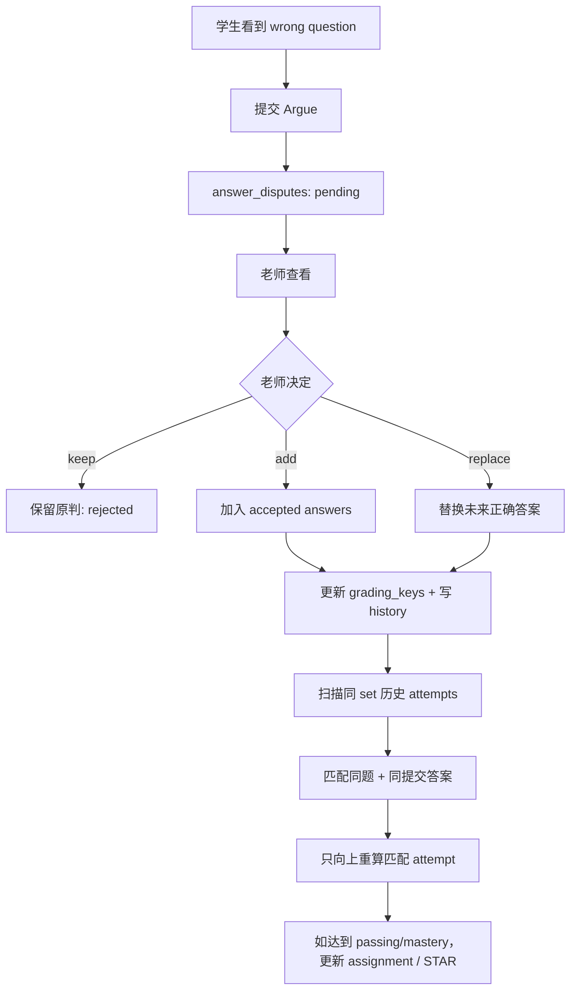
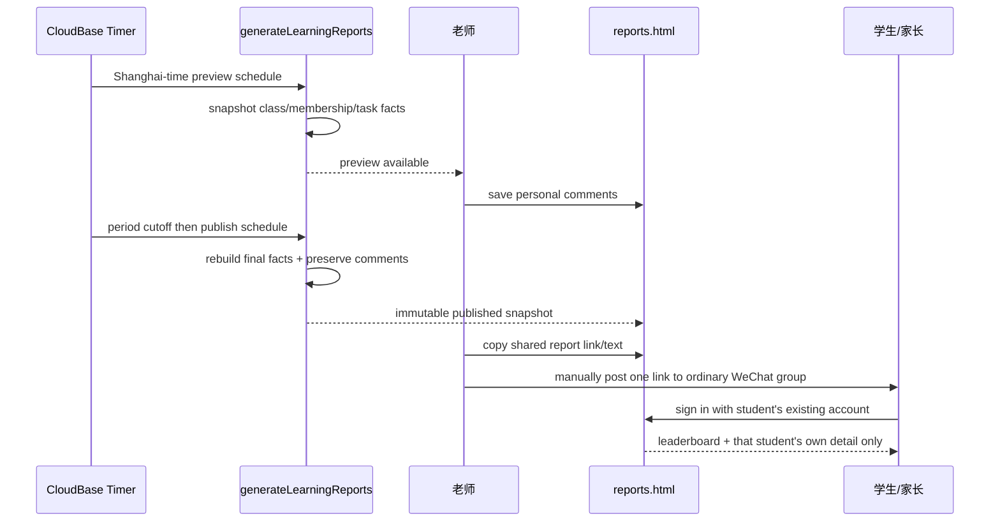

# Mr. Cat Academy 产品需求与后端架构说明

> 本文档是给人看的，也给未来 Agent 用来理解产品意图。
> 它记录“这个系统到底要做什么、为什么这么做、核心数据怎么流动、后端规则是什么”。
> 它不同于 `AGENTS.md`：`AGENTS.md` 是 Agent 的操作契约；本文档是产品和架构需求的校对版。

## 0. 文档状态

- 当前版本：2026-06-16 初版
- 当前阶段：开发早期，允许较大后端架构调整
- 主要读者：项目 owner、协作老师、未来接手的 Agent、必要时的开发者
- 维护原则：需求或架构规则变化时，先更新本文档，再同步到 `AGENTS.md`、后端代码和部署说明

### 变更记录

| 日期 | 变化 | 说明 |
| --- | --- | --- |
| 2026-08-20 | 公开免费资料单向引流 | 两份 DSE 写作资料使用稳定公开网址；资料页可进入主页，但登录页和站内目录不反向展示资料 |
| 2026-08-19 | 统一登录返回路由 | 内页统一返回中央登录页，并安全恢复原页面 query/hash；旧 user/visitor 参数不再代表身份 |
| 2026-08-03 | 学习报告 V1 需求冻结 | 新增班级成员历史、周/月固定快照、老师预览点评和登录后共享报告链接；部署仍待 owner 授权 |
| 2026-06-16 | 初版 | 根据现有文档、CloudBase 后端、内容管线和当前开放问题整理成人类可读 PRD |

## 1. 一句话目标

Mr. Cat Academy 不是单纯的做题网页，而是一个轻量级学习管理系统。

它要让老师继续像老师一样工作：给 Markdown、PDF、真题材料、课堂想法或自然语言修改意见；系统和 Agent 负责把这些内容变成网站练习、私有答案、可布置作业、可计分提交和可追踪学习记录。

## 2. 产品定位

### 2.1 这个系统是什么

这是一个面向小规模教学场景的静态网站 + CloudBase 后端系统。

它需要支持：

- 老师管理学生账号
- 老师给学生或班级布置练习
- 学生登录后看到自己的作业
- 学生也可以在 Explore / Library 自主练习
- 提交后由服务器评分
- 每一次可计分提交都永久保留
- 老师能查看进度、处理学生对判分的争议
- 老师修正答案规则后，未来评分使用新规则
- 学生可以保存自己的生词或短语
- 老师可以为一个班级生成周报和月报，并把一条登录后的报告链接手动发到普通微信群

### 2.2 这个系统不是什么

当前阶段不做完整 LMS。

暂不追求：

- 多老师组织权限体系
- 家长账号
- 通用竞赛、跨班排行榜或以分数平均值决定名次；V1 只提供按统一班级任务完成数计算的班内报告榜
- 支付和课程购买
- 通用消息系统、家长独立账号、邮件/短信/微信登录
- 复杂报表 BI；V1 只提供固定的周报、月报和浏览器打印/PDF
- 大规模自动排课

系统应保持目的明确：给一个老师稳定管理内容、学生、作业、评分和学习记录。

## 3. 核心用户与使用场景

### 3.1 老师

老师需要：

- 创建学生账号
- 重置学生密码
- 启用或停用学生账号
- 从学生详情修改班级时，先从现有班级中选择；只有选择底部的 `Customize`
  后才显示新班级名称输入框并创建新班级
- 学生详情顶部不重复显示已经出现在第一张身份卡中的学生姓名；点击 STAR
  指标打开独立来源弹窗，点击 Completed 指标打开独立 To Do / Finished 明细弹窗
- 从学生名单进入的 STAR Redemption、添加学生、学生 STAR 来源和 Completed
  明细弹窗统一使用卡片左上角返回按钮，不在卡片下方放置 `Close`
- 学生详情不再显示独立的 Overall Progress 卡片
- 给一个学生、多个学生或一个班级布置练习
- 查看学生完成情况和最近提交
- 在铃铛中按学生作业/自学线程查看合并的 attempt 通知；未打开的线程
  持续显示红色，打开后可查看该线程全部 attempt 历史；铃铛内的
  `Read all` 可以一次把当前所有 attempt 线程标记为已读，之后的新提交仍会变成未读
- 教师主页只用轻量状态读取显示铃铛未读线程数；计数返回前，铃铛持续显示加载转圈，
  不先显示一个无角标的静态铃铛再突然加入数字。通知摘要每批 10 个线程，按最新在上；
  如果未读超过一批，浏览器自动继续分页直到覆盖全部未读线程。打开铃铛后，列表按
  10 条一批显示列表；打开弹窗不为填满高度而连续补页，教师每次滚动到底时只自动
  追加下一批 10 条更早摘要，不显示 `Load more`
  按钮。所有已读取的未读线程会在当前标签页内自上而下静默预取逐题答案与解释；
  已读历史在教师打开线程前只加载摘要，不自动读取私有详情，也不把私有详情写入
  持久浏览器缓存
- 通过普通邮箱及时收到与铃铛线程一致的私有 attempt 通知。BBC 从第一次提交起固定
  收集 7 分钟后发送一封；Vocabulary Quiz 和计时 Practice 每次 recorded attempt
  都立即到期发送。第二次词汇邮件必须带第 1、2 次完整对比，第三次带第 1 至 3 次，
  依此类推。邮件显示完整历史柱状图、Passing/STAR 参考值、上海提交时间、模式/组别，
  以及每次提交的错题、学生答案、正确答案与解释；发送邮件不改变铃铛已读状态
- attempt 邮件主题只显示学生姓名、练习名称和该线程历史最高分，不带产品名称；
  邮件柱状图、逐次详情和纯文本回退都按最新一次在前排列，使第 4 次位于第 3、2、1
  次之前
- 点击教师铃铛中的学生完成线程后，详情先停留在全部 attempts 的柱状图总览；
  不自动跳到某次答案。只有点击某根柱子后，才选中并滚动到下方对应 attempt 详情
- 教师从铃铛或 View 打开 BBC / Vocabulary 某次提交的试卷报告时，只显示错题，
  不再重复显示正确题。BBC 错题同时显示教师专用的标准答案和答案解析。
  Vocabulary 报告明确标识 `Quiz` 或计时 `Practice`，并显示学生当次选择的具体词组。
  计时 Practice 无论选择多少组都会保存仅供教师通知的 activity attempt，但不计入
  学生完成记录；Learn 内的 inline Practice 不保存 attempt
- 教师从铃铛打开某次提交的试卷报告时，当前仍判错、答案非空且学生尚未对该题
  发起 Argue 的题目提供 `Add as accepted answer`。点击后由可信后端直接把该答案
  加入 accepted answers，并沿用 Argue `add` 的审计、历史向上重判、assignment 与
  STAR 修复规则；已有任何 Argue 的题目不显示该快捷入口
- BBC / Vocabulary 通知线程的每次提交卡片顶部只显示 `No. n`、上海提交日期时间和
  卷子入口，不重复显示 `Attempt`、分数、页面耗时或音频耗时。BBC 错题表的题号统一
  显示为 `Qn`，不暴露 `Blank_`、`Question_` 或 `MC` 等内部题目 ID。Vocabulary
  `Quiz` 显示所选 set 数量；计时 `Practice` 用与学生选择器一致的数字胶囊显示
  当次选择的 set 编号
- 教师右上角的 Notifications、Review、Dictionary 与 STAR Redemption 都打开
  同尺寸、同结构的独立弹窗并使用统一的内容卡片和内部滚动区。Notifications、
  Review、Dictionary 使用卡片外正下方 `Close`；从学生名单进入的 STAR Redemption
  改用卡片左上角返回按钮。
  Review 直接以 Pending / Approved / Rejected 三个状态入口开始，每个入口始终显示
  当前数量，让老师同时看到待处理工作和已经完成的处理成果。每个状态每批读取 5 条，
  更早记录由 `Load 5 more` 继续读取
- 在 Library 中预览练习和查看答案
- 处理学生 Argue 请求
- 修改答案接受规则
- 保持内容更新，但不需要手写 JSON 或数据库记录

### 3.2 学生

学生需要：

- 用老师给的 Login ID 和密码登录
- 所有内页登录动作统一进入 index.html，不在练习页或公开 Library 内维护另一套 Student ID 登录
- 登录前的同源根级 HTML 页面、query 和 hash 在验证后恢复；外部、嵌套或格式错误的 return 目标回退到安全默认页
- user / visitor URL 参数只作为旧链接兼容输入，不得识别学生身份、授予权限或继续传播
- 第一次或重置后修改密码
- 从页面最左侧、与右侧工具按钮分开的清单图标打开 `To Do List`，查看待完成和已完成练习
- 学生首页头部不显示猫 Logo，左上角只保留清单入口，避免占用横向空间
- 点击右上角姓名打开居中的独立 Personal Center；它使用与 To Do List、日历、
  生词本一致的苹果式厚玻璃卡片和柔和暗化背景。卡片不显示右上角叉号，唯一的
  `Close` 胶囊独立位于卡片外部正下方，并且只能点击该 `Close` 关闭；背景点击和
  Escape 不得关闭弹窗
- 学生端凡是在卡片外正下方提供独立 `Close` 的弹窗，都统一执行 Close-only 规则：
  点击遮罩层或弹窗外区域以及按 Escape 均保持弹窗打开。弹窗内明确的 Back、Enter、
  保存或取消等流程动作仍按各自语义工作
- Personal Center 姓名右侧只显示当前可兑换的黄色 STAR 余额。点击后打开独立
  `STAR WALLET` 弹窗。Wallet 首页最上方使用金色通行证式卡片，只显示放大的黄色
  STAR 与当前可兑换数字，不显示 `Yellow STARs available` 等说明字段。其下依次为
  深绿色实心 `Redeem` 主按钮，以及浅绿色 `STAR Source`、`History` 胶囊入口。
  Back 返回账户摘要并把焦点还给黄色 STAR
- `Redeem` 直接进入 Cash 兑换并只选择要兑换的整数黄色 STAR 数量，不显示或保存
  现金金额/汇率。`STAR Source` 显示各 STAR 来自哪些任务，固定先显示黄色 assignment
  STAR，再显示蓝色 self-study STAR；每条记录保留转换状态、获得日期、历史最高分和
  关联最佳 attempt 入口。`History` 按最新在前显示每次 Cash request、状态与永久凭证，
  并承载未完成 request 的追加凭证及取消操作
- `To Do List` 默认弹窗不显示 `ASSIGNMENTS` 标题。顶部固定并排显示
  `THIS WEEK`、`UPCOMING`、`FINISHED` 三个按钮及各自任务数量，默认选中
  `THIS WEEK`，一次只显示一个分类的任务；空分类显示简短空状态。
  Finished 同时包含已通过的 assignment，以及无需等待老师布置、已达到该 set
  passing 标准的 countable self-study；同一 set 已有完成 assignment 时不重复显示。
  Finished 任务按完成时间倒序，最新完成的置顶。未尝试任务右侧统一显示
  红色 `0%`，尝试但未通过时显示红色历史最高分，不再显示 `TO DO` 文字
- 首页大卡片固定显示 `THIS WEEK`、`UPCOMING` 两条摘要。`THIS WEEK` 合并
  本周任务与全部逾期未完成任务，并把逾期任务计入总数；点击后逾期任务排在
  列表最前并使用红色脉冲提示；只要存在逾期任务，This Week 进度轨道也使用
  红色呼吸式提醒，减少动态效果时改为静态红色强调。有 Upcoming 任务时继续
  显示蓝色进度条和百分比；没有时不显示 `0%` 或进度条，改为不可点击的日历
  勾图标加 `NO TASKS` 空状态。首页本身不直接展开任务行
- 首页 `To Do List` 按钮右侧放置独立纯对话气泡图标；点击查看全部历史老师回复，
  图标内部不带勾，红点只提示未读回复。回复弹窗没有左上角 Back 或卡片内关闭
  图标，卡片外正下方使用与其他学生独立弹窗一致的 `Close` 胶囊；关闭时标记
  当前回复已读并返回 Dashboard。顶部仅保留与 `PERSONAL CENTER` 同字体、同
  绿色的 `TEACHER REPLIES` 标题，不显示历史回复数量说明。每条回复按任务名称、题号、
  原始题目排列，再以 `Expected` 和 `Submitted` 展示标准答案与学生提交答案；
  点击首页
  `THIS WEEK` 或 `UPCOMING` 打开的聚焦任务弹窗不显示 Teacher Replies 图标，
  两者标题使用与 `PERSONAL CENTER` 一致的绿色字体
- 从右侧工具区的日历图标打开个人完成记录；以周一为首日的自然月日历展示每天
  完成的 assignment 和首次达到 passing 的 countable self-study，点击日期查看当天
  任务；自主学习达到 mastery 时仍显示 STAR 标记。日历不显示教师端的
  `Wxx` 周编号；弹窗使用与 Assignments 一致的透明玻璃材质，任务行也复用
  Assignments 的“左侧栏目—中间滚动标题—右侧分数”样式并可进入习题。弹窗
  不显示 `Progress` 标题、说明文字、Completed 总数或 Active days 统计，月份和
  年份导航直接位于内容顶部。右上角日历入口的图标内部按 `Asia/Shanghai` 显示
  当天日号，并在上海午夜或页面重新激活时更新；该显示不调用后端。最左侧 To Do
  List 与相邻 Teacher Replies 使用相同玻璃颜色、线宽和 19px 图形视觉尺寸
- 打开作业并提交答案
- BBC 与 Vocabulary 的提交结果弹窗统一使用两类短音效：未通过播放低沉下降的
  “叹气”音；Passed 与 Mastered 统一播放同一个明亮上升音，不再把 Mastered
  作为第三种结果音效
- 不及格时继续 Try Again
- BBC 提交结果弹窗关闭后直接在当前卷面进入订正，不要求学生退出或重新打开练习；
  只开放本次答错的填空和匹配控件，答对题与全部选择题继续保持不可操作
- BBC 选择题以第一次提交的选项永久锁分。后续订正提交仍使用首次选项评分，前端不提供
  改选入口，也不额外显示锁图标
- 通过后可以选择继续挑战更高分，或查看答案
- 达到 mastery 后获得 STAR
- 在 Explore 中自主练习
- 对自己被判错的问题发起 Argue
- 在所有学生学习和复习页面保存选中的单词或短语到 My Words，包括
  `a`、`I` 等单字母词；访客和教师预览不能保存
- 铃铛右边的笔记本图标先打开 Dashboard 快速预览弹窗。预览只显示最近活动的 7 个
  生词，每行包含英文、词性、单行中文核心释义和发音；不足 7 个时全部显示，其余数量
  在固定底部操作区提示。预览不提供搜索、新增、编辑、删除、导出或完整词典详情，避免
  在 Dashboard 复制第二套完整生词本运行时
- 预览底部固定 `Open My Words` 主按钮，进入独立认证工作区 `my-words.html`；弹窗外
  保留与 To Do List、Teacher Replies 和 Calendar 一致的 `Close` 胶囊。旧
  `dashboard.html#my-words` 链接仍重定向到新页面
- 从预览进入完整工作区时，Dashboard 笔记本图标与 My Words 顶部表面使用同源共享
  元素转场；进入和返回沿同一路径完成，不支持原生页面转场的浏览器使用轻量展开/淡入
  降级，减少动态效果时只做极短淡化或直接切换。转场不得等待个人生词接口完成
- My Words 页面结构、导航和工具栏必须立即显示。首批只加载最近 18 个生词并原位替换
  卡片骨架，后续生词接近列表底部时分页加入；Dashboard 可在主内容稳定后预热这批
  owner-scoped session 缓存并用同一份最近页数据渲染快速预览，登出必须清除。Search、
  A–Z/Z–A 和 Export 必须在需要时
  补齐全部分页后再给出完整结果，不能只处理当前已加载部分
- My Words 桌面端使用与学习报告一致的固定 Header、左侧 `Study / Word List`
  Sidebar 和右侧工作区；每次从 Dashboard 进入默认打开 `Study`，页面刷新保留当前栏目
- `Study` 第一版只显示明确的静态学习功能占位、真实生词总数、本周新增和最近保存；
  不增加认识度、复习日期、测验、学习进度或新数据库字段
- 桌面 `Word List` 使用约 300px 左侧词表和右侧详情，首次自动选择最近活动词；
  手机隐藏 Sidebar，改为顶部吸附的 `Study / Word List`，词表首次默认双列并允许
  切换单列，当前浏览器记住选择
- 手机词卡只显示英文；超出词卡宽度时复用任务标题的自动往返滚动和 7–14 秒
  动态时长，减少动态效果时改为省略号。点击词卡使用最高约 88dvh 的独立详情弹窗，
  桌面则继续在右侧详情区更新
- My Words 右上角加号只展开单行词汇输入框，按 Enter 即可保存，不要求填写上下文；
  Search、Recent/A–Z/Z–A 排序、单双列和 Export 都属于 Word List 工具栏
- 保存生词后立即看到已保存状态；系统随后自动补充词性、音标和释义，词典
  查询不能阻塞或撤销已经成功的保存
- 每行左半边显示英文，右半边显示词性与中文，二者上下居中且由中间竖线分隔；
  发音按钮只在展开后显示在音标旁边
- 英英释义、来源、上下文和删除动作点击单词行后展开；学生端不显示
  New/Learning/Mastered、到期筛选或揭示/评分式复习功能
- 学生只能修改英文单词或短语本身，并可另写最多 500 字符的个人 Note；修改后按
  新词重新查共享词典，词典字段本身不可直接编辑
- 对高置信度的规则变化形显示 `Base: ...` 推荐原形；点击后可直接改为原形，或在
  已有原形词卡时进入 Merge Group。合并由学生勾选参与词卡，保留原形为主卡，来源
  例句保留原词形，已有 Note 以原词形标签拼接，并提供 10 秒 Undo
- Word List 可按上海时区自然周、自然月、自然年或手动勾选导出；时间以学生最近一次
  保存、再次保存、改词、改 Note 或合并的活动时间为准。Excel 导出为真正的 `.xlsx`，
  PDF 通过表格预览进入浏览器打印/另存为 PDF；English 必选，其余列可选
- 共享词典和外部词典都未命中时，学生可请求 AI 草稿并在预览后确认。首位确认的学生
  将该草稿写成全体复用的共享词条，明确标记 `AI-generated · Not reviewed by teacher`；
  老师后续发布审核词条时覆盖当前共享版本，历史版本只在后端保留

### 3.3 访客

访客可以：

- 浏览公开学习内容
- 打开练习页面查看内容
- 查看受保护参考资料的明确预览；预览可显示结构、少量示范和马赛克占位
- 从学生 Dashboard 打开学习报告入口时留在空白报告页；不清除 Visitor 状态，
  不跳回登录页，也不请求任何私有报告数据

访客不能：

- 填答案
- 提交
- 保存个人词汇
- 读取任何 CloudBase 私有数据
- 通过取消 CSS、查看网页源码或直接请求静态文件取得受保护资料完整版

公开分享资料是与 Visitor Library 分开的外部引流面。经 owner 明确选定的资料可以用
无需登录的稳定 URL 分享到抖音、小红书或微信；页面必须明确标记为免费资料，并提供
前往 `index.html` 的 Mr. Cat Academy 品牌入口。为保持单向关系，`index.html`、
Dashboard 和 Library 不列出这些 URL。旧临时 URL 只保留兼容跳转，不作为新分享链接。
公开资料不得包含学生数据、私有答案、受保护报告全文或任何 CloudBase 写操作。

### 3.4 Agent

Agent 的角色是把老师的自然材料变成系统可用内容和代码改动。

Agent 需要：

- 理解本文档中的产品规则
- 遵守 `AGENTS.md` 中的安全和操作规则
- 更新公开内容、私有 grading 数据、目录、部署包和文档
- 不要求老师手动改 JSON、数据库或链接

## 4. 当前学习内容范围

### 4.1 主干内容类型

当前主干内容包括：

- BBC Six Minute English Listening
- IELTS Reading
- IELTS Listening
- Intensive Listening（精听）
- Vocabulary

IELTS Listening 默认进入 `Practice Mode`。Practice 允许暂停、拖动音频及
选择 `0.75×`、`1×`、`1.25×`、`1.5×`、`2×` 倍速，检查答案只返回
即时评分，不创建 attempt，也不推进 Assignment、Exercise Progress 或 STAR。
学生主动确认进入 `Test Mode` 后，当前答案和反馈会清空，音频从头以
`1×` 播放；测试进行中不得暂停、拖动、切换模式或调速。只有 Test 提交
属于正式可计数成绩。所有 IELTS Reading / Listening 题目均不允许新建
Argue，包括学生、History 和 teacher preview；历史 Argue 审计记录保留。

以后可以扩展：

- Grammar
- Writing
- DSE Reading / Writing / Listening / Speaking
- 中考 / 高考相关内容

新增主干内容类型前，需要先更新本文档。

### 4.2 内容来源方式

内容来源分两类：

| 类型 | 例子 | 老师提供什么 | 系统生成什么 |
| --- | --- | --- | --- |
| 持续更新型 | BBC | Markdown 文稿、音频、修改意见 | 网站 JSON、目录元信息、私有答案 |
| 一次整理型 | IELTS Reading / Listening | PDF、题本、音频、答案图 | 网站 JSON、音频引用、私有答案 |
| 结构化词库 | Vocabulary | 词库、单词表、例句 | 词汇单元、测试组、私有答案 |
| 临时材料 | 课堂讲义 | 临时主题或活动 | 可独立存在的 HTML 页面 |

BBC 这类内容应尽量保留老师可读 Markdown 源。IELTS 这类内容可以直接从原始材料生成网站数据。

### 4.3 Intensive Listening（精听）

精听使用共享的 `intensive-listening.html` 学生页面。每份带时间戳 JSON 的记录
直接成为一个播放单元；一个审核后的单词对应一个等宽词位，标点直接显示，核对
只做忽略大小写的固定位置机械比较。首单元由学生通过三秒倒计时主动开始，后续
单元首次进入时自动播放；`Tab` 重播、`Space` 前进词位、`Enter` 检查。

Visitor 可打开同一精听页面并播放、暂停和重播该课程已公开的 BBC 完整音频，但
不能进入分段听写：不调用精听云函数，不返回逐词结构、正文、答案或个人进度，也
不允许填写、Check、Show Answer、Argue 或任何进度写入。学生登录后仍使用私有的
分段精听材料和服务端流程。

正确词位锁定，错误词位标红并聚焦第一个错误位置。三次有效检查后才可查看答案；
自主完成与查看答案完成分别统计。永久最高完成记录单调不降，`Clear & Start Again`
只创建临时重练。答案、可接受拼写和逐词状态只存在于 `ADMINONLY` 数据和可信云函数。

拥有显式 `intensiveListeningSetId` 的 BBC 习题在顶部课程卡片显示
`Intensive Listening` 胶囊入口；没有绑定的 BBC 习题不显示入口。
这是学生端唯一的精听入口；Library 不显示独立精听专栏或材料卡片。

每个时间戳段落显式使用 `dictation`、`listen_only` 或 `skip`。只有
`dictation` 产生词位并计入完成率；`listen_only` 和 `skip` 仍按原顺序显示并
播放，但在同一练习卡中显示 `JUST LISTEN` 和一个禁用输入框，框内明确提示
`No typing needed for this sentence.`。两者播放结束后自动进入下一段，没有
Check / Show Answer，也不计入完成率、有效检查或重播统计。`skip` 在数据层表示
不要求作答和不计分，而不是从完整音频序列中删除。教师和已打开答案的学生都可对单个词位提交“拼写豁免”
Argue。教师批准后该词成为所有学生直接可见且不评分的 Provided Word；教师拒绝
则继续要求拼写。教师模式可导出包含当前段落模式与已批准词位的最新版私有 JSON。


## 5. 高层架构

系统由三层组成：

1. 静态网站层：HTML、CSS、JavaScript、公开 JSON、音频和图片
2. CloudBase 云函数层：所有鉴权、评分、作业、进度和老师操作都在这里执行
3. CloudBase 数据库层：所有私有数据、学生数据、提交记录和答案规则



## 6. 数据公开边界

### 6.1 可以公开放在 GitHub / 静态网站中的数据

可以公开：

- 文章、听力文本、题目、选项
- 公开目录元信息
- 音频和图片资源
- 练习页面结构
- CloudBase 环境 ID

### 6.2 不能公开的数据

不能放进 GitHub 或前端代码：

- 学生密码
- 初始密码或重置密码
- Tencent Cloud 密钥
- 管理员 token
- 私有 grading key
- 正确答案
- accepted variants
- 解析、证据和评分规则

### 6.3 当前迁移状态

当前仓库中部分旧 `data/*.json` 仍然包含 `answer`、`evidence`、`explanation` 等字段。这是历史迁移状态，不代表长期设计。

长期规则是：

- 新增或修订的答案应进入 CloudBase `grading_keys`
- 公开 runtime 数据只保留题目和展示内容
- `.cloudbase-private/` 生成的导入文件不得提交
- 只向登录学生开放的完整参考资料不得出现在 GitHub Pages 静态文件中；公开页
  只保存预览，完整版由 CloudBase 云函数再次验证 active student/teacher 后返回

## 7. 主要数据对象

本节只写人能读懂的简化模型。精确字段以 `docs/04_DATA_MODEL.md`、当前 CloudBase 函数和真实代码为准；`CLOUDBASE_ARCHITECTURE.md` 只作为旧的详细参考。如果规则冲突，应先更新本文档和数据模型文档。

### 7.1 students

用途：保存老师和学生 profile。

核心字段：

- `auth_uid`：CloudBase Authentication 用户 ID，所有权限判断使用它
- `student_id`：学生登录 ID，给人看的唯一 Login ID
- `chinese_name`、`english_name`：分别保存经老师确认的中英文名，是姓名编辑的权威字段
- `name`：由后端从中英文名生成的兼容完整显示值；两者都有时直接显示为 `中文名English name`，中间不加分隔符
- `class_group`：班级
- `curriculum_track`：课程体系，例如 DSE、IELTS 等
- `role`：`student` 或 `teacher`
- `active`：是否可用
- `must_change_password`：是否需要改密码
- `deleted_at` / `deleted_by_teacher_uid`：老师删除学生账号后的隐藏和审计字段

规则：

- `student_id` 在未删除账号中必须唯一；删除完成后可供新账号再次使用
- `auth_uid` 必须唯一
- 学生姓名可以重复
- 姓名拼写错误应直接在老师端学生资料中编辑，不需要删除账号
- 浏览器不能传一个 `student_id` 来冒充身份
- 老师权限也来自 `students` 中的 active teacher profile
- 老师删除学生账号时，CloudBase Auth end user 应被删除，学生 profile 标记
  `active:false` 和 `deleted_at`，教师端学生列表、Assign 候选、View 进度、
  attempt activity 和 Argue 列表都应隐藏该学生。历史 attempts、
  assignments、STAR 和 Argue 记录不硬删。
- 删除完成时，原 Login ID 保存到 `deleted_student_id_snapshot`，profile 的
  `student_id` 改为内部归档键，从而允许老师用原 Login ID 创建全新的账号。
  新账号使用新的 `auth_uid`，不得自动继承或重新关联旧账号历史。

### 7.2 sets

用途：可布置、可练习的公开资源目录。

核心字段：

- `set_id`：稳定练习 ID，例如 `BBC-250717`、`C7-T1-P2`、`NGSL-A`
- `section_id`：栏目
- `title`：标题
- `type` / `course`：类型或课程
- `link`：打开哪个练习页面
- `passing_percentage`：通过线；通用默认 50，Vocabulary 默认 90，BBC 默认 80
- `mastery_percentage`：STAR 掌握线；通用默认 90，Vocabulary 默认 100，BBC 默认 95
- `feedback_policy`：反馈策略
- `visible`：是否显示

规则：

- Student Explore / Library 依赖 `sets`
- 直接 URL 能打开不代表 `sets` 已导入
- 没有 matching `grading_keys` 时，页面能打开但不能评分

### 7.3 assignments

用途：一条作业记录，表示一个练习被布置给一个学生。

核心字段：

- `assignment_id`：唯一作业实例 ID
- `assignment_batch_id`：同一次老师 Assign 操作中、同一个 set 创建的作业共享的批次 ID
- `student_uid`：学生 auth UID
- `set_id`：练习 ID
- `status`：`to_do`、`passed`、`mastered`、`cancelled`
- `passing_percentage`
- `mastery_percentage`
- `mastery_enabled`：是否允许本 assignment 升级为 mastered / STAR；新布置的
  assignment 默认 false，除非老师在 Assign 参数中明确勾选 `Earn STAR`
- `attempt_count`
- `latest_attempt_id`
- `best_attempt_id`
- `latest_percentage`
- `best_percentage`
- `best_improved_at`：该学生同一 `set_id` 的最高分最后一次严格提高的时间
- `progress_updated_at`：排序兼容字段；只随最高分严格提高而变化
- `completed_before_assignment`：布置时全局最高分已经达到本 assignment 的 passing 标准
- `answer_revealed`
- `mastery_locked`
- `due_at`：必填 due week 的周日 23:59:59（上海时区）；学生 Dashboard、
  红色提醒、Teacher View 的 Wxx 矩阵列和日期筛选都使用这个时间
- `assigned_at`：弃用的兼容镜像；新业务逻辑不得再用它和 `due_at` 表达两套周
- `created_at`：实际创建 assignment 的审计时间，不参与 due-week 归类
- `completed_at`
- `mastered_at`

规则：

- 同一个学生可以被重复布置同一个 `set_id`
- 已完成后的普通重新布置必须创建新的 `assignment_id`；但同一学生已有开放的个人
  assignment、老师随后向其完整班级布置同一 set 时，应复用并提升该记录进入新的
  Class Task，而不是跳过或重复创建
- 同一次老师 Assign 操作中，同一个 set 给多个学生创建的作业应共享
  `assignment_batch_id`，供教师 View 矩阵按布置批次显示；同一个 set 即使在
  同一周重复布置，也应显示为不同 column
- Assign 参数按选中的 task 逐行设置。每个 task row 都必须有自己的 due week、
  passing percentage 和 `Earn STAR`/mastery percentage，因此同一次 Assign
  可以把不同 task 设置到不同截止周；缺少 due week 时服务器拒绝创建。
- 旧作业和旧提交不能被覆盖
- 已完成或已 STAR 的历史记录不应阻止未来重新布置
- 单独 Assign 仍阻止同一学生同一 set 同时存在重复开放作业；完整班级 Assign 可把
  已有开放个人作业整合进班级批次，并采用本次班级作业的 due / passing / mastery 参数
- Assignment 只定义教师统计、截止时间、达标线和黄色 STAR 奖励权。学生同一
  `student_uid + set_id` 的学习进度只有一份，以所有 countable attempts 的历史最高分为准
- Vocabulary Quiz 可以反复提高全局最高分；BBC 在答案 reveal / mastery lock 后锁分，
  锁分后的提交仍保留为 attempt 历史，但不能提高有效最高分
- FINISHED 只在全局最高分严格提高时按 `best_improved_at` 向前移动；同分或低分重做不改排序
- 老师撤销作业时只能软撤销开放作业，写入 `status: "cancelled"` 和撤销审计字段；不能删除 assignment 或旧 attempts
- 已撤销作业从学生 Dashboard 的 To Do / Finished 和教师 View 进度中隐藏，并且旧 assignment URL 不能继续提交到这条作业
- 教师在 View 矩阵点击学生姓名，或从 Students 清单进入学生详情时，应打开该学生的月度完成日历；每一周显示为独立周带，日期、完成密度、STAR 和完成项目明细与学生 Dashboard 的进度语义一致，并包含该学生的自学记录
- Students 清单只保留搜索、班级筛选、右上角新增入口和学生姓名，不在姓名下重复显示 Login ID、班级或 Active 状态。姓名搜索同时匹配中文名、英文名和兼容完整姓名。学生详情顶部使用一个同时显示中文名和英文名的身份胶囊，右侧只保留 STAR、Completed 和 Account 三个功能胶囊；Completed 显示完成数/总数。旧记录只有完整 `name` 时只按一条旧姓名显示并提示老师在 Account 中确认，绝不按字符或空格自动拆分。班级、Login ID、System 和账号操作只在点击 Account 后的独立弹窗中出现，详情底部不再保留 Account settings 展开区
- 已完成、已 mastered 或已有 STAR 的作业不会被普通撤销操作降级或移除；未来需要时应重新布置一条新的 assignment
- 老师可以开启或关闭单条 assignment 的 `mastery_enabled`。新作业默认关闭
  STAR earning，只有 Assign 时勾选 `Earn STAR` 或后续在 View 中开启后，
  才会要求/使用 mastery percentage。关闭后学生仍可达到
  `passed` / FINISHED，但后续提交不会把该 assignment 升级为 `mastered`，
  也不会创建新的 STAR。已有 mastered 状态和受保护 STAR 不会因此被撤销。

### 7.4 attempts

用途：每一次可计分提交的不可变记录。

核心字段：

- `attempt_id`
- `student_uid`
- `student_id_snapshot`
- `set_id`
- `assignment_id`，没有匹配开放作业的自主练习时为 `null`
- `mode`
- `answers`
- `question_results`
- `correct_count`
- `question_count`
- `raw_percentage`
- `display_percentage`
- `passed`
- `mastered`
- `grading_version`
- `submitted_at`
- `duration_seconds`
- `practice_context`

规则：

- attempt 是事实记录，不能覆盖
- Try Again 会创建新 attempt
- 失败 attempt 也必须保存
- assignment 的 latest / best / count / status summary 是从该学生同一 `set_id` 的全部
  countable attempts 派生的全局汇总，不能替代 attempts 本身；`assignment_id` 仍保留提交
  当时的上下文和审计归属，不再隔离学习分数
- 自主 Explore / Library attempt 只有在同一学生同一 `set_id` 没有开放作业时才使用 `assignment_id: null`
- 如果学生从 Library 打开已布置但未完成的同一 `set_id`，`submitAttempt` 必须在后端自动绑定该开放作业
- 学生从 BBC Library 入口打开同一 `set_id` 时，即使 URL 没有
  `history` 或 `assignment` 参数，History 也应能通过后端找到该学生自己的
  最佳历史 attempt
- 历史 review 默认不应泄露正确答案和解析，除非对应作业已经 reveal answers

### 7.5 grading_keys

用途：私有答案、解释、accepted variants 和评分规则。

核心字段：

- `set_id`
- `grading_version`
- `answers`
- `explanations`
- `scoring_rules`
- `updated_at`

规则：

- 只有云函数能读
- 浏览器不能直接访问
- 老师 Argue 处理后的修改以 CloudBase 中的 `grading_keys` 为权威
- 后续内容导入不能盲目覆盖老师线上修过的答案

### 7.6 student_set_achievements

用途：稳定的蓝色自主学习成就和永久受保护的黄色任务 STAR 记录。

核心字段：

- `achievement_id`
- `student_uid`
- `set_id`
- `assignment_id`，蓝色自主练习 STAR 为 `null`
- `star_type`：`yellow` 或 `blue`
- `source`
- `status`：黄色为 `star`，蓝色为 `active` 或 `converted`
- `protected`：黄色为 true，蓝色为 false
- `reward_eligible`：只有黄色为 true
- `first_earned_at`
- `best_attempt_id`
- `best_percentage`
- `passing_percentage_snapshot`
- `mastery_percentage_snapshot`
- `converted_to_achievement_id` / `converted_from_achievement_id`
- `converted_at`

规则：

- STAR 是后端事实，不能依赖 localStorage
- 黄色 STAR 一旦创建，普通业务不能删除、撤销或降级；后续低分、改答案、改
  通过线都不能取消
- 新黄色 STAR 按 `student_uid + set_id` 终身唯一；历史上已经存在的同 set
  assignment-keyed 重复黄色 STAR 保留并继续可兑换
- 蓝色 STAR 按 `student_uid + set_id` 唯一、稳定且不可兑换；它只能从 `active`
  变成 `converted`，不能被普通业务撤销
- 已有黄色 STAR 的 set 后续自主学习只更新最佳成绩，不再创建蓝色 STAR
- self-study 蓝色 STAR 使用 `assignment_id: null`，并保存获得时的默认 passing /
  mastery 阈值快照
- 只有 assignment 的 `mastery_enabled` 为 true 时，系统才把历史自主学习最高
  分与该 assignment 的 `mastery_percentage`（STAR Rate）比较。达标时立即创建或
  修复黄色 STAR，并把蓝色 STAR 标记为 converted；未开启 Earn STAR 时，即使
  历史成绩为 100% 也不比较、不转换
- Personal Center 的来源清单直接读取这些永久记录，不从 assignments 或
  localStorage 临时推导
- 奖励兑换不得消耗或修改这些成就记录；兑换余额与支出使用独立的 append-only
  交易流水，并通过具体 `achievement_id` 保留审计关系

### 7.6a star_reward_ledger

用途：黄色 STAR 钱包的只追加交易流水。

规则：

- 每个黄色 STAR 通过唯一 credit entry 产生一个可兑换额度
- reserve 将具体 achievement IDs 从 available 移到 reserved
- release 用于学生取消、老师拒绝或七天自动过期
- redeem 在老师确认 Cash 已当面交付后把 reserved 转为 spent
- refund 返还已兑换额度；不得修改或删除原 redeem entry
- available / reserved / spent 全部由流水 delta 投影，浏览器不能提交余额

### 7.6b star_redemption_requests

用途：学生 Cash 兑换申请及其状态审计。

规则：

- 每个学生同时最多一笔 `awaiting_proof` 或 `awaiting_teacher` 申请
- 创建申请时选择并冻结具体黄色 `achievement_id`，数量必须是 1 到当前
  available balance 的整数
- 不保存现金金额或兑换汇率
- 状态为 `awaiting_proof`、`awaiting_teacher`、`completed`、`rejected`、
  `cancelled`、`expired` 或 `refunded`
- 至少一张已完成 Evidence Photo 后老师才能确认；确认需要第二次 UI 确认
- 七天未完成自动 expired 并释放冻结；学生可在完成前取消；老师拒绝必须写原因
- 完成后只能通过 refund 流水修正

### 7.6c star_redemption_evidence

用途：Cash 申请的私有永久图片凭证元数据。

规则：

- 学生或老师可在申请完成前上传；每笔至少一张、最多三张
- 文件存放在私有 CloudBase Storage，单张原图最大 10 MB
- 浏览器通过后端签发的单次上传元数据直传，后端在登记前校验路径、大小和类型
- 错误图片不能覆盖或删除，只能标记 `superseded` 并追加新图片
- 完成后学生不能追加；老师可追加更正凭证
- 只有所属学生和 active teacher 可取得短期查看 URL

### 7.7 answer_disputes

用途：学生或老师发起的单题判分争议。

核心字段：

- `dispute_id`
- `requester_role`
- `student_uid`
- `set_id`
- `attempt_id`
- `assignment_id`
- `question_id`
- `submitted_answer`
- `answer_snapshot`
- `explanation_snapshot`
- `question_text_snapshot`
- `status`
- `decision`
- `teacher_note`

规则：

- 学生只能争议自己某次 recorded attempt 中被判错的问题
- 同一个 `attempt_id + question_id` 只能争议一次
- 老师预览也可以发起 teacher-originated dispute
- teacher-originated dispute 可以没有 `attempt_id`
- 如果学生举证绑定的 assignment 后来被老师撤销为 `cancelled`，教师端 Argue / Review 列表不再显示这条学生举证
- `add` / `replace` 会改未来评分规则，也会自动向上重算同一 set、同一题、同一提交答案的历史 attempt
- 自动重算不能降分、不能撤销 assignment 完成状态或 STAR

### 7.8 grading_key_history

用途：记录老师每一次改答案规则的历史。

规则：

- `add` 或 `replace` 答案时必须写入
- 记录修改前、修改后、老师 UID、dispute ID、版本变化
- 记录自动重算的范围、扫描 attempt 数和实际调整 attempt 数
- 不能公开
- 不能随意删除

### 7.9 student_vocabulary_items

用途：学生个人保存的单词或短语。

规则：

- 只属于学生本人
- 通过 `studentVocabulary` 云函数读写
- 浏览器不能直接写数据库
- 访客和老师预览不能保存个人词汇
- 这类数据不属于 assignment、attempt 或 grading key
- 已有共享词条直接显示中英文释义、词性和音标；未知词以 pending 状态保存，
  后端查询完成后自动更新

### 7.9a vocabulary_lexicon

用途：所有学生共享的词典缓存。

规则：

- 优先使用项目已有 Vocabulary 课程词条和可选 ECDICT 高频词库
- 只有共享词库未命中时才由 `studentVocabulary` 后端调用外部英文词典
- 同一个 normalized word 的外部结果只缓存一次，不能按学生重复调用
- 外部词典密钥或访问逻辑不得放在浏览器；词典失败不能影响个人生词保存
- AI 草稿与老师审核词条使用同一 normalized word 的当前共享记录，不在学生端并排显示
  多个版本；老师发布时覆盖当前记录并把旧版本写入隐藏历史

### 7.9b vocabulary_lexicon_history

用途：保存共享词条被老师覆盖前的不可见修订快照。

规则：

- 只由老师发布共享词条时写入
- 学生端不读取，也不显示旧版本卡片
- 保留 normalized word、前后内容、修改老师和修改时间供追溯

### 7.9c vocabulary_dictionary_reports

用途：学生对 AI 草稿或共享词条提交问题报告。

规则：

- 报告必须关联 authenticated student、词条和当前共享版本
- 老师能看到报告学生的 Login ID，并在 Dictionary 工作区处理
- 老师发布审核词条后，相关开放报告可标记为已解决

### 7.10 vocabulary_test_sessions

用途：只服务词汇正式 Quiz 的防作弊 session。

规则：

- 只在 Vocabulary Quiz 开始时创建；当前 Quiz 选择器从 5 组开始
- Vocabulary Practice 无论选择多少组都不创建该 session；BBC、IELTS 也不创建
- Vocabulary Quiz 计时按每组 90 秒计算，即每组选中组 1.5 分钟
- session 记录本次正式测试的 group IDs、question IDs、开始时间、截止时间、
  最后 heartbeat、页面实例 ID 和状态；页面实例 ID 必须是每次页面加载生成的内存标识，
  不能用会被新标签继承的持久存储
- `submitAttempt` 提交词汇 Quiz 时必须校验 `test_session_id`
- 开始 Quiz 时选定的 assignment 或 self-study 关系由 session 锁定。提交和草稿恢复必须沿用
  该关系，不能再次自动选择当前开放 assignment；Quiz 期间新建、重排或完成其他
  assignment 不得改变本次 attempt 的归属
- 若锁定的 assignment 在 Quiz 期间被取消或删除，拒绝提交并返回明确的 assignment
  session 错误，不得静默改绑另一条 assignment，也不得写入 attempt
- 正式测试判分使用 session 中记录的 `question_ids`，不能相信浏览器临时传来的题目范围
- 同一学生有 active 词汇正式测试时，其他设备或其他浏览器页签不能进入学生云函数功能
- heartbeat 每 10 秒发送一次。普通网络错误不得因单次请求失败立即作废测试；前端应在
  60 秒恢复窗口内自动重试并保留当前答案，只有明确的 session/auth/content 错误或
  连续网络不可用达到恢复窗口时才结束测试
- 鉴权预检或提交重放不得重建 session、延长开始/截止/heartbeat/grace 时间，或改变
  page-instance、题目快照和 assignment 锁定；这些服务端边界继续作为反作弊依据
- 切换 App、切换页签、离开页面、heartbeat 超时或测试过期会把 session 标记为
  `abandoned`
- `abandoned` / `invalidated` 不写入正式 attempt，不改变 assignment 状态，
  学生可以重新开始

### 7.11 classes（Learning Reports V1）

用途：保存可用于统一布置作业和学习报告的班级实体；它不是浏览器传入的一段
任意 `class_group` 字符串。

核心字段：

- `class_id`：稳定班级 ID，不能用显示名代替
- `name` / `normalized_name`：显示名和用于去重的标准化名称
- `active`：是否可用于新的班级操作
- `created_at`、`updated_at`、`archived_at`：审计时间

规则：

- 新报告、成员关系和 class-scoped assignment 一律引用 `class_id`。
- 现有 `students.class_group` 在迁移期只保留为旧 Teacher UI 的兼容显示镜像；它
  不能成为报告范围、历史成员或权限判断的来源。
- 班级归档不删除历史成员、assignment、attempt 或已发布报告。

### 7.12 class_memberships（Learning Reports V1）

用途：记录学生在班级中的可追溯成员关系，而不是覆写一个当前班级字段。

核心字段：

- `membership_id`
- `class_id`
- `student_uid`：学生 `auth_uid`
- `active`
- `started_at`、`ended_at`
- `student_id_snapshot`、`student_name_snapshot`
- `chinese_name_snapshot`、`english_name_snapshot`：当 profile 已分别提供中英文名时
  的稳定显示快照；旧 `name` 只能作为完整显示名 fallback，不能靠猜测拆分
- `ended_by_teacher_uid`、`created_at`、`updated_at`

规则：

- 一个学生同一时刻只能有一条 active membership。老师调班时，服务器必须在同一
  受控操作中结束旧 membership 后再开始新 membership；浏览器不能指定或伪造
  `student_uid`、开始/结束时间。
- 结束成员关系是历史事实，不硬删。修改学生当前姓名不得改写 membership 快照或已发布
  报告中的中英文姓名。
- 一个学生要进入某期公开班级排名，必须有同一班级覆盖整个报告周期的 membership。
  入班、转班或离班只覆盖部分周期时，其个人数据仍可进入自己的报告，但显示
  “本期未参与排名”，且不出现在该期公开排行中。
- 旧 `class_group` 数据迁移时不得猜测过去的成员历史。只从 cutover 时刻创建当前
  active membership，cutover 以前的报告不回填、不生成；迁移应同时更新旧字段镜像。

### 7.13 learning_reports（Learning Reports V1）

用途：存储可复现的班级学习报告。报告不是由浏览器每次临时重算的页面，而是由服务端
保存的预览或已发布快照。

核心字段：

- `report_id`
- `status`：`preview` 或 `published`
- `class_id`、`class_name`
- `period_type`：`weekly` 或 `monthly`
- `period_key`、`period_start`、`period_end`：均按 `Asia/Shanghai` 的自然周期解释
- `snapshot_cutoff_at`：最终统计截点
- `membership_snapshot`：本期成员资格快照；详细/排行投影同时保存当次显示名
- `leaderboard`：仅含可公开班内比较所需的排名投影
- `student_details`：每位学生的个人报告详情和老师点评；服务端按 authenticated UID 定位
- `report_url`、`snapshot_version`、`generated_at`、`created_at`、`updated_at`、`published_at`

规则：

- 同一个 `class_id + period_type + period_key` 最多有一个逻辑报告。重复 timer、重试或
  老师重复点击生成必须幂等，不能产生两份正式报告或重复通知。
- `preview` 可随新的预览生成刷新事实数据，并允许老师保存个人点评；不能公开给学生。
  `published` 在最终截点后写成不可静默改写的完整快照。之后发现评分修正时，必须通过
  明示的更正记录/重新发布流程保留审计，而不是改写原发布事实。
- Preview 刷新可采用当前 profile 的中英文显示字段；最终 published 投影会冻结当次
  `chinese_name`、`english_name` 和 `display_name`。若旧 profile 缺少独立英文名，系统
  只能显示稳定的 `name` fallback，owner/老师应在首次最终发布前补齐 profile，不能让
  系统猜测姓名拆分。
- 每位学生详情冻结老师最终点评。未填写点评不阻塞自动发布，公开榜永远不展示个人点评。
- 正式排名只看本期 `due_at` 落在周期内、`assignment_scope: "class"`、同一
  `class_id` 的任务；已取消任务不进入分母。排名分子是截止前首次通过的不同
  `class_task_id` 数量，分母是该期统一班级任务数量。相同数量同名次，不再以分数、
  完成时间或跨训练类型平均分破同分。
- 对同一 `class_task_id` 全量修改/取消时必须在事务内统一执行；只选择部分学生时，
  后端先原子地把整组降级为 individual，再执行个人变更，不能留下半班 Class Task。
- 超过报告 `snapshot_cutoff_at` 后的通过和 future-due assignment 不进入该期正式
  排名；同月稍晚完成的本月到期任务可进入月报，但不得回写已经发布的周报。
  自主学习只统计后端实际保存且 countable 的 `assignment_id: null` attempt：同一
  `set_id` 首次达到 passing 计一项。Vocabulary 只有 Quiz attempt 会计入完成项；
  计时 Practice 虽保存通知用 activity attempt，但无论选择多少组都不计入报告完成项。
  自主学习不影响班级名次。
- 环比只显示整数完成项变化，例如 `+3 项` 或 `-2 项`；上期为零时仍显示实际新增项，
  不计算百分比。不同训练类型只分别展示成绩/趋势，不能跨类型计算平均分。

## 8. 云函数职责

### 8.1 getCurrentStudent

用途：登录后读取安全 profile。

要求：

- 从 CloudBase authenticated context 获取 UID
- 查询 `students.auth_uid`
- 只返回安全 profile 字段
- 不返回密码或私有数据

### 8.2 getResources

用途：返回可见资源目录。

要求：

- 读取 `sets.visible: true`
- 不返回 grading key
- 给学生 Explore / Library 使用

### 8.3 getDashboard

用途：学生 Dashboard 聚合。

包括：

- 当前学生 assignments
- assignment 状态和 best attempt
- self-study STAR
- newest-first `star_achievements` 来源明细；每项包含 STAR 类型、set、
  assignment、首次获得时间、最佳 attempt 和最高分
- teacher replies
- answer reveal
- historical attempt review
- claimStar 兼容兜底
- dispute submit / list
- STAR wallet summary、Cash requests、学生取消、凭证上传登记和未读状态

学生 Dashboard 启动采用缓存优先的分层读取：账号隔离、最长 24 小时的
IndexedDB 快照可立即显示脱敏作业摘要、周进度数量、STAR 数量和未读老师回复
数量，同时后台向 CloudBase 重新验证。首次网络响应只返回 10 条 To Do 与
10 条 Finished 摘要；两个列表滚动到底后每次追加 10 条。首屏稳定后依次
静默预取首批 To Do 的公开练习数据、其余 To Do 摘要、完整未读老师回复、
最近 Finished，以及 STAR/完整历史。缓存不能持久化回复正文、答题内容、
正确答案、解析、grading key、密码或 token；明确登出必须删除该账号缓存。

要求：

- 只返回当前 authenticated student 的数据
- 不允许看别人的作业或 attempt
- 如果该学生正在另一设备或页签进行 active 词汇正式 Test，应拒绝学生功能请求
- 大量历史 assignments / attempts / STAR 也必须完整返回；独立集合应并行读取，
  `sets` 元数据应按 `set_id` 批量读取，不得随历史 set 数量执行逐条串行查询
- Dashboard 聚合失败必须显示可重试错误，不能把失败响应伪装成“没有作业”
- 历史 review 默认不返回正确答案和解析
- reveal answers 后才允许历史 review 返回 explanation

### 8.4 submitAttempt

用途：唯一可信评分入口。

流程：

1. 验证学生身份
2. 验证 set 可见
3. 加载私有 grading key
4. 如果前端传入 assignment，验证 assignment 属于该学生
5. 如果前端未传 assignment，但该学生同一 `set_id` 有开放作业，后端自动绑定该 assignment
6. 服务器评分
7. 创建 attempt
8. 从 linked attempts 重算 assignment summary
9. 如果 mastered，创建或修复 STAR
10. 返回允许学生看到的反馈

要求：

- 浏览器提交的是答案，不是分数
- 所有可计分提交都要记录
- 状态不能因为后续低分而向下回退
- Vocabulary 只有 Quiz attempt 可以计入成绩、完成记录和进度
- Vocabulary 计时 Practice 无论选择多少组都保存 notification-only activity attempt，
  但不计入作业状态、FINISHED、日历、STAR、学习报告或后续作业初始化
- Vocabulary Cloze 的学生 Quiz 选择器只显示 5 组及以上选项
- Vocabulary 5 组及以上提交必须带有效 `vocabulary_test_sessions.test_session_id`
- Vocabulary 5 组及以上的题目范围以后端 session 中的 `question_ids` 为准
- Vocabulary Learn 中的 inline practice 不记录 attempt；学生在 inline practice 中
  点击单题 `?` 时，可以在未点击 `Check` 的情况下请求该题正确答案和解析用于自学反馈
- Vocabulary Cloze 内的计时 Practice 记录 `mode: "vocabulary_practice_timed"`
  activity attempt，供教师铃铛和试卷查看；它强制 `assignment_id: null`
- Vocabulary Quiz 和计时 Practice 在写提交前先验证当前登录。只有只读鉴权预检可重试；
  写提交本身不得盲目自动重试。计时 Practice 必须在预检成功后才开始计时
- 每次 recorded Vocabulary Quiz/计时 Practice 提交携带稳定的
  `client_submission_id`；同一学生、set、mode、submission ID 的顺序或并发重放只能
  创建一个 immutable attempt，也不能重复触发 assignment、STAR 或邮件副作用
- Vocabulary Quiz 提交后应立即返回错题复盘所需的正确答案和解析；
  这不改变 attempt 记录规则，只改变学生提交后的反馈可见性

### 8.5 teacherAdmin

用途：老师端高权限操作入口。

包括：

- 验证 teacher profile
- 创建学生 auth user + students profile
- 更新学生姓名、班级和课程体系
- reset password
- reset password 成功后显示与布置作业一致的小型勾选确认弹窗，明确提示密码已重置，
  并保留 Login ID 与初始密码信息
- delete student auth user and hide the student profile from teacher views
- list sets
- assignment candidates
- create assignments
- update existing assignment due weeks and passing/mastery standards
- teacher preview answer key
- list assignments / attempts / progress
- list / submit / resolve disputes
- update grading keys
- write grading key history
- 分开查看学生个人 My Words 数据与共享词典维护队列
- 查看 Missing、AI Drafts、Reported、Reviewed 四类词条，使用 AI 起草并发布老师审核版本
- list / confirm / reject / refund STAR Cash requests
- 为 Cash request 签发老师凭证上传元数据并返回受权的短期凭证查看 URL

要求：

- 每个 action 都必须服务端验证老师身份
- 不能信任浏览器传来的 role
- 创建学生时要同时检查 CloudBase Authentication 和 `students.student_id`
- profile 创建失败时回滚 auth user
- 不要返回不必要的私有答案
- 教师页面初始化的 attempts / progress 列表只返回计数、分数、状态和时间等摘要；
  打开铃铛中的某个完成线程后，前端为该线程的每次 attempt 分别通过 `attempt_id`
  读取逐题详情，让所有 attempt 默认展开错题答案对比；打开卷子报告复用同一详情。
  不得把完整历史塞回初始化响应，避免超过 CloudBase 6 MB 响应上限

### 8.6 changePassword

用途：学生已登录状态下修改自己的密码。

要求：

- 使用 authenticated UID
- 不读取或保存旧密码
- 新密码必须满足 CloudBase 当前复杂度要求
- 成功后清除 `must_change_password`

### 8.7 studentVocabulary

用途：学生个人词汇本。

要求：

- 只允许 active student
- 不允许 teacher 和 visitor
- 所有权来自 authenticated UID
- 一个学生重复保存同一 normalized text 时增加次数，不创建重复记录
- `add` 先完成个人词条保存并返回；`enrich` 自动补充共享词典信息
- 外部查询超时或失败时保留 pending 状态并延迟重试，不能无限即时重试
- `updateWord` 只改英文词/短语并重新关联词典；`updateNote` 只写学生个人 Note
- 规则形态推荐必须保守且高置信度，不自动处理歧义、不规则变化或派生词
- `mergeWords` 合并学生明确勾选的词卡，保留来源例句并拼接 Note；10 秒内可撤销
- AI 只接收词/短语及一个学习上下文，不接收学生身份或个人 Note；每名学生每日最多请求
  10 次，结果必须先预览再确认

### 8.8 getProtectedResource

用途：按资料自身的角色策略，向已登录账号提供不应公开进入 GitHub Pages 源码的完整参考资料。

要求：

- 身份只来自 CloudBase authenticated context
- 必须匹配 active `students` profile；每个私有载荷可用 `allowed_roles` 进一步限制角色
- HKDSE Topic Bank 允许 active `student` 和 `teacher`；港八大 JUPAS 加权报告只允许 active `student`
- 访客静态页只含预览和马赛克占位，不能含可被 CSS 解锁的全文
- 私有载荷由仓库外源文件生成，生成文件和部署 ZIP 均不提交 Git
- 分块响应包含数量、编码和 SHA-256；浏览器组装后必须校验完整性

### 8.9 resetStudentPassword

当前状态：独立函数已禁用，真正 reset 走 `teacherAdmin`。

后续选择：

- 保持禁用并从“活跃函数”文档中移除
- 或恢复为一个只做 reset 的 teacher-only 小函数

### 8.10 learningReports（Learning Reports V1）

用途：报告页面和教师报告工作区的受权读写入口。

Actions：

- `listReports`
- `getReport`
- `generatePreview`
- `saveComment`
- `publishReport`

要求：

- 所有 action 都从 CloudBase authenticated context 推导身份。学生只可读取自己出现在
  `membership_snapshot` 中的已发布报告；老师必须是 active teacher。
- 对学生返回的 payload 只能包含共享 leaderboard 和其本人一个 `student_details` 项；
  不得以隐藏 DOM、前端筛选或猜测 `student_uid` 的方式下发其他学生明细、点评、attempt
  或 membership 数据。未登录访客、非本班学生和 preview 请求都必须被拒绝。
- `generatePreview`、`saveComment`、`publishReport` 仅允许 active teacher；老师也不能
  通过浏览器指定任意学生、班级范围、最终截点或排名结果。
- assignment 的 `assignment_scope`、`class_id` 与 `class_task_id` 只能在
  `teacherAdmin` 创建/更新 assignment 时由服务器推导：只有有效接收人恰好覆盖该班当时
  的全部 active membership，才标为 `class`；否则是 `individual`。报告函数只相信该
  服务端标记，不从前端选中的学生列表猜测班级任务。

### 8.11 generateLearningReports（Learning Reports V1）

用途：只供 CloudBase 定时触发器调用的批量报告生成/发布入口。

要求：

- 验证专用内部 token；不接受浏览器调用，也不接受任意 class、日期或 timestamp 参数。
- 在 `Asia/Shanghai` 下只允许计算当前可预览周期或刚结束的可发布自然周/月；周报
  预览在周六生成，周日 23:59:59 截止后发布最终快照；月报预览在月末倒数第二天生成，
  次月 1 日最终发布。具体 Cron 由 owner 在 CloudBase 配置。
- 对重复触发、超时重试和并发运行保持幂等：同周期报告的快照、点评和发布状态不能
  被重复创建、丢失或倒退。

## 9. 核心业务流程

### 9.1 创建学生



失败回滚规则：

- 如果 Auth user 创建成功但 students profile 创建失败，必须删除刚创建的 Auth user
- 不允许创建只有 Auth 没有 profile 的半成品账号

### 9.2 布置作业



当前目标规则：

- 已完成或已 STAR 不能阻止未来重新布置
- 只阻止普通重复开放作业；完整班级布置应整合已有开放个人记录
- 重新布置后必须是新的 `assignment_id`
- 如果学生先在 Explore / Library 自主完成同一个 `set_id`，老师之后布置时应直接创建
  已完成 assignment。达到 passing 的自学 attempt 初始化为 `passed`，达到 mastery 的自学
  attempt 初始化为 `mastered` 并创建或转换 assignment STAR。
- 任何来源的 countable 历史最高分都可初始化 Finished。教师 Assign 界面同时按任务
  展示 Not started、Existing progress、Already finished 人数和学生明细。

### 9.3 学生提交作业



### 9.4 Try Again

规则：

- 不删除旧 attempt
- 不覆盖旧分数
- 新提交创建新 attempt
- assignment 的 latest 指向最新提交
- assignment 的 best 保留最高表现
- 状态只能维持或提升，不能被低分撤销

### 9.5 Reveal Answers 和 Mastery Lock

当前规则：

- 学生低于 passing：只能看到分数，不看完整答案
- 学生达到 passing：可以选择看答案，也可以继续 Try Again
- 如果未 mastered 就看答案，assignment 设置 `answer_revealed: true` 和 `mastery_locked: true`
- mastery locked 后，即使后续 raw score 达到 mastery，显示和状态也不能成为 mastered
- 如果已经 mastered，再看答案不撤销 mastery

### 9.6 STAR

STAR 是后端成就记录。

创建/转换时机：

- 开启 Earn STAR 的 assignment attempt 达到 STAR Rate 时创建黄色 STAR
- self-study attempt 达到当时默认 mastery 时创建蓝色 STAR
- 老师后来为同 set 开启 Earn STAR 时，只用历史真实最高分对比新 assignment 的
  STAR Rate；达标立即蓝转黄，未达标保留蓝星
- dashboard 加载时发现历史 mastered attempt 但缺 STAR，可修复
- Argue 改判后使某次 attempt 达到 mastery，也应创建或修复 STAR；如果
  assignment 已经因 reveal answers 进入 `mastery_locked`，则只修分和
  passed 状态，不绕过锁升级为 mastered / STAR

保护与唯一性规则：

- STAR 不因后续低分取消
- STAR 不因 reveal answers 取消
- STAR 不因修改通过线取消
- STAR 不因答案规则变化取消
- 只能改进 best attempt 和 best percentage
- 新黄色 STAR 每 student + set 终身最多一颗；重新布置仍可完成/mastered，但不
  再产生同 set 的新黄色 STAR
- 蓝色 STAR 不可兑换、不会撤销，转换后保留历史但不再计入 active blue 数量
- Cash 兑换只改变独立钱包流水，不改变 STAR 成就记录

### 9.6a Cash Redemption

```text
学生选择 1..available 黄色 STAR -> reserve -> awaiting_proof
上传至少一张私有凭证 -> awaiting_teacher
老师查看并二次确认 -> redeem -> completed
学生取消 / 老师拒绝 / 七天过期 -> release
老师纠错 -> refund
```

第一版只有当前唯一老师处理全部申请。Cash 金额和汇率完全在线下处理，系统只
记录黄色 STAR 数量。Gifts 只显示未开放。多老师与学生绑定、按老师划分余额和
审批权限留待未来关系模型实现。

### 9.7 Argue



要求：

- 自动重算覆盖学生 Argue 和老师预览 Argue
- 只重算同 set、同 question_id、同 submitted answer 的历史 attempt
- 不降低任何历史 attempt
- 重算 assignment 状态时必须沿用普通提交的 passing / mastery /
  mastery lock 规则
- 历史旧数据可通过 `teacherAdmin.backfillAcceptedAnswerRegrades` 手动分页补算；该动作默认 dry run，必须由登录教师触发
- 老师批准后的 grading key 是未来评分权威
- 学生端 Dashboard 的 To Do List 按钮右侧提供独立 Teacher Replies 气泡入口，
  并保留全部已解决回复；
  `student_seen` 只控制未读红点，原题 Argue 状态仍是另一处永久查看入口

### 9.8 周报、月报与共享链接



统计与发布规则：

- 周期按上海自然周（周一 00:00:00 至周日 23:59:59）和自然月计算；字段中保存明确的
  起止时间，不能只靠浏览器本地时区或 Wxx 文本判断。
- 预览允许老师写点评和最多三个下周期目标；周末新增学习进入最终快照。若预览后事实
  有变化，发布前提示老师复查，但不自动改写老师文字。
- 教师不确认或未填写点评也不应阻塞固定时间自动发布；发布后页面成为正式版本。老师的
  预览/发布提醒渠道可后续单独确定，家长无需独立账号或邮箱。
- `reports.html?report=<report_id>` 是全班可复制的同一条链接，不是无登录的静态 HTML
  文件。学生/家长使用学生账号登录后，页面只展示本班榜和自己的详情；老师看到全班明细
  及预览编辑控件。
- 普通微信群没有受支持的官方自动推送接口。V1 只提供复制链接和复制群文案，由老师
  手动发送；不接入个人微信 RPA/第三方机器人。报告页面的 `Print / PDF` 走浏览器打印
  对话框，方便家长按需另存 PDF。

### 9.9 教师 Attempt 邮件

```text
recorded attempt -> 写入私有邮件 outbox -> 定时 dispatcher 认领 -> SMTP -> 教师普通邮箱
```

- 只有 `bbc`、`vocabulary_test` 和 `vocabulary_practice_timed` recorded attempts
  创建邮件事件；Vocabulary Learn inline Practice 不保存 attempt，也不发送邮件。
- BBC 使用从第一条事件开始的固定 7 分钟窗口。窗口内同一铃铛线程的新 attempt
  合并成一封；窗口结束后的提交进入下一批，但邮件继续显示该线程此前完整历史。
- Vocabulary 每条事件立即到期。每封新邮件重新投影截至该次提交的完整线程历史，
  因而后一次邮件天然包含并对比此前 attempts。
- SMTP 或 dispatcher 故障不能回滚 attempt、阻塞评分或让学生看到交卷失败。发送失败
  使用有上限的退避重试并保留私有审计状态。每一次 SMTP 投递（包括重试或人工补发）
  必须生成新的 `Message-ID`，避免 QQ 等收件系统把已被 SMTP 接受的新投递按旧 ID
  静默去重；业务防重复仍由 outbox `event_id` 与事务认领负责。
- 邮件只发到教师个人中心中当前启用的 Email。简洁界面允许教师添加、启用或暂停地址；
  若到期时没有任何启用地址，该事件记为跳过，之后重新启用时不补发旧事件。SMTP
  授权码、Cron token 和发件设置不得出现在 Git、浏览器或数据库公开响应中。
- 最多十个教师自有邮箱可以通过 BCC 同时接收同一封邮件，任一收件人都不能看到
  其他白名单地址。未来家长邮件必须建立学生到监护人邮箱的独立授权绑定并按学生
  路由，不能把所有家长加入教师全局广播名单。

## 10. 前端产品原则

前端可以小步调整，但要服务后端事实。

### 10.1 学生端

当前学生 Dashboard 分成：

- `TO DO`
- `FINISHED`

后端可以保留：

- `to_do`
- `passed`
- `mastered`

前端把 `passed` 和 `mastered` 合并到 `FINISHED`。不要重新拆成 `PASSED` / `MASTERED` 三卡，除非产品明确改回。

学生端周进度按 `due_at` 计算：首页固定显示 `THIS WEEK` 和 `UPCOMING`。
`THIS WEEK` 的总任务数包含本周任务和全部逾期未完成任务，完成数为本周已
完成任务；点击后逾期任务排在最前，并以红色脉冲和文字状态提示，减少动态
效果时改用静态红色强调。点击任一分组打开对应任务列表；下周任务不计入红色
数字。红色数字只计算逾期、本周未完成任务。未读 Teacher Replies 使用 To Do List 按钮右侧气泡图标
自己的红点，不计入 To Do List 外部数字。首页这些周进度分区默认直接显示
摘要而不展开任务行。

#### 学习报告入口（V1）

- Dashboard 和 Teacher 均可进入 `reports.html`。报告列表按当前身份过滤，选择历史
  报告时 URL 只携带 `report_id`。
- 学生报告页面固定先显示共享班级排行榜，再显示自己的完成、分类表现、自主学习、整数
  环比、老师点评和下周期目标；没有资格参加排名时明确显示原因，不把学生放在榜尾。
- 老师看到相同报告的完整版本：全班明细、未参与排名原因、预览状态、点评编辑、生成/
  发布与复制分享文案。个人点评不可出现在班级公开榜。
- `Print / PDF` 必须是当前已授权视图的浏览器打印；学生打印不得把其他学生私有明细带
  进 PDF。PDF 不存答案、Argue 内容或逐题 attempt 数据。

### 10.2 老师端

老师端重点不是漂亮，而是高效：

- 任何独立弹窗打开时都必须锁定背后的教师页面；鼠标滚轮、触控板与触摸滑动
  只能滚动弹窗内部，关闭最后一层弹窗后恢复原页面位置

- Assign
- Library
- Students
- Argue

老师端要能快速回答：

- 谁还没做？
- 谁卡住了？
- 谁已经完成？
- 某个班级、某个学生、某个任务当前完成数量和分数分布如何？
- 哪个题有争议？
- 哪个答案规则需要改？

老师可以在 View 中按学生、班级或任务范围批量修改已布置 assignment 的
due week、passing percentage 和 mastery percentage。修改 due week 会更新
`due_at` 并立即改变 View 的 Wxx 周归类、学生端周进度和截止状态；修改后的
评分标准用于之后提交和老师端显示，不自动降低已完成状态或受保护 STAR。
View 矩阵保留原任务列头，并在列头下、学生成绩行上增加一整条 Due 行：
第一格显示 `Due`，后续每个任务格只显示对应截止周 `Wxx`。点击任务列头会
打开当前矩阵筛选范围的整列参数编辑，一次把 due week、passing、mastery 和
Earn STAR 设置应用到该班/该范围内的所有对应 assignment，避免逐个学生修改。
参数弹窗只显示三栏：Due week 直接下拉选择，Passing % 与 Mastery % 通过
滚动轮滑动选择。仅 Earn STAR 保留勾选框；未勾选时 Mastery % 禁用且不参与
保存校验。整列入口批量覆盖当前筛选范围内所有学生，单个学生详情中的 Edit
只修改该学生对应记录。底部左侧为红色 Cancel assignments、右侧为 Save
changes；点击取消作业后必须在第二层独立弹窗再次确认。任何尚未取消的 assignment
都可以取消，包括 passed / mastered；该操作只清理布置关系和 View 矩阵，不删除
attempt、全局 Exercise Progress、完成历史或受保护 STAR。以后重新布置同一 set 时，
仍按历史全局最高分立即判断新 assignment 是否已经 passed / mastered。

### 10.3 访客模式

访客体验应尽量接近学生浏览体验，但不能进入数据写入流程。

### 10.4 Teacher Preview

老师从 Library 打开练习时：

- 使用同一练习页面
- 带 `teacher=1`
- Show Answers 走 `teacherAdmin.getAnswerKeyForSet`
- 不调用学生 reveal answer
- 不锁学生 mastery

### 10.5 应用内 Back、教师 View 恢复与本地快照

练习页面中的应用内 `Back` 与 `Home` 是两个不同动作。`Back` 应返回进入
练习前的来源现场；`Home` 才直接前往学生 Dashboard 或 Teacher Library。
IELTS Reading / Listening 的 Back 保留在考试页顶部，其他练习页沿用各自
已有位置，不把这项规则误解为要求用户点击浏览器工具栏的后退按钮。

老师从 View 矩阵任务列进入 teacher preview 后，应用内 Back 必须恢复同一
View 历史项，包括 Class / Column / Date 筛选、矩阵尺寸、By student / By
task 模式、展开分组、页面纵向位置及矩阵内部横向/纵向位置。进入练习前的
确认弹窗不属于返回现场，不得被恢复。正常路径优先复用浏览器历史和
bfcache；bfcache 不可用时，浏览器历史状态和同标签页恢复快照负责重建现场。

教师私人设备可使用账号隔离的 IndexedDB 快照即时显示上一次教师工作区
摘要，但 CloudBase 仍是唯一事实来源。缓存不得包含密码、认证令牌、正确
答案、解析或 grading keys；登出时必须删除该账号的教师缓存。教师停留在
View 时系统定期后台检查最新作业、attempt 和进度，自动更新界面，同时保留
筛选、展开分组、页面位置和矩阵可见列锚点。

## 11. 目前已确认的后端问题和架构待办

这些是当前最适合早期修正的地方。

### P0：状态必须单调（源码已修复，待部署验证）

原问题：

- 已通过作业可能被后续低分重试改回 `to_do`

当前源码目标：

- `to_do -> passed -> mastered` 只能向上
- later failed attempt 只更新 latest，不降低 completed status
- latest 和 best 分开看
- `mastery_enabled: false` 的 assignment 最高只自动进入 `passed`，不创建 STAR

### P0：完成后应允许重新布置（源码已修复，待部署验证）

原问题：

- 当前 teacher candidates 和 `teacherAdmin.createAssignments` 会阻止 completed / STAR work

当前源码目标：

- 只阻止开放中的同一 set 作业
- passed/mastered/done 历史不阻止新 assignment
- UI 应显示“Completed before, can reassign”之类状态，而不是禁选

### P0：Argue 改判后要补 STAR（源码已修复，待部署验证）

原问题：

- 当前 Argue 改判只更新 attempt / assignment，没有统一调用 assignment STAR 创建逻辑

当前源码目标：

- 改判向上后，如果达到 mastery，必须创建或修复 STAR
- teacher-originated dispute 即使没有 `attempt_id`，`add`/`replace` 后也要扫描并向上重算匹配历史 attempt

### P1：学生函数统一 role guard（部分源码已修复，待 shared 化）

原问题：

- `studentVocabulary` 已限制 role=student
- `submitAttempt` 和 `getDashboard` 主要检查 active profile，但应明确排除 teacher

当前状态：

- `submitAttempt` 和 `getDashboard` 已增加 role guard

后续目标：

- 所有学生端写入或 dashboard 数据读取都使用统一 `requireStudent`
- 老师预览走 teacher-only 路径

### P1：共享后端领域逻辑

问题：

- passing/mastery/status/star 逻辑分散在多个函数
- 同一规则被复制，后续改动容易漏

目标：

在 `cloudfunctions/_shared/` 下提取：

- `auth.js`
- `grading.js`
- `assignment-state.js`
- `stars.js`
- `disputes.js`
- `dates.js`

每个云函数部署包仍可独立上传，但包含同一份 shared 代码。

### P1：CloudBase grading key 与本地导入 reconcile

问题：

- 本地 `prepare-cloudbase-data.js` 可重新生成 `grading_version: "1"`
- 可能覆盖老师在 CloudBase 中通过 Argue 改过的答案

目标：

- 增加“导出线上 grading_keys / history -> 本地对比 -> 人确认 -> 生成导入”的流程
- 不允许盲目覆盖线上高版本 grading key

### P1：后端 smoke tests

目标：

建立轻量测试，不依赖真实 CloudBase，也能验证纯规则：

- 状态只上升
- reveal answer lock
- reassignment eligibility
- vocabulary 1-4 / 5+ 规则
- Argue add / replace
- STAR monotonic

### P2：文档去旧规则

问题：

- 部分文档仍有 `done/failed`、三卡 Dashboard、STAR 阻止布置等历史描述

目标：

- 本文档作为产品真源
- `AGENTS.md` 作为操作真源
- 旧文档要逐步删掉或标记过期段落

## 12. 推荐的后端简化结构

当前不建议立刻换技术栈，也不建议上复杂框架。

推荐保持：

- 静态 HTML/JS
- CloudBase 云函数
- CloudBase 数据库 ADMINONLY

但要把后端业务规则集中起来。

推荐结构：

```text
cloudfunctions/
  _shared/
    auth.js
    grading.js
    assignment-state.js
    stars.js
    disputes.js
    db.js
  submitAttempt/
    index.js
  getDashboard/
    index.js
  teacherAdmin/
    index.js
  studentVocabulary/
    index.js
  ...
```

### 12.1 为什么这样更简单

这样做的好处：

- 不改变部署平台
- 不改变现有页面
- 不需要引入大型后端服务
- 不需要老师学习新工具
- 以后改 passing/mastery/STAR/Argue 时只改一处
- 能更容易写单元测试

### 12.2 暂不推荐的方向

暂不建议：

- 把网站重写成 React / Next.js
- 把 CloudBase 换成自建服务器
- 引入复杂 ORM
- 过早做多租户权限模型
- 给每个题型创建独立后端函数

这些会增加维护成本，但不直接解决当前最大问题。

## 13. 内容导入与部署流程

### 13.1 新增正式内容

默认流程：

1. 判断内容类型
2. 读取模板和现有示例
3. 生成或更新 `content/` 元信息
4. 生成或更新 `data/` runtime 数据
5. 私有答案进入 `.cloudbase-private/source` 或生成的 private import
6. 运行 catalog 生成
7. 运行 CloudBase 数据准备脚本
8. 校验 JSON、题号、答案数量、链接
9. 运行 `npm run cloudbase:import:content` dry-run
10. 运行 `npm run cloudbase:import:content -- --apply` 导入缺失的
    CloudBase `sets` 和 `grading_keys`
11. 发布静态站点

### 13.2 修改答案或解析

如果是老师通过 Argue 修改：

- CloudBase `grading_keys` 是权威
- 必须写 `grading_key_history`
- 本地内容后续要 reconcile，不得覆盖

如果是老师直接要求修内容：

- 同步修改公开题目展示
- 同步修改私有 grading key
- 如果有 Markdown 源，也尽量同步修改

### 13.3 部署注意

静态网站发布和 CloudBase 函数部署是两回事。

常见情况：

- 页面能打开，但提交报 `GRADING_KEY_NOT_FOUND`：缺 `grading_keys`
- 首页能看到，但学生 Explore 不显示：缺 `sets`
- 本地代码修了，但线上还报旧错：CloudBase 函数 ZIP 没部署

## 14. 权限和安全规则

必须保持：

- 所有数据库集合 `ADMINONLY`
- 浏览器不直接读写私有集合
- 所有身份从 CloudBase authenticated context 获取
- 老师权限从 active teacher profile 获取
- 学生只能读写自己的数据
- visitor 不能写任何学生数据
- teacher preview 不能误触发学生 reveal / mastery lock

禁止：

- 前端传 role 来获得权限
- 前端传 student_id 来访问数据
- 在 Git 中保存密码、密钥、私有答案
- 为了调试放开数据库权限

## 15. 当前产品判断

当前最重要的不是前端视觉。

当前最重要的是：

1. 身份和权限边界清楚
2. 提交记录不可变
3. assignment 状态规则稳定
4. STAR 永久保护
5. grading key 私有且可追溯修改
6. 内容导入不会覆盖老师线上修正
7. Agent 能稳定接手，不需要每次重新理解系统

前端可以继续小修小改。只要后端事实稳定，前端展示可以逐步打磨。

## 16. 以后改需求时怎么写

任何后端或架构需求变化，建议按这个格式更新本文档：

```text
日期：
变化类型：产品规则 / 数据模型 / 云函数 / 内容流程 / 权限 / 部署
旧规则：
新规则：
影响范围：
需要修改的文件：
需要 CloudBase 操作：
需要验证的场景：
```

例子：

```text
日期：2026-06-16
变化类型：产品规则
旧规则：完成过的 set 不能再次布置
新规则：只要没有开放中的同 set assignment，老师可以再次布置
影响范围：teacherAdmin.createAssignments、teacher.js candidate UI、AGENTS.md
需要 CloudBase 操作：部署 teacherAdmin
需要验证的场景：学生完成 BBC-250717 后，老师能再次布置 BBC-250717，生成新 assignment_id
```

## 17. 待 owner 确认的问题

这些问题不阻塞当前后端修复，但需要后续产品确认。

1. STAR 数量是否要在学生端区分 assignment STAR 和 self-study STAR，还是统一显示一个总数？
2. 老师端 Progress 是否需要按班级、学生、课程体系过滤？
3. Argue 批准后，是否需要给老师一个“同步本地内容源”的提醒？
4. 历史公开 JSON 中已有答案是否要逐步清理，还是只保证未来新增内容不再公开答案？
5. 临时课堂 HTML 什么时候正式升格为主结构内容？

## 18. 当前结论

当前架构方向正确：静态网站 + CloudBase 后端足够支撑这个系统。

现在需要尽早做的不是换平台，而是把后端规则收束：

- 状态机统一
- STAR 逻辑统一
- Argue regrade 统一
- 学生和老师鉴权统一
- grading key 导入和线上修正建立 reconcile 流程

只要这些稳定，后面新增 BBC、IELTS、Vocabulary、DSE 或更多练习类型，都会更容易维护。

## 19. 内容版本（Edition）

- 只有 owner 明确说明“这是新版/V2”时才创建新版本；普通修改继续更新当前 set。
- 已产生数据的原始 `set_id` 永不重命名。原始版可继续叫 `BBC-250904`，新版使用 `BBC-250904-V2`。
- V1、V2 是完全独立的 set、Assignment、Attempt、通过率、STAR Rate 和 STAR 来源，不继承成绩。
- 学生 Library 对同一 `edition_family` 只显示一个总胶囊。多版本时，现有确认弹窗顶部显示
  `V2 (latest)`、`V1 (previous)` 等按钮及各自成绩；系统不默认代选。单版本不显示版本按钮。
- 教师 Assign 将每个版本显示为独立任务。Assignment、History、STAR、Argue 和教师报告已经携带
  具体 `set_id`，因此直接进入对应版本，不再询问版本。
- 当前所有版本均对学生可见、对教师可布置；不实现归档，也不区分新老学生。
- 同一 set 的小修订可保留 `question_id`。旧原始成绩不向下调整；合理答案修正可以向上修复
  Passed、Mastery 和 STAR。历史报告必须优先使用提交时快照。

## AI Tutor Writing Workspace

Visitor、未登录用户和非学生角色进入 AI Writing Tutor 时，不调用作文 profile 或
作品列表接口。页面显示权限弹窗，提示联系 `@猫先生英语` 或发送邮件至
`jxbleo@foxmail.com` 获取临时学生账号。My Words 的现有访客行为保持不变。

### Durable AI waiting experience

- The four student-facing AI tasks (`ocr`, `review`, `rewrite`, and
  `revision_ocr`) use one waiting surface with `Uploaded` and `Finished` as the
  two endpoint nodes. Normal work has no process label; the connector continuously
  transmits a restrained energy sweep from left to right. The browser never
  invents percentages or remaining-time estimates.
- Every concrete Composition screen uses the persistent toolbar `Back` action;
  the waiting card itself contains no duplicate Back or Upload Again row. Back
  requires confirmation and returns to Writing Home without cancelling a
  durable Job. During the brief unconfirmed upload handoff the toolbar action is
  disabled and the card never promises that the task will continue after the
  page closes. The runner is nevertheless visible immediately; there is no
  separate upload-only or “AI is reading” loading screen.
- While a durable task waits, the surface hosts the temporary `Mr. Cat Runner`
  canvas activity. Its in-memory Score can be positive or negative: one
  obstacle collision subtracts one, each green collectible adds one, and the
  runner supports repeat jumps, one air jump, and a 120ms landing buffer. Ground
  and airborne obstacles and green collectibles replenish continuously at
  randomized playable intervals. A short local light-pluck cue plays exactly
  when a collectible is taken, and a distinct low descending cue plays on
  obstacle contact.
  Score, collectibles, distance, and stumble state are discarded on refresh and
  are never rewards, analytics, or AI progress.
- A successful Job changes the same open page to `Finished` with a full-width
  result button and no redundant `Text is ready` copy. The
  runner stops immediately, rejects further jump input, and preserves its last
  frame under a roughly 1.4-second ice-frost sealing animation until the student
  clicks that button; no result renderer is entered automatically. The final node
  and label use a brief periodic Dock-style
  bounce synchronized with a clearly louder, spacious low-to-high two-note jingle
  on each cycle when audio is available. The completion jingle must remain more
  prominent than both Score cues. Reduced motion uses one completion cue, applies
  a static frost layer, and removes repeating choreography without changing the manual
  handoff. Reopening an already-ready Job is silent and opens its actual result
  directly, without constructing a Ready card or Runner.
- Waiting polling runs immediately, then serially at 3 seconds while visible
  and 10 seconds while hidden; focus, online, and visibility changes wake it.
  Temporary failures back off at 3/6/12/20 seconds. A stale Composition,
  operation, or polling generation cannot update the current page.
- Refresh, browser closure, re-login, and reopening a Composition continue to
  use the existing server Job and polling lifecycle. Leaving the waiting card
  never cancels a durable Job.

- Student Dashboard 在 Library 之前提供独立的 `AI Tutor` 入口。作文作品不是 Assignment、
  Attempt、Exercise Progress 或 STAR；老师分享 Library 题目只会预填 Writing Prompt。
- AI Tutor 页面只保留一个顶部工具栏；工具栏不再显示品牌图标、`AI Tutor`、`Writing Studio`、
  学生身份、Home 或 New。Writing Home 左侧显示 `History`；进入任何具体 Composition 后同一位置
  改为 `Back`。中间保留当前作文标题，最右侧只显示语言订正百分比。Home 与 New 集中放进
  History 抽屉；Composition 的 Back 必须先显示自定义确认弹窗，确认后返回 Writing Home，并明确
  说明已保存内容不会丢失、正在进行的 OCR 或 AI 批改会继续在后台运行。
- `History` 占用工具栏最左侧。手机、iPad 与桌面使用同一可收起的左侧抽屉模型，初始均为收起；
  再次点击作品库按钮、点击抽屉关闭按钮、点击遮罩或按 `Escape` 都必须收起。抽屉之外的主要
  内容以卡片呈现，不保留第二层页面工具栏或常驻桌面侧栏。
- 打开任何已有或新建 Composition 后，当前页面地址必须保存该 Composition 的稳定定位符；刷新
  本页应重新打开同一篇作文及其服务端步骤，而不是退回 AI Tutor 首页。返回 AI Tutor 首页时清除
  定位符；若定位到的空白过期占位稿已被安全清理，则清除定位符并正常返回首页。
- Writing Home 或具体 Composition 刷新时只允许一个连续的英文加载状态 `Opening your writing…`。
  不得先显示 Writing Home 加载页再替换成第二张作文加载卡。登录确认后，当前 Composition 详情应与
  Profile、History 并行读取；正文先返回即可显示，History 与额度允许随后补齐。最终内容从工具栏
  下方以约 10px 的轻微向下展开和透明度渐变进入，不得人为延迟；Reduced Motion 下只做短淡入。
- 顶部工具栏中间的空白区域在打开作文时显示该篇作文的 AI 或学生标题。标题过长时在可用宽度内
  往返横向滚动并在两端停顿；Reduced Motion 下改为单行省略。未打开作文时该区域不占空间。
- 学生可直接输入，或上传最多八张作文照片。OCR 必须保留原始错误并标出不确定处；学生确认
  Confirmed Manuscript 后才可评估。确认后删除作文图片，只长期保存文字。
- OCR 是可恢复的后台长任务：照片上传确认与持久任务创建由同一个服务器步骤完成；任务进入
  云端队列后，学生可以返回其他页面或关闭浏览器。刷新、重新登录或稍后打开同一 Composition
  必须恢复等待、成功或失败状态，不新建作品且不要求重复上传。每个持久 AI 任务最多自动尝试五次。
- 标化内容评估和通用语言批改也必须作为可恢复的后台长任务执行。点击开始批改后立即保存排队状态；
  学生可离开、刷新或重新登录，系统继续处理同一 Composition。相同 operation ID 只能预留一次额度；
  短暂失败自动重试，最终失败释放预留字数，只有成功结果计入当日用量。
- OCR、标化/语言批改、逐句检查或订正扫描在五次自动尝试后仍失败时，不得销毁等待游戏或
  替换为整页错误卡片。等待轨道改为红色，中间 `Thinking` 改成 `Interrupted`，轨道下提示可立即或稍后重试，游戏与
  当前临时 Score 继续运行。游戏下方只显示一个 `Retry`；返回统一使用顶部工具栏 `Back`，
  不增加第二个返回、重新上传或其他次要按钮。Retry 必须重新排队已保存任务或创建一次受额度
  控制的新批改请求，不能只是刷新同一个失败状态。
- 作文照片只用于 OCR 和学生确认。确认文本后立即删除；学生未返回确认时也必须在上传确认后
  七天内由定时清理删除。OCR 和任务元数据不能复制作文正文，OCR 不计每日批改字数。
- 每次评估只能选择 `通用语言批改` 或 `标化考试内容批改`。前者无分数；后者要求 Writing
  Prompt 和一个 Assessment Framework，并严格服从学生选择，不自动改判考试类型。
- AI Writing Tutor 主页是行动优先的写作工作台，不是长期功能介绍页。删除时段问候和
  `Ready to keep writing?` 标题。工具栏下首先显示新作文卡片及原有 `Polishing` / `Brainstorming`
  两个纯文字模式按钮；其下把所有未完成 Composition 显示为可横向滑动的 Library 风格任务胶囊，
  最后单独显示已完成订正的 Composition。每篇胶囊含模式、标题、当前状态和细进度条；对应分区
  没有项目时不显示空占位。
  主页删除 `Quick Start`、`Start New`、模式图标与箭头，也不再显示 `Recent Writing` 或 `Writing Focus`。
  三个自上而下的区域使用统一小标题栏：新作文为 `New`，未完成作品为 `Continue`，已完成作品为
  `Review`。点击当前已展开的 Polishing 或 Brainstorming 第二次必须收起输入表单，并正确更新
  `aria-expanded`；收起只改变显示状态，不清空任何尚未提交的 Prompt、Writing 或 Rubric，
  再次展开必须恢复原值。新作文输入不提供 Title 字段；未批改作品使用正文已有标题或临时回退名，
  批改成功后由既有 AI 建议标题流程补充，学生仍可在作品库中编辑标题。
  点击任意未完成稿或 History 项目必须先打开与 Dashboard Library 任务入口相同材质、尺寸与弹入动画的确认层；确认层只投影作文标题、当前进度文字与进度条，学生明确 Enter 后才读取全文。
  主页顶部工具栏中间显示 `Writing`，右侧仅以小号数字显示当日剩余 AI 批改词数。
- 点击主页 `Polishing` 或 `Brainstorming` 不进入新的输入页面，而是在两个按钮下方原位展开表单；展开采用克制、可中断且尊重
  Reduced Motion 的材质过渡。表单不在控件上方显示 `Rubric`、`Writing Prompt` 或
  `Your Writing` 标签，并且新作文不提供 Title 输入。Rubric 保留选择提示，
  Prompt 与正文保留各自输入提示，并用与正文一致的灰色衬线占位字体。标化模式仍严格按
  Rubric、Writing Prompt、完整实线分隔线、Your Writing 的控件顺序排列；Rubric 与 Prompt 位于
  分隔线上方，学生正文位于下方。Writing Prompt 初始只显示一行，Your Writing 初始显示三行，两者都随输入
  自动增高而不出现内部纵向滚动。正文占位文案仍为 `Type or paste your writing here…`。输入界面不显示独立的模式切换或 `Type` / `Scan` 双按钮。
  选择模式、输入 Prompt/Writing 都只是当前标签页的临时表单状态，不调用 `createComposition`、不生成 URL
  定位符，也不进入 History。未提交内容只存在当前页面内存；刷新、关闭、离开后再次进入都必须消失，且不得
  通过 `sessionStorage`、`localStorage` 或其他浏览器持久层恢复。刷新仍停留 Writing Home，不得进入已废弃的
  独立初稿输入页。只有文本模式点击 `Submit`，或照片模式点击底部
  `Scan`，才创建服务端 Composition 并持久化模式及输入。`Your Writing` 的占位文字与首行必须贴近输入框顶部，
  不得因正文行高而视觉下沉。
  `Writing Prompt` 与 `Your Writing` 输入框内部右下方各提供一个只显示相机图标的按钮，并以 `aria-label` 保留可访问名称；前者 OCR 确认后只回填 Writing Prompt，后者才进入作文正文 OCR。
  任意相机入口先打开同一个 Apple 风格来源选择层，提供 `Take Photo` 与 `Choose from Library`，取消时
  回到原触发按钮。选择后必须在同一用户手势内同步打开原生输入，避免 iPhone/iPad Safari 阻止选择器。
  拍摄后返回照片暂存区，可继续添加图片，最多八页。选择照片只暂存，
  不启动 OCR。初稿和 Sentence Revision 照片都必须始终只显示当前一页，不得同时平铺或露出相邻页；
  左右箭头按加入顺序切换，页码显示当前页/总页数，点击图片打开可关闭且可继续翻页的放大预览。
  图片右上角使用红色叉号作为删除入口，删除前必须显示 Apple 风格确认弹窗；原图片下方的删除操作位置改为
  `Add Photo`。不提供手动前移/后移。添加或删除照片、删掉最后一张照片、切换输入方式或切换评估模式后，手机/iPad 必须重新显示当前页面顶部，
  不得保留内容缩短前的底部滚动位置。底部主按钮按输入方式显示 `Submit` 或 `Scan`，只有点击底部 `Scan` 才上传并开始识别。左侧小号红色
  `Discard` 使用与主操作同等完整的方框按钮外观。空白稿直接删除并返回；存在学生输入时先显示永久删除确认弹窗。服务器仅允许删除 revision 1、尚未进入上传/OCR/评估/订正且没有 Library 题目绑定的 `draft`；不满足条件时必须拒绝，因此任何已开始处理或已提交作品仍不可删除。
- OCR 确认页删除 `OCR Review` 标题，保留顶部右侧 `Compare with Image`、正文上方的小型
  `Title (Optional)` 输入框、`Use First Line`、紧接其后的正文编辑器，以及底部唯一一个水平居中的
  `Confirm`。`Use First Line` 把首个非空行移动到标题而不是复制，防止标题继续进入逐句批改；操作后提供
  `Undo`，恢复原标题、正文和存疑标记。超过 80 个字符的首行不得静默截断，学生可改为手动填写。
  输入框不显示额外的 `Optional composition title` 上方标签，其可访问名称由 `aria-label` 提供；输入框与
  `Use First Line` 必须等高对齐，无法提取或首行过长的说明使用低强调浅红色。对照原图的普通图片区域
  可点击或通过键盘打开与上传暂存页相同的全屏查看器；红色存疑框仍优先定位对应文字。
  此步骤删除 `Upload Again`；原有中文说明、步骤、存疑数量和编辑器标签全部
  删除。原图默认隐藏；按钮在电脑/iPad打开左右对照，在手机把图片放到编辑器上方，再次点击隐藏。
  AI 返回的存疑片段必须是 OCR 正文中的精确子串，前端以浅红底和深红字直接标出且不加下划线；
  学生点击确认或修改后取消高亮，保存时只提交纯文本。编辑器按真实段落显示，按一次 Enter 就产生
  带视觉间距的新段落，不要求学生输入第二个空行。
- `Scan Revisions` 是可编辑 `Sentence Revision` 内的辅助入口，不是新的作文或提交类型。学生拍照或选择
  包含改写答案的纸张后，必须在每个答案开头写已有的全局句子编号；`8`、`8.`、`8、`、`8)` 和 `(8)`
  都有效，标点可省略，编号与答案之间建议留空格。系统只把编号用于映射到当前的句子，不会创建新的句子编号。
  选择第一张照片后不得立即上传；先进入本地照片确认页。确认页不显示 `Revision Photos` 标题，顶部只显示
  居中的当前页/总页数，例如一张为 `1/1`，两张照片随横向切换显示 `1/2` 或 `2/2`，不得显示容量式 `1/8`。
  照片使用单张横向分页预览，每张照片下方同一操作层只显示 `Add Photo` 与 `Remove`；`Add Photo`
  打开统一来源选择层，再进入相机或不带 capture 的相册多选输入，最多 8 张。底部 `Back` 与 `Start Scanning` 在手机、iPad 和桌面均保持同一行；
  `Back` 丢弃本次未扫描的本地照片并返回原 Sentence Revision 分析界面，不改动已有订正草稿。拍照或相册返回后页面必须自动定位到照片确认卡片顶部，追加照片后定位到最新照片，
  不得继承订正长页面底部的旧滚动位置；iPad 单图预览必须限制高度，手机使用同一稳定定位逻辑。只有学生明确按下 `Start Scanning` 后，整组照片
  才作为一个有序且幂等的扫描操作上传并进入后台识别。
  扫描结果必须先经过学生 Review Scan；导入只是把确认的文字放入对应改写草稿，不会自动触发 `Check`。
  每条识别结果使用一张卡片：顶部红色待订正框显示全局句号与原句，并作为目标句选择器；底部小框显示
  可编辑的 OCR 改写。目标列表只允许当前仍需订正且尚未通过 `Check` 的句子，原本正确或已订正通过的
  句子不显示且服务器也拒绝作为导入目标；同一句不能同时分配给两张扫描卡片。
  Review Scan 页面不显示标题、说明、缺失句子汇总或匹配状态文案，只保留句子卡片和底部返回/确认操作；
  主按钮固定为 `Confirm Scanning`，且必须等每个识别项都有唯一有效目标句和非空文字后才可用。
  卡片内不显示手写编号或扫描字段标签；识别置信度仅用极小的高 `✓` / 中 `!` / 低 `?` 符号显示，并提供可访问说明。
  学生按下 `Confirm Scanning` 即是明确采用当前卡片中已核对的扫描文字；它覆盖对应未完成句子的现有草稿。返回而不确认则不改动原草稿。
  导入成功返回 Sentence Revision 时，所有需要订正的双面卡片默认翻到作答面，便于同时查看原句和扫描导入的订正。
- AI 只负责返回受约束的分项判断。标化总分由服务器按照所选 Rubric 的求和或加权规则计算；
  是否需要改写以及改写是否通过也由服务器根据明确字段推导，模型自相矛盾的汇总字段不能直接
  决定产品状态。
- 标化内容评估后可电子修改或再次手写上传，也可把最新文本带入语言批改。通用语言批改按
  稳定句子编号展示分析、建议和默认折叠的参考句；学生可自由跳转，未完成胶囊保留 Review 标记。
- `Language Review` 的开头必须显示本篇 Confirmed Manuscript 的结构化
  `CEFR Writing Estimate`：使用 `A1- / A1 / A1+` 至 `C2- / C2 / C2+` 的紧凑三级记法，
  不显示“偏下 / 中段 / 偏上”等中文位置词，并附一段简体中文点评。点评依据持续体现的词汇范围与
  准确度、语法范围与控制、句式复杂度、衔接和语域，并指出
  一个最重要的进阶方向；它只是本篇写作表现估计，不代表学生综合英语水平或正式 CEFR 认证。
- 通用语言批改在订正进行中使用三个主卡片：`Language Review`、`Draft`、
  `Sentence Revision`，三个英文标题必须共用同一字号、字重、行高和字距。所有必改句通过且
  `Revised` 可用后，完成页只保留 `Language Review` 和带 `Draft / Revised` 切换的全文卡片，
  整个 `Sentence Revision` 卡片不再显示。订正进行中的 Sentence Revision
  大卡片第一行显示标题，右侧使用 44px 触控区的 `−` / `+` 调整本卡片内 AI 分析和历次反馈的字号；
  调整采用有限档位并保存为浏览器显示偏好，不改变原句、学生答案、标题或
  数字胶囊。第一行随页面正常滚走，不吸顶。第二行使用可横向滑动的数字胶囊定位对应句子，胶囊
  使用统一的 `1px` 实线边框；只有该数字导航滚到视口顶部后吸顶并取代主工具栏。全部句子始终以
  列表呈现，不提供逐句模式、布局切换或两种布局图标。
  列表中每个原句前显示对应句子编号。需要修改的句子使用同一个双面卡片：正面显示原句和一个仅含
  单段简体中文反馈的语法分析，背面显示同一原句和学生输入区域；两面互斥，任何时刻都不得同时看到
  分析与改写输入。语法分析不得显示 `Grammar Analysis`、`Word Choice`、语法类别或拆分后的建议
  区块。每张卡片左上角显示不占正文宽度的裸序号，右上角只显示圆圈线框状态图标，不显示
  `CORRECT`、`REVISED` 或 `NEEDS REVISION` 字段：原句无需修改或订正通过使用绿色圆圈勾；空白、
  尚未通过或未改变上次未通过答案使用红色圆圈叉；学生新输入或改变了尚未 Submit 的订正文本使用
  黑色圆圈问号。无需修改的句子只
  显示这一状态行和原句，不得显示语法框、`Your Attempt` 或句末图标。需订正句的输入标签固定为弱化灰色的 `Your Attempt`。
  Sentence Revision 标题下不显示“亲自重写后再按 Submit”等说明；底部操作栏只在 `Submit` 左侧显示一个带可访问名称的小相机图标按钮，不显示 `Scan Revisions` 文字。
- Sentence Revision 行首编号采用 BBC classroom worksheet 填空题的裸序号风格：小号粗体，
  不使用边框、圆底或胶囊背景。数字导航胶囊下方恢复最早期的 9px 纯文字状态符号，不使用 SVG
  或圆圈：正确为绿色勾，空白、待检查或最后一次检查未通过均为红色叉。输入、清空或修改文本时，
  胶囊与卡片右上角必须同步更新；卡片仍可用圆圈问号表达尚待检查，可访问名称同时说明状态。
- 每个 Sentence Revision 行在静态状态下就使用其句子索引对应的浅色背景，不能等点击导航胶囊后
  才着色；激活仅负责定位与状态同步。行左侧不显示深色竖线或其他 inset 强调边。
- 顶部工具栏百分比只衡量需要订正的句子：已被 Check 接受的必改句数除以全部必改句数，原本
  `CORRECT` 的句子不进入分母；没有必改句时显示 `100%`，尚无语言逐句结果时隐藏。可访问名称
  同时说明已完成、总数和剩余句数。Check 完成后不再在工具栏下方显示“统一检查完成……”说明。
- 句子一旦通过 Check，卡片默认翻到学生已订正句子的一面，以同句索引色高亮正文，并在右上角显示
  绿色圆圈勾；此状态不再显示禁用输入框或句末图标。学生主动翻面后才重新看到原句与语法分析。
- 每次 `Submit` 的逐句 AI 点评必须按句子保留历史，不得用新点评覆盖上一轮。分析面先显示初始语言建议，其后按时间顺序直接显示各次点评；界面不得显示“第几次点评”等轮次字段，只在相邻点评之间使用一条细分割线。旧作文只有一份现存点评时，仍将其作为可恢复的第 1 次数据快照，下一次提交继续追加。
- Sentence Revision 中无需修改的原句也必须放进与其他句子相同的有边框卡片表面，不能退化成
  无框文本行；它只有一个静态面，不伪造可翻转内容。编号放在独立顶部状态行，不得占用正文列；
  正文始终使用卡片完整宽度，长句换行与首行第一个字母对齐。
- 双面卡片的外层高度必须跟随当前可见面自然收缩并平滑过渡，隐藏面的较长内容不得在已完成句子
  下方预留大块空白；窗口宽度、字体或当前面内容变化后必须重新测量。Reduced Motion 下立即切换高度。
- 删除卡片内“我记住了，开始改写”“返回查看分析”等翻面按钮。除输入框等独立控件外，单击卡片
  任意位置即可翻面；同一覆盖式原生按钮同时提供键盘焦点和无障碍名称。
- 模型与私有 Composition 数据继续保留 `reference_revision`，供未来教学设计或服务端处理使用；
  当前 Sentence Revision 前端不得显示 `Sample` 按钮、参考句面板或任何等价入口。
- 双面卡片必须支持按钮、键盘和屏幕阅读器切换。正常动画可以表达翻面关系；启用
  `prefers-reduced-motion` 时必须改为无旋转的即时状态切换或短淡化，同时仍只暴露当前一面。
- Sentence Revision 底部不得显示“未完成的句子……”等说明，提交按钮文本为 `Submit`。学生在仍有
  必改句未填写时按 Submit，页面不得使用顶部红色状态条；所有必改卡片立即翻到 `Your Attempt` 面，
  页面定位到第一句未完成卡片，并显示仅含 `OK` 的紧凑 Apple 风格提醒
  `You still have unfinished changes.`。关闭提醒后焦点进入该句输入框。
- 学生在 Review Scan 按下 `Confirm Scanning` 并成功导入后，页面先回到 Sentence Revision、保留
  已导入文字并把所有必改卡片翻到 `Your Attempt` 面，然后立即显示 `Submit revisions now?` 弹窗。
  `Submit` 直接进入既有逐句检查提交；`Review First`、遮罩或 Escape 关闭弹窗并留在订正页逐句检查。
  弹窗必须锁定背景、约束键盘焦点并在关闭后回到 Sentence Revision 的 Submit 操作。
- History 内的 Home 使用红色离开语义；确认弹窗复用练习页的紧凑 Apple 风格，提供绿色 `Cancel` 与红色
  `Leave`。句子数字导航向上滚动到视口顶部后必须取代主工具栏吸顶，而不是停留在工具栏下方。
- 数字胶囊、Sentence Revision 卡片及完成后的 `Revised` 全文必须共享同一组循环配色，避开全站
  作为主操作及状态语义使用的绿色；八色循环固定使用蓝、橙、紫、玫红、靛蓝、珊瑚、金黄和深粉。
  点击 Draft/Revised 句子或数字胶囊都必须激活相同句子并滚动到对应批改项。所有卡片和动态英文
  内容必须在手机宽度内收缩；只有数字胶囊行允许横向滚动。
- `Draft` 必须按照学生确认原稿中的空格和段落换行连续排版，不能把每个句子渲染成独立段落。
  原始 Draft 使用暖象牙色纸张、极轻纸纤维和深灰正文，不使用八色填充；AI 在原稿中判定为需要
  订正的句子始终使用克制的暗红色细波浪线，不能因为学生输入、Submit 或订正通过而移除。Draft
  是永久保留批注的原稿，Revised 才是订正后的完整文本。句子边界的空格和换行必须留在可点击句子元素之外，
  确保真实段落结构不受分句结果影响。
- 只有在所有必改句均已通过且至少存在一条已保存的学生订正句时，Draft 卡片顶部才显示
  `Draft / Revised` 分段控件；完成记录默认打开 `Revised`。Revised 按原稿顺序和段落结构重组全文：
  用已通过的 `student_rewrite` 替换对应错误原句，原本正确的句子保持不变，全部句子恢复八色填充且
  不显示波浪线。切回 `Draft` 始终显示未替换的确认原稿，并继续标出所有原始必改句。完成记录中，
  `Draft / Revised` 分段控件必须在卡片内水平居中。点击 Draft 中有分析的原始必改句打开 Apple 风格
  反馈弹窗。弹窗顶部显示绿色、居中的 `AI Feedback` 标题及横跨弹窗的底部分割线；原句不套内层
  卡片，直接使用与 Draft 相同的红色波浪线。原句与初始分析之间、每次后续反馈之间都使用同款
  细分割线，且不显示 `Sentence N` 或轮次名称。点击原本正确、没有分析的句子只触发一次轻微
  抖动反馈，不得打开弹窗；Reduced Motion 下改为静态色彩反馈。Revised 句子不可点击。初稿本来
  没有必改句时不显示多余的 Revised；全文重组只使用现有持久化结果，不得新增 AI 调用。
- 参考句暂不向学生前端展示。输入框提示为 `Rewrite this sentence in your own words.`。改写采用
  语义验收而不是精确匹配，全部提交后统一反馈。完成必要逐句训练即通过；整篇重写为可选训练。
- 逐句改写草稿使用双层持久化。学生输入时按学生、Composition、revision 和 sentence ID 保存在
  浏览器本地，未点击 `Check` 也必须经得住刷新；点击 `Check` 后，同一批正文再写入私有
  Composition 的 `pending_rewrite_check`，由持久 Job 使用。只有检查结果成功发布后才清理相应
  本地草稿和云端暂存；断网、模型失败、页面刷新或关闭浏览器都必须保留可恢复内容。
- 同一活跃 Composition 的 `重新上传` 成功确认后覆盖其旧文本和 AI 结果；失败不覆盖。只有从
  New Writing 开始才创建新作品。已完成作品只读，学生不能删除任何已提交作品。
- 学生可用输入页 `Discard` 删除一篇尚未进入任何上传、OCR、评估或订正流程的初始草稿，即使其中已有标题、题目或未提交正文。删除必须由服务端重新验证完整生命周期字段后执行；客户端不可直接删除作品记录。
- 单击 `New` 创建但尚未写入标题、题目、正文、照片/OCR或任何 AI 任务的空白占位稿，不计入作品，
  不得出现在 History 或作品数量中。学生离开该空白稿或再次单击 `New` 时，服务端只在重新核验其
  仍为空白后自动删除；异常关闭遗留的空白稿先从 History 隐藏，并在安全保留期后后台清理。
  空白占位清理由既有严格空白谓词处理；它与显式初始草稿 Discard 都不是通用删除。只要已有上传/任务状态、评估或订正结果、完成时间、Library 题目绑定或 revision 大于 1，就必须拒绝删除。
- 新作文未提供学生标题时，第一次成功的正式 AI 批改必须在同一次结构化响应中生成一个由
  `2–6` 个英文单词组成的简短标题；不得为标题另发模型请求或另计额度。学生可以在作品库内联
  修改标题，手动标题一经保存，后续重新评估或重新上传都不得由 AI 覆盖。历史
  `Untitled writing` 可随时手动修改；若学生尚未手动命名，则未来再次评估时可由同一次批改响应
  补生成标题。
- 教师可为每名学生设置上海自然日 AI 批改字数上限。仅成功的正式评估计费，OCR、失败调用和
  重试不计；使用记录无作文正文并通过私有邮件摘要通知已启用的教师地址。
- 每一次真实模型请求都必须记录供应商返回的输入、输出和总 Token；OCR、模糊区域定位、正式
  批改、结构修复重试、订正照片 OCR 与改写 Check 分开记账。Token 记录只用于成本与运行健康
  统计，不改变学生字数额度。后台必须独立审计每个已结束任务；若成功/失败任务没有对应记录、
  供应商未返回 `usage`，或账本写入失败，应生成不含作文内容的教师邮件告警，不能阻断学生取得
  已成功生成的 OCR 或批改结果。
- A Level 首发采用 Cambridge International AS & A Level English Language 9093，并把 Paper 2
  Shorter Writing、Reflective Commentary 和 Extended Writing 分成三个明确选项，避免混用
  15、10、25 分的不同量表。
- 学生端评分标准使用简短名称：`IELTS Task 1`、`IELTS Task 2`、`DSE Paper 2`，以及三个
  `A Level 9093` Paper 2 题型。IELTS Task 1 默认指 Academic；General Training Task 1 不在
  新建选择中展示，但保留后台兼容标识。

### OCR uncertain-image locations

OCR Review may show subtle, rounded red regions over the authenticated student's uploaded pages for
server-validated high/medium-confidence uncertain spans. A region only links to the corresponding text
highlight; it never edits or acknowledges the text. Selecting a region scrolls the editor highlight into
view, while acknowledging or editing the text hides the matching region. If the optional visual locator
times out, fails validation, or returns no usable region, OCR still succeeds and the existing text-only
review remains available.

## DSE Speaking Lab V1 (local implementation boundary)

Speaking Lab covers only DSE English Language Paper 4 Part A Group Interaction.
The creator may invite active students by exact Student ID and add Discussion-
scoped Guests. Three to six listed participants are eligible for DSE analysis;
a two-person Discussion does not generate a report. Prompt text is typed or pasted,
recordings are private, and no pronunciation/delivery score or official total
is produced. Reports use three integer 0–7 domains plus
`Pronunciation & Delivery — Not assessed`.

Speaker Tracks are canonicalized server-side. A VIP may explicitly register a
reusable Tencent voiceprint from the student Speaking Lab; the teacher may
register or replace a VIP voiceprint by Student ID or from a Discussion roster.
A teacher may also register a Non-VIP/Guest voiceprint, but it belongs only to
that Discussion participant and never creates an account or cross-Discussion
identity. The browser produces a 16 kHz mono WAV and sends it directly through
the authenticated function to Tencent; Mr. Cat Academy does not retain the
enrolment recording. Discussion-scoped Voice References remain an optional
fallback and keep their seven-day deletion rule.

Student Voice confirmation is still required before a Student Share, while
teachers may remap and lock mappings. Voiceprint recognition is a proposed
match rather than legal identity proof. Guests never receive account access or
share controls. Student snapshots expose the caller's detailed analysis and
anonymous peer summaries; Teacher snapshots apply explicit per-participant
name selection and redact hidden names everywhere. Raw share tokens are
returned once, stored only as SHA-256 hashes, expire after seven days, and
snapshots are revoked when mapping/report/privacy state changes.

Production speech and text providers fail closed with
`SPEAKING_PROVIDER_NOT_CONFIGURED` until the owner completes the real-audio
benchmark and deployment. No deterministic fixture is available through a
browser or production action. Reusable voiceprint registration independently
fails closed with `SPEAKING_VOICEPRINT_NOT_CONFIGURED` until the Tencent
credentials, region, group, collections, indexes, and functions are deployed.

### Intensive Listening Library

Intensive Listening is a separate authenticated student workspace with
Continue, source filtering, global search, chronological sorting, and
Completion-based Start/Continue/Review cards. Dashboard Writing, Intensive
Listening, and Speaking capsules are full-width and ordered 写/听/说.
Assignments default to a 100% Completion target and never earn STAR. Student
library responses contain safe metadata and progress only; private units and
answers are returned only by the authorized practice flow.
