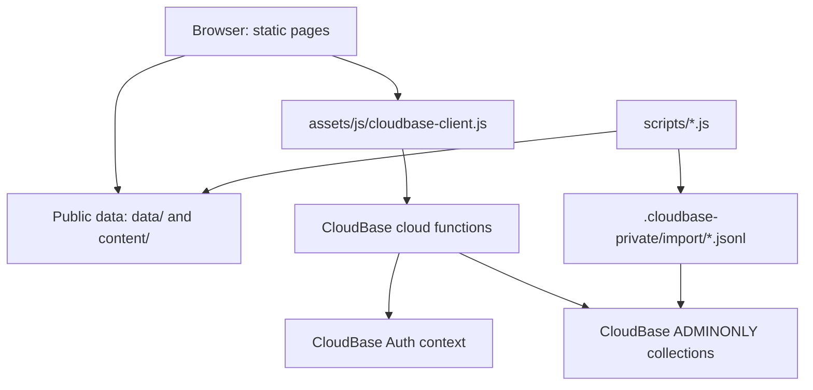

# 02 Architecture

> This document explains how Mr. Cat Academy is built and why the pieces are arranged this way.
> Update it when architecture, deployment shape, directory structure, backend boundaries, or major dependencies change.

## 1. Current Architecture Summary

Mr. Cat Academy is a static web application with a CloudBase backend.

The current design is intentionally simple:

- Static HTML pages provide the user interface.
- Vanilla JavaScript handles page behavior.
- Public JSON files provide browser-readable lesson content.
- CloudBase Authentication handles login.
- CloudBase cloud functions are the only trusted data access layer.
- CloudBase database collections are private and `ADMINONLY`.
- Correct answers, explanations, accepted variants, student data, assignments, attempts, and disputes live behind cloud functions.

This is a good fit for the current project because the owner needs a maintainable teaching system, not a large custom backend platform.

## 2. Technology Stack

| Layer | Current choice |
| --- | --- |
| Frontend | Static HTML, CSS, vanilla JavaScript |
| Hosting | GitHub Pages / static web hosting |
| Backend | Tencent CloudBase cloud functions |
| Auth | CloudBase username/password Authentication |
| Database | CloudBase database collections |
| Runtime data | `data/*.json`, `content/**/*.json`, JS fallback files |
| Cloud functions | Node.js 18 |
| Build system | No frontend build step |
| Deployment package | ZIP files under `deploy-packages/` |

## 3. High-Level System Flow

## 4. Frontend Structure

Important pages:

- `index.html`: login and public entry
- `dashboard.html`: student dashboard
- `teacher.html`: teacher interface
- `library.html`: public/learning library surface
- `bbc.html`: BBC listening runtime
- `ielts-reading.html`: IELTS Reading runtime
- `ielts-listening.html`: IELTS Listening runtime
- `vocabulary.html`: Vocabulary runtime
- `attempt-review.html`: attempt history/review helper

Shared frontend assets:

- `assets/css/app.css`
- `assets/js/config.public.js`
- `assets/js/cloudbase-client.js`
- `assets/js/auth.js`
- `assets/js/dashboard.js`
- `assets/js/teacher.js`
- `assets/js/practice-session.js`
- `assets/js/personal-vocab.js`

Current frontend philosophy:

- Reuse shared practice pages.
- Do not create a permanent standalone HTML page for each exercise.
- Temporary classroom pages may remain standalone.
- Preserve cache query strings on changed scripts.

## 5. Backend Structure

Cloud function source lives in `cloudfunctions/<function>/`.

Active or relevant functions:

- `getCurrentStudent`: authenticated profile lookup
- `getResources`: visible set catalog for authenticated surfaces
- `getDashboard`: student assignments, history, replies, reveal, STAR fallback
- `submitAttempt`: trusted grading and attempt storage
- `teacherAdmin`: teacher-only admin, assignment, progress, disputes, answer-key access
- `studentVocabulary`: personal My Words list
- `changePassword`: authenticated student password change
- `resetStudentPassword`: currently disabled; reset is handled by `teacherAdmin`

Generated deployment ZIPs live in `deploy-packages/`. They are ignored by Git but still required for CloudBase upload.

## 6. Database and Storage

CloudBase collections are `ADMINONLY`. Browsers should not directly read or write them.

Main collections:

- `students`
- `sets`
- `assignments`
- `attempts`
- `grading_keys`
- `system_config`
- `student_set_achievements`
- `answer_disputes`
- `grading_key_history`
- `student_vocabulary_items`

See [04_DATA_MODEL.md](04_DATA_MODEL.md) for fields and relationships.

## 7. Auth and Permissions

Authentication has two linked records:

1. CloudBase Authentication end user
2. `students` collection profile

The link is `students.auth_uid`.

Rules:

- Student ownership checks use authenticated `auth_uid`.
- `student_id` is a human-facing Login ID, not an authorization key.
- Teacher authority comes from a `students` document with `role: "teacher"` and `active: true`.
- Frontend role flags are never trusted.
- Visitors are frontend-only browsing state and cannot write CloudBase data.

## 8. Main Data Flows

### Student Login

1. Student signs in with CloudBase username/password.
2. Browser calls `getCurrentStudent`.
3. Function resolves authenticated UID to `students.auth_uid`.
4. Safe profile is returned to the browser.

### Assignment Submit

1. Practice page submits answers to `submitAttempt`.
2. Function verifies student, set, assignment ownership if present.
3. Function loads private `grading_keys`.
4. Function grades on the server.
5. Function writes an immutable `attempts` record.
6. Function updates assignment latest/best summary.
7. Function creates or repairs STAR if mastered.

### Teacher Assignment

1. Teacher page calls `teacherAdmin`.
2. Function verifies active teacher profile.
3. Function checks set and student eligibility.
4. Open duplicate assignments are skipped.
5. Completed/passed/mastered history can be reassigned with a new `assignment_id`.

### Argue

1. Student submits a dispute for one wrong recorded question.
2. Teacher resolves with `keep`, `add`, or `replace`.
3. `add`/`replace` updates private `grading_keys`.
4. A `grading_key_history` record is written.
5. Only the disputed attempt is regraded upward.
6. STAR is created or improved if the regraded attempt reaches mastery.

## 9. Content Pipeline

Public source layers:

- `content/`: canonical metadata and vocabulary source content
- `data/`: browser-readable runtime lesson data and generated home catalog
- `bbc-audio/`, `assets/audio/`: audio assets

Private generated layer:

- `.cloudbase-private/import/sets-cloudbase.json`
- `.cloudbase-private/import/grading-keys-cloudbase.json`
- `.cloudbase-private/import/system-config-cloudbase.json`

Important scripts:

- `scripts/build-home-catalog.js`
- `scripts/prepare-cloudbase-data.js`
- `scripts/import-bbc-lessons.js`
- `scripts/import-vocabulary-unit.js`
- `scripts/import-ngsl-bc.js`

See [09_CONTENT_WORKFLOW.md](09_CONTENT_WORKFLOW.md).

## 10. Deployment

Static site deployment and CloudBase deployment are separate.

Static site:

- Publish committed HTML/CSS/JS/data/audio changes.
- Bump script query strings when shared JS changes.

CloudBase functions:

- Edit function source in `cloudfunctions/<name>/`.
- Rebuild `deploy-packages/<name>.zip`.
- Upload ZIP to the development CloudBase environment.

CloudBase data:

- Run `node scripts/prepare-cloudbase-data.js`.
- Import JSON Lines files into the correct collections.

See [10_DEPLOYMENT.md](10_DEPLOYMENT.md).

## 11. Security Notes

Never commit:

- Tencent Cloud `SecretId` or `SecretKey`
- admin credentials
- access tokens
- private keys
- student passwords
- initial/reset password
- private grading answers

Keep collections `ADMINONLY`.

## 12. Current Architecture Limits

- Backend domain logic is still partly duplicated across cloud functions.
- There is no automated backend test suite yet.
- Some public legacy data still contains answers from before the private grading migration.
- CloudBase function deployment is manual.
- Grading-key reconciliation after teacher Argue corrections is not fully automated.

## 13. Recommended Next Architecture Work

High-value next steps:

- Extract shared backend logic under `cloudfunctions/_shared/`.
- Add pure rule tests for assignment status, STAR, Argue, and Vocabulary boundaries.
- Add grading key reconcile workflow before large imports.
- Keep `AGENTS.md` short and move product/architecture detail into `docs/`.
