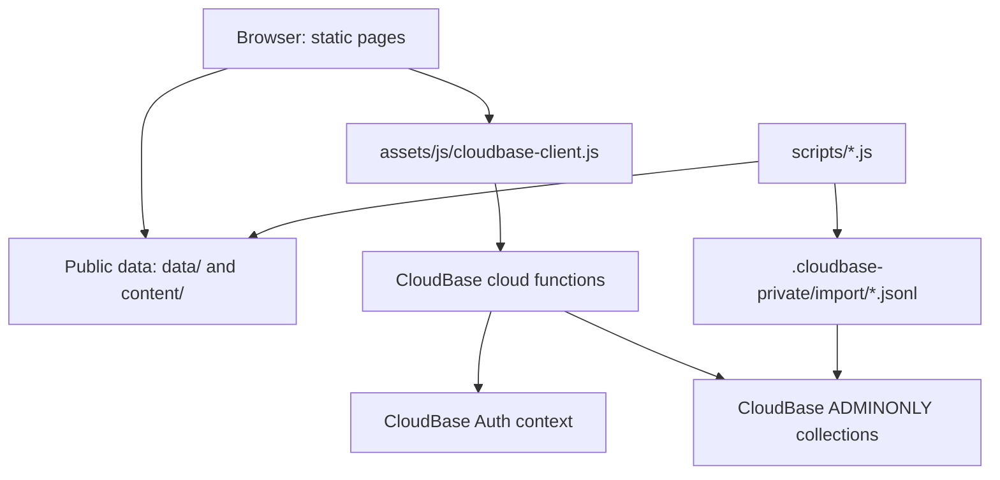

# 02 Architecture

> This document explains how Mr. Cat Academy is built and why the pieces are arranged this way.
> Update it when architecture, deployment shape, directory structure, backend boundaries, or major dependencies change.

## 1. Current Architecture Summary

Mr. Cat Academy is a static web application with a CloudBase backend.

The current design is intentionally simple:

- Static HTML pages provide the user interface.
- Vanilla JavaScript handles page behavior.
- Public JSON files provide browser-readable lesson content.
- CloudBase Authentication handles login.
- CloudBase cloud functions are the only trusted data access layer.
- CloudBase database collections are private and `ADMINONLY`.
- Correct answers, explanations, accepted variants, student data, assignments, attempts, and disputes live behind cloud functions.

This is a good fit for the current project because the owner needs a maintainable teaching system, not a large custom backend platform.

## 2. Technology Stack

| Layer | Current choice |
| --- | --- |
| Frontend | Static HTML, CSS, vanilla JavaScript |
| Hosting | Tencent COS static website for the custom domain; GitHub remains the source repository |
| Backend | Tencent CloudBase cloud functions |
| Auth | CloudBase username/password Authentication |
| Database | CloudBase database collections |
| Runtime data | `data/*.json`, `content/**/*.json`, JS fallback files |
| Cloud functions | Node.js 18 |
| Build system | `npm run build:static` copies the public static allowlist into `dist/` |
| Deployment package | ZIP files under `deploy-packages/` |

## 3. High-Level System Flow

## 4. Frontend Structure

Student Dashboard 的 `ACHIEVEMENTS` 贡献格采用独立的读路径：页面先完成原有
`dashboardBootstrap`，再调用 `getDashboard.getAchievementCalendar`。云函数只扫描
滚动窗口内的 countable attempts、学生自己的 Writing Composition 完成里程碑，
并批量解析 sets 元数据，然后返回按上海日期分组的脱敏投影。该投影不进入启动
bootstrap 或 IndexedDB，避免一年历史拖慢作业首屏，也避免把作文正文或答题内容
带到浏览器。投影只附带重新打开当前学生自有任务所需的安全定位符；Dashboard
用这些定位符在浏览器内生成现有练习或 Writing 路由，并复用任务清单的进入确认，
不会把答案、批改细节或完整 attempt 内容加入日历响应。

Important pages:

- `index.html`: login and public entry
- `dashboard.html`: student dashboard
- `my-words.html`: authenticated student personal-vocabulary study/list workspace
- `teacher.html`: teacher interface
- `library.html`: public/learning library surface
- `bbc.html`: BBC listening runtime
- `intensive-listening.html`: authenticated shared word-slot listening runtime
- `ielts-reading.html`: IELTS Reading runtime
- `ielts-listening.html`: IELTS Listening runtime
- `vocabulary.html`: Vocabulary runtime
- `attempt-review.html`: attempt history/review helper
- `reports.html`: authenticated weekly/monthly class-report reader and teacher preview workspace
- `dse-topic-bank.html`: public preview shell and authenticated full-report reader
- `dse-writing-guide.html`: unlisted public DSE Article/Essay study guide
- `dse-writing-formats.html`: unlisted public DSE Paper 2 format reference

Shared frontend assets:

- `assets/css/app.css`
- `assets/css/liquid-glass-shell.css`
- `assets/css/public-resource.css`
- `assets/css/spatial-workspace.css`
- `assets/js/config.public.js`
- `assets/js/cloudbase-client.js`
- `assets/js/auth.js`
- `assets/js/login-navigation.js`
- `assets/js/public-resource.js`
- `assets/js/dashboard.js`
- `assets/js/my-words.js`
- `assets/js/liquid-glass-shell.js`
- `assets/js/teacher.js`
- `assets/js/practice-session.js`
- `assets/js/personal-vocab.js`
- `assets/js/bbc-waveform.js`
- `assets/js/intensive-listening.js`
- `assets/css/intensive-listening.css`
- `assets/js/reports.js`
- `assets/css/reports.css`
- `assets/css/my-words.css`
- `assets/icons/mrcat-favicon-32.png` and `mrcat-apple-touch-icon.png`
- `assets/icons/mrcat-icon-192.png`, `mrcat-icon-512.png`, and `mrcat-icon-1024.png`
- `site.webmanifest`

`bbc-waveform.js` is a dependency-free presentation controller for the shared
BBC runtime. It fetches and decodes the same public `audioSrc` used by the
native hidden `<audio>`, retains only a bounded peak array, and releases the
decoded audio buffer. Waveform shape is sampled in normalized source order,
while seeking, played-state clipping, and the playhead use the media element's
authoritative `duration` and the full scrollable waveform bounds. Therefore a
zoomed viewport cannot accidentally reinterpret its visible width as the whole
programme. A decode/fetch failure falls back to a flat but still seekable
timeline and never blocks audio playback.

GitHub Actions tracks the GitHub `main` branch and synchronizes successful
static builds to the production Tencent COS bucket. The build copies only root
HTML/web-manifest files plus `assets/`, `bbc-audio/`, `content/`, and `data/`
into `dist/`. Cloud functions, deployment packages, scripts, repository
documentation, and local/private configuration are not published as website
files. CloudBase continues to provide authentication, functions, database, and
private storage; static hosting is a separate release track.

All root HTML pages declare the same favicon, Apple touch icon, and
`site.webmanifest`. The manifest is curriculum-neutral and references only the
supplied Mr. Cat face at standard 192 px and 512 px sizes; DSE and IELTS no
longer switch home-screen identity.

The two public DSE share pages are intentionally absent from the login,
Dashboard, Library, and generated catalog navigation. Their stable URLs are
external acquisition entry points; their own brand, header, CTA, and footer may
link one way to `index.html`. Legacy `temp-*` paths are lightweight `noindex`
redirect aliases so previously shared URLs keep working. These pages are fully
public static content and must never be used for protected reports or private
answer material.

The shared Liquid Glass layer is presentation-only on login and public Library.
The authenticated Student Dashboard and Teacher desk additionally use the
spatial workspace layer for their current header, navigation, matrix, progress,
and page-level modal layouts. These layers remain ordinary static CSS and
vanilla JavaScript; they do not introduce a frontend framework or move trusted
state out of CloudBase functions.

`my-words.html` is a separate authenticated workspace rather than a Dashboard
modal. It calls the existing `studentVocabulary` function directly and reuses
`personal-vocab.js` enrichment plus `my-words-export.js`; no personal word data
is embedded in static HTML. Desktop renders a persistent word index and detail
pane, while narrow layouts replace the Sidebar with top tabs and open one word's
detail in a bounded modal. The Dashboard notebook remains a normal same-origin
page link, but after primary Dashboard content settles it may issue one bounded
18-item `studentVocabulary` page request and store that owner-keyed response in
`sessionStorage`. My Words validates the signed-in owner before hydrating that
cache, revalidates page zero in the background, and clears the cache on logout.

`studentVocabulary.list` keeps its legacy bounded non-paginated response for old
callers. Requests with `paginated`, `cursor`, or `page_size` use ordered offset
pages, return `next_cursor`, `has_more`, and a page-zero `total_count`, and join
lexicon/recommendation data only for the current page. My Words requests 18 rows
for first paint and 30-row continuation pages near the scroll boundary. Search,
non-recent sorting, Review period statistics, and Export explicitly finish the
remaining pages before claiming complete results; ordinary entry never waits for
the full collection.

Intensive Listening uses a two-source lifecycle. The private iCloud JSON is the
portable authoring/backup package; after import, the ADMINONLY CloudBase material
is the live runtime source so teacher Argue decisions can take effect without a
static redeploy. Only metadata and audio are public. Approved spelling exemptions
increment a policy revision, and open student pages poll that lightweight revision
and refresh the redacted material only when it changes. Teacher export reconstructs
a current source JSON from the private material.

Visitor Intensive Listening never calls the private `intensiveListening` cloud
function. The browser derives the linked BBC set ID and reads only that lesson's
already-public title and audio URL, then creates one local `listen_only` full-
programme unit. Segment boundaries, transcript text, word slots, answers,
policy state, disputes, and progress remain behind active-profile authentication.

Current frontend philosophy:

- Reuse shared practice pages.
- Do not create a permanent standalone HTML page for each exercise.
- Temporary classroom pages may remain standalone.
- Keep isolated design previews, such as `my-words-modal-preview.html`, clearly
  unlinked from production navigation and free of real student/backend data.
- Preserve cache query strings on changed scripts.

Intensive Listening imports publish catalog metadata only. Reviewed text,
accepted slot answers, and timestamps are imported into
`intensive_listening_materials`; the authenticated `intensiveListening` cloud
function returns redacted slot structure and performs every check/reveal/progress
write. Progress and temporary replays use separate private collections.

### Teacher Workspace Return and Local Cache

Teacher practice entry remains a normal same-origin history navigation. Before
opening a practice runtime, `teacher.js` stores a compact workspace snapshot in
the current `history.state` entry and a tab-scoped `sessionStorage` fallback.
The snapshot contains only UI state: active destination, View filters, matrix
density, grouped-progress expansion, Library filters/search, document scroll,
matrix scroll, and stable visible anchors. Practice `Back` uses the shared
validated history return, so bfcache can restore the live page. If bfcache is
unavailable, the history/session snapshot is applied after asynchronous matrix
rendering. Practice-entry confirmation and teacher detail modals are excluded.

After teacher authentication, `teacher.js` may render a private-device
IndexedDB snapshot while live CloudBase reads continue. The cache is scoped by
teacher Login ID, expires after 24 hours, and stores only student display
profiles, public set metadata, assignment summaries, and progress summaries
with nested attempts/answers removed. It never stores credentials, auth tokens,
correct answers, explanations, or grading keys, and explicit logout deletes the
account cache. Live CloudBase results replace the snapshot, remain authoritative,
and are refreshed periodically while View is visible. Re-rendering preserves
the current matrix column anchor, grouped-progress anchor, and scroll offsets.

### Student Dashboard Startup and Local Cache

After student authentication, `dashboard.js` first hydrates an owner-scoped
IndexedDB snapshot that expires after 24 hours, then calls
`getDashboard.dashboardBootstrap`. The snapshot and bootstrap contain only
redacted assignment/set summaries, ten-row To Do/Finished pages, aggregate
counts, weekly counts, and STAR totals. The bootstrap additionally returns the
authorized unread Teacher Reply summaries so an immediate click does not wait;
those reply bodies remain current-tab memory only and never enter IndexedDB.

First paint does not wait for complete attempts, wallet history, STAR
provenance, self-study reconstruction, or protected resource merging. A silent
queue prefetches public data for the first ten actionable To Do items, continues
the remaining To Do summary pages, hydrates Teacher Replies, and finally runs
the authoritative full Dashboard/resource refresh. Visible To Do and Finished
lists append ten rows near their internal scroll edge. Full CloudBase results
replace cached summaries and explicit logout deletes the Student cache.

## 5. Backend Structure

Cloud function source lives in `cloudfunctions/<function>/`.

Active or relevant functions:

- `getCurrentStudent`: authenticated profile lookup
- `getResources`: visible set catalog for authenticated surfaces
- `getDashboard`: student assignments, history, latest attempt lookup, all
  resolved teacher replies plus their read state, reveal, STAR fallback, and
  newest-first unified Yellow/Blue STAR provenance views for Personal Center,
  plus distinct-set self-study completion projections once a countable resource
  attempt first passes (excluding timed Vocabulary Practice and deduplicating a
  completed assignment for the same set),
  plus the current student's wallet, Cash requests, cancellation, evidence
  upload registration, and redemption read-state actions. Its
  independent student collections are read concurrently, and visible `sets`
  metadata is fetched in bounded `set_id` batches rather than one query per
  historical task so large student histories remain inside the function limit.
- `submitAttempt`: trusted grading and attempt storage
- `sendTeacherAttemptEmails`: timer-only SMTP dispatcher for private BBC
  seven-minute batches and cumulative immediate Vocabulary attempt emails
- `teacherAdmin`: teacher-only student account deletion/admin, assignment,
  progress, disputes, answer-key access, shared dictionary review, and
  read-only student vocabulary inspection. Its student-detail STAR source action
  is a bounded, click-triggered read for one authorized `auth_uid`; STAR history
  remains outside teacher bootstrap/progress responses. It also lists and processes Cash
  requests, issues teacher evidence-upload metadata, and returns authorized
  temporary evidence URLs. Teacher bootstrap no longer waits for complete
  notification or Argue history. Notification summaries use ten-thread cursor
  pages; after the lightweight unread-thread count arrives, the browser silently
  continues only until every unread thread is represented. A two-request in-memory
  queue then prefetches each unread thread's private per-question detail through
  bounded, individually authorized `attempt_id` requests. When the bell is open,
  earlier read-history summaries advance in ten-thread pages as its internal
  scroll reaches the end; those read pages do not trigger private-detail prefetch.
  Argue uses independent five-record status
  pages. Private details never enter the persistent Teacher IndexedDB snapshot,
  and growing history remains outside bootstrap responses and below CloudBase's
  6 MB response limit.
  Its lightweight `listClasses` action supplies active stable class IDs and
  names to the Student detail selector; class changes still pass through the
  trusted `updateStudent` membership-history synchronization.
- `studentVocabulary`: personal My Words editing/merge/export data, dictionary
  enrichment, bounded AI fallback, and dictionary issue reporting
- `changePassword`: authenticated student password change
- `getProtectedResource`: authenticated, chunked delivery of private reference
  artifacts, with per-resource role policies after active-profile validation
- `learningReports`: authenticated report list/read plus teacher-only preview,
  comment, and publish actions; it returns a role-redacted report projection,
  never raw report documents to the browser
- `generateLearningReports`: timer-only idempotent generator for Shanghai-time
  preview/final report phases, protected by an internal trigger token
- `resetStudentPassword`: currently disabled; reset is handled by `teacherAdmin`

Generated deployment ZIPs live in `deploy-packages/`. They are ignored by Git
but still required for CloudBase upload. `package:functions` uses locked
dependencies and esbuild to include only reachable runtime code, so deployed
functions do not depend on CloudBase resolving npm ranges during an update.

Protected report payloads use a separate private build boundary. The reviewed
full HTML stays outside the public repository. `scripts/prepare-protected-resource.js`
gzip-compresses it into the ignored
`cloudfunctions/getProtectedResource/protected-payloads.private.js`; the normal
function packager bundles that private module into the ignored deployment ZIP.
GitHub Pages contains only the preview shell. After CloudBase authorization,
the browser fetches bounded chunks, decompresses them locally, verifies the
SHA-256 manifest, and renders the report in a sandboxed `srcdoc` iframe.
The private module may contain multiple named resources. Each resource can
declare `allowed_roles`; the JUPAS weighting report is student-only while the
existing HKDSE topic bank retains student/teacher access.

My Words enrichment uses a dictionary-first cascade inside `studentVocabulary`:
the shared `vocabulary_lexicon` collection is checked first, then the fixed
`dictionaryapi.dev` endpoint is used only for a cache miss. Saving the personal
word completes before the browser starts enrichment. Curated/ECDICT hits are
shared across students; external results are normalized and cached once. API
access never comes directly from the browser.

After a confirmed external miss, an optional provider-neutral OpenAI-compatible
request may generate a student preview from the word and one saved context. The
student must confirm it before it becomes the single shared AI draft. Teacher
publication replaces that current shared record, first writing the previous
record to `vocabulary_lexicon_history`. Reports are stored separately in
`vocabulary_dictionary_reports`. Personal Notes never enter the AI request or
the shared lexicon.

Word List export is browser-side. `assets/js/my-words-export.js` builds a real
OpenXML `.xlsx` without a third-party runtime dependency and creates a
print-ready HTML table for browser Save as PDF. Neither format contains private
data beyond the rows and columns the current student explicitly selects.

## 6. Database and Storage

CloudBase collections are `ADMINONLY`. Browsers should not directly read or write them.

Main collections:

- `students`
- `sets`
- `assignments`
- `attempts`
- `grading_keys`
- `system_config`
- `student_set_achievements`
- `star_reward_ledger`
- `star_redemption_requests`
- `star_redemption_evidence`
- `answer_disputes`
- `grading_key_history`
- `student_vocabulary_items`
- `vocabulary_lexicon`
- `vocabulary_lexicon_history`
- `vocabulary_dictionary_reports`
- `vocabulary_test_sessions`
- `classes`
- `class_memberships`
- `learning_reports`
- `teacher_attempt_email_events`

See [04_DATA_MODEL.md](04_DATA_MODEL.md) for fields and relationships.

`student_set_achievements` remains the source of STAR provenance. Yellow STARs
are protected and redeemable; active or converted Blue STARs are stable but
non-redeemable. New Yellow STARs are unique by student and set, while historical
assignment-keyed duplicates remain valid. Personal Center reads a redacted
unified view through `getDashboard` rather than querying the collection directly.

Reward spending is a separate boundary. `star_reward_ledger` is append-only and
references exact Yellow `achievement_id` values for credit, reserve, release,
redeem, and refund events. `star_redemption_requests` is the workflow aggregate;
`star_redemption_evidence` stores private file metadata separately so images do
not inflate request documents. Achievement rows are never marked spent.

Evidence upload uses a two-phase storage flow. An authenticated student or
teacher asks the appropriate cloud function for single-use upload metadata for
a request-scoped path. The browser uploads the original and compressed display
image directly to CloudBase Storage, then the function verifies file IDs, path,
type, size, ownership, request state, and the three-image limit before appending
evidence metadata. Read actions return short-lived URLs only after student-owner
or active-teacher authorization. Storage remains private.

The student Dashboard renders teacher replies as a dedicated inbox opened from
the speech-bubble control in the To Do List modal header. `getDashboard`
returns resolved `answer_disputes` regardless of
`student_seen`; the browser derives the unread badge from that read state and
`markTeacherRepliesSeen` updates the state without deleting reply history.

### Learning-report storage boundary

`classes`, `class_memberships`, and `learning_reports` are `ADMINONLY`, just
like the existing learning data. `classes` supplies a stable `class_id`;
`class_memberships` records one current class relationship plus closed history
for each student; `learning_reports` stores preview and immutable published
snapshots. The legacy `students.class_group` field remains a transition/display
mirror, not a report scope or authorization source.

The report snapshot contains both a shared leaderboard projection and protected
per-student detail. `learningReports.getReport` derives the caller from the
CloudBase context. It returns only the relevant one student detail to a student,
while an active teacher receives the full teacher projection. Thus a copied
`reports.html?report=<report_id>` link is convenient for a class group but
cannot become a public or cross-student data API.

## 7. Auth and Permissions

Authentication has two linked records:

1. CloudBase Authentication end user
2. `students` collection profile

The link is `students.auth_uid`.

Rules:

- Student ownership checks use authenticated `auth_uid`.
- `student_id` is a human-facing Login ID, not an authorization key.
- A completed teacher deletion archives the old profile's `student_id`, keeps
  the original value in `deleted_student_id_snapshot`, and releases that Login
  ID for a new auth user/profile. The new `auth_uid` does not inherit records
  owned by the deleted UID.
- Teacher authority comes from a `students` document with `role: "teacher"` and `active: true`.
- Frontend role flags are never trusted.
- Visitors are frontend-only browsing state and cannot write CloudBase data.
- index.html is the only credential-entry surface. Shared login-navigation.js validates same-origin root HTML return targets, preserves query/hash context, and strips legacy user/visitor identity parameters before navigation.
- Practice pages derive displayed student identity from the authenticated profile or explicit visitor state; URL parameters and legacy localStorage keys are never authorization sources.
- During an active countable Vocabulary Test, student cloud-function surfaces
  reject requests from other browser page instances for the same student.

## 8. Main Data Flows

### Student Login

1. Student signs in with CloudBase username/password.
2. Browser calls `getCurrentStudent`.
3. Function resolves authenticated UID to `students.auth_uid`.
4. Safe profile is returned to the browser.

### Assignment Submit

1. Authenticated Vocabulary flows run a read-only login preflight, then the
   practice page invokes the mutating `submitAttempt` call exactly once. Only
   the preflight may retry.
2. Function verifies student and set visibility.
3. If an `assignment_id` is present, the function verifies ownership.
4. If no `assignment_id` is present, the function auto-binds the student's open assignment for the same `set_id`, when one exists.
5. Function loads private `grading_keys`.
6. Function grades on the server.
7. Function writes an immutable `attempts` record. Recorded Vocabulary Quiz
   and timed Practice requests derive a stable document ID from authenticated
   student, set, mode, and `client_submission_id`; an atomic duplicate create
   returns the existing attempt before downstream side effects run again.
8. Shared `cloudfunctions/_shared/exercise-progress.js` recomputes the student's
   set-wide latest/best/status summary from every countable attempt for the same
   `student_uid + set_id`. Vocabulary timed Practice is excluded. For BBC, the
   earliest answer-reveal/mastery lock caps which attempts may improve Best.
9. Every non-cancelled assignment for that student/set receives the same global
   score summary evaluated against its own Passing/Earn STAR thresholds. A tie
   or lower retry updates latest history but not `best_improved_at`.
10. Function creates or repairs STAR if mastered.

Learning Report snapshot projection uses the same student/set attempt pool and
BBC lock boundary when deciding whether each Class Task participation was
passed by its cutoff. It does not require the qualifying attempt to carry that
Class Task's `assignment_id`.

### Vocabulary Test Integrity Session

1. `vocabulary.html` creates a `vocabulary_test_sessions` record before a
   countable 5+ group Vocabulary Test starts.
2. The browser sends the public unit `contentVersion`; the function verifies it
   against private `grading_keys.grading_version` before creating the session.
3. The session stores selected group IDs, graded question IDs, the grading
   version, private answer/explanation snapshots, server start and expiry times
   based on 90 seconds per selected group, an in-memory page-instance ID
   generated on each page load, and heartbeat state.
4. The page heartbeats every 10 seconds while visible and active. A transient
   network failure enters a 60-second recovery window with bounded retries;
   the current answers remain in place and the page shows a reconnecting
   status. Explicit session/auth/content errors remain terminal.
5. `submitAttempt` validates `test_session_id` and grades from the session's
   locked snapshots, treating missing answers as blanks. A grading-key update
   during the test therefore cannot change that test's result.
6. Counted Quiz submission resolves assignment ownership from the session's
   locked `assignment_id` / `assignment_doc_id`, not from a second open-assignment
   search. A session that started as self-study remains self-study even if a
   teacher assigns the set before submission. A cancelled or missing locked
   assignment ends the session without recording an attempt.
7. Switching apps/tabs, leaving the page, 60 seconds without a successful
   heartbeat, or time expiry
   closes the session as `abandoned` without creating an attempt or changing
   assignment status.
8. Login preflight retry and idempotent response replay reuse the original
   session and never extend its server start, deadline, heartbeat timeout,
   grace period, page ownership, question snapshot, or assignment lock.

Teacher progress and student dashboard reads use paginated CloudBase reads for
owned or relevant records instead of assuming the first page contains every
assignment, attempt, set, student, dispute, or STAR. Teacher progress also uses
linked attempts as a display fallback when an assignment summary is stale.

### Teacher Assignment

1. Teacher page calls `teacherAdmin`.
2. Function verifies active teacher profile.
3. Function checks set and student eligibility.
4. Ordinary open duplicates are skipped. When the effective recipients exactly
   cover one Class and a student already has an open individual assignment for
   the set, that assignment is moved into the new batch and promoted with its
   classmates instead of being skipped or duplicated.
5. Completed/passed/mastered history can be reassigned with a new `assignment_id`.
   Assignments created for the same set in one teacher Assign action also share
   an `assignment_batch_id` for teacher matrix grouping.
6. Every new assignment requires a due week. The browser sends `due_at`, and
   `teacherAdmin` normalizes it to that Shanghai-time week's Sunday 23:59:59.
   Existing assignments can be edited by explicit `assignment_id` selections
   for due week, passing percentage, and mastery percentage. Due-week edits
   immediately drive Teacher View Wxx grouping/date filters and the student
   Overdue / This Week / Upcoming model. `assigned_at` remains only as a legacy
   compatibility mirror; `created_at` is the creation audit timestamp.
   The View matrix task header builds this explicit ID list from the currently
   filtered column, so one save can update every matching student in the
   selected class/scope without affecting hidden classes; a student-detail edit
   sends only that student's assignment ID. The UI submits Due week and Passing
   % directly on every save. Mastery % is submitted only when `mastery_enabled`
   is true, and server validation applies `passing <= mastery` only in that
   enabled state.
7. Open assignments can be soft-cancelled through `teacherAdmin`; cancellation
   sets `status: "cancelled"` with audit fields, hides the item from the
   student dashboard, and prevents old assignment links from recording new
   submissions against that assignment.
8. Assign previews use server-derived global progress to show Not started,
   Existing progress, and Already finished counts per selected task. Prior
   completion initializes the participation as Finished immediately; the
   student's FINISHED ordering still uses the last strict score improvement.

### Teacher Attempt Notifications

The teacher notification bell derives unread state from two server-owned
markers on the authenticated teacher profile. Individually opened threads add
their attempt IDs to `teacher_activity_attempt_reviewed_ids`; `Read all` writes
`teacher_activity_attempts_read_all_at`. Attempts at or before that timestamp
are read, while later submissions become unread without growing an unbounded
list of historical IDs.

The browser keeps a separate notification-thread ID set instead of treating the
matrix's attempt collection as the feed. `listAttemptNotifications` returns ten
newest unseen thread summaries at a time, `listAttemptThread` supplies the bounded
summary history for one authorized thread, and `getAttemptDetail` remains the only
source of full answers and explanations. Matrix cells also use the thread action
on demand so notification pagination cannot hide older progress history.

External teacher email is an asynchronous outbox projection of the same
attempt threads. After `submitAttempt` stores a recorded BBC, Vocabulary Quiz,
or timed Vocabulary Practice attempt, it idempotently writes one
`teacher_attempt_email_events` document keyed by `attempt_id`. A queue-write
failure is logged but does not change the successful grading response.

`sendTeacherAttemptEmails` is callable only by a token-authenticated CloudBase
timer. It transactionally claims due events before SMTP delivery. BBC events
use a fixed seven-minute first-attempt window and one claimed batch contains
every pending event in that thread/window. Vocabulary events are due at their
submission time and are claimed separately. Before rendering, the dispatcher
loads the same assignment/self-study thread through the current event cutoff,
joins the private grading key for legacy missing snapshots, and builds the
cumulative score chart plus mistake-only comparisons. Stable subjects and
deterministic `Message-ID` values keep retries idempotent. Only BBC batches use
`In-Reply-To` / `References` to continue one mailbox conversation. Each
Vocabulary Quiz or timed Practice event is a separate mailbox message whose
subject includes its mode and current attempt number, while its body remains a
cumulative projection through that event.
Sent/retry/failed audit state remains in the outbox; email never changes the
teacher profile's bell read markers.

Before each dispatch, the function reads active teacher profiles and derives a
deduplicated BCC list from their enabled `attempt_email_recipients`. If the list
is empty, due events are transactionally claimed and marked `skipped` so a
later re-enable does not send stale notifications. SMTP user/password, sender,
Teacher URL, and timer token exist only as function environment variables. The
function uses Nodemailer as the bounded SMTP transport dependency. The browser
may manage only the authenticated teacher's recipient array through
`teacherAdmin`; no public collection can invoke or configure delivery.

### STAR Cash Redemption

1. `getDashboard` synchronizes missing Yellow STAR credit entries idempotently
   and projects available, reserved, spent, and lifetime values.
2. The student creates one Cash request by choosing `1..available`; a database
   transaction locks explicit Yellow achievement IDs and appends reserve entries.
3. Student or teacher uploads at least one request-scoped private Evidence Photo.
4. `teacherAdmin` lists every pending request for the current single-teacher V1,
   oldest first. The header badge includes both awaiting-proof and
   awaiting-teacher requests.
5. Teacher confirmation atomically settles reserved credits as redeemed.
   Cancellation, rejection, and seven-day expiry append release entries; refund
   appends a compensating entry without editing the completed redemption.
6. Student and teacher history reads project request status and authorized
   evidence without exposing cash amount, exchange rate, ownership internals, or
   permanent public file URLs.

### Argue

1. Student submits a dispute for one wrong recorded question.
2. Teacher resolves with `keep`, `add`, or `replace`.
3. `add`/`replace` updates private `grading_keys`.
4. A `grading_key_history` record is written.
5. `teacherAdmin` scans historical attempts for the same set/question and
   regrades matching submitted answers upward.
6. Assignment summaries are improved but never downgraded.
7. STAR is created or improved if a regraded attempt reaches mastery.

For older approved grading changes, `teacherAdmin.backfillAcceptedAnswerRegrades`
can be run by an authenticated teacher in bounded batches. It compares
historical wrong answers against current `grading_keys`, then applies the same
upward-only attempt, assignment, and STAR repair logic.

### Learning Reports

1. A teacher creates/updates class membership through a trusted teacher action.
   The server ends any prior active membership and starts the new one as one
   database transaction that locks the student's profile row. The active member
   set is therefore canonical even when two teacher requests overlap.
2. When creating assignments, the server derives `assignment_scope`, `class_id`,
   and `class_task_id`. An assignment is class-scoped only when recipients
   cover the class's complete active member set; a browser cannot label an
   arbitrary subset as a class task. New records are first written safely as
   individual assignments; only after the complete current roster is re-read
   are all matching records promoted atomically to one class task.
   Later full-task edits/cancellations are also atomic; partial mutations first
   downgrade the entire class task to individual scope so report denominators
   cannot diverge by student.
3. `generateLearningReports` runs under the configured CloudBase timer in
   `Asia/Shanghai`, creates/reuses a preview, and later finalizes the matching
   weekly/monthly period idempotently. It preserves saved teacher comments when
   moving from preview facts to final facts. Preview refresh, comment saves,
   and preview-to-published transitions re-read status and write inside a
   database transaction, so concurrent requests cannot regress or overwrite a
   published snapshot.
4. Finalization derives the due-period class tasks, cutoff-time completed counts,
   tie ranks, self-study summaries, and membership eligibility from immutable
   attempts/assignments plus membership history. It writes a published
   snapshot; the browser does not recompute rankings.
5. The teacher copies the same authenticated URL into an ordinary WeChat group.
   Families sign in with the student's existing account. V1 uses manual group
   sharing rather than an unsupported personal-WeChat automation.

## 9. Content Pipeline

Public source layers:

- `content/`: canonical metadata and vocabulary source content
- `data/`: browser-readable runtime lesson data and generated home catalog
- `bbc-audio/`, `assets/audio/`: audio assets

Private generated layer:

- `.cloudbase-private/import/sets-cloudbase.json`
- `.cloudbase-private/import/grading-keys-cloudbase.json`
- `.cloudbase-private/import/system-config-cloudbase.json`

Important scripts:

- `scripts/build-home-catalog.js`
- `scripts/prepare-cloudbase-data.js`
- `scripts/import-bbc-lessons.js`
- `scripts/import-vocabulary-unit.js`
- `scripts/import-ngsl-bc.js`

See [09_CONTENT_WORKFLOW.md](09_CONTENT_WORKFLOW.md).

## 10. Deployment

Static site deployment and CloudBase deployment are separate.

Static site:

- Publish committed HTML/CSS/JS/data/audio changes.
- Bump script query strings when shared JS changes.

CloudBase functions:

- Edit function source in `cloudfunctions/<name>/`.
- Rebuild `deploy-packages/<name>.zip`.
- Upload ZIP to the development CloudBase environment.

CloudBase data:

- Run `node scripts/prepare-cloudbase-data.js`.
- Dry-run and apply the owner-run CLI import:
  `npm run cloudbase:import:content` and
  `npm run cloudbase:import:content -- --apply`.
- The CLI import inserts missing `sets` and `grading_keys` records by default.
  JSON Lines console import remains a fallback.

See [10_DEPLOYMENT.md](10_DEPLOYMENT.md).

Learning reports add an owner-gated fourth operational concern inside the
CloudBase track: create the three private collections and indexes, upload the
two report functions, configure the timer's internal token/cron, then publish
the matching static report page. No agent should create collections, configure
Cron, or invoke a production report run without explicit owner approval.

## 11. Security Notes

Never commit:

- Tencent Cloud `SecretId` or `SecretKey`
- admin credentials
- access tokens
- private keys
- student passwords
- initial/reset password
- private grading answers

Keep collections `ADMINONLY`.

## 12. Current Architecture Limits

- Backend domain logic is still partly duplicated across cloud functions.
- There is no automated backend test suite yet.
- Some public legacy data still contains answers from before the private grading migration.
- CloudBase function deployment is manual.
- Grading-key reconciliation after teacher Argue corrections is not fully automated.
- Multi-teacher/student ownership and per-teacher STAR redemption authority are
  deferred; the first Cash release assumes the current single active teacher.
- Ordinary WeChat groups have no official inbound webhook suitable for V1.
  Copy-to-clipboard/manual sharing is deliberately retained until an approved
  official channel exists.
- Report generation needs CloudBase timer observability and a correction/audit
  path before a high volume of historical reports is expected.

## 13. Recommended Next Architecture Work

High-value next steps:

- Extract shared backend logic under `cloudfunctions/_shared/`.
- Add pure rule tests for assignment status, STAR, Argue, and Vocabulary boundaries.
- Add grading key reconcile workflow before large imports.
- Keep `AGENTS.md` short and move product/architecture detail into `docs/`.
- Add pure report-rule tests for time-zone boundaries, membership eligibility,
  class-task scope, redacted reads, and idempotent timer retries.

## 14. Edition-Aware Content Routing

`assets/js/content-editions.js` is the shared pure helper for explicit edition
families. Static catalog metadata and CloudBase `sets` carry the same
`edition_family`, `edition_number`, `edition_label`, and `is_latest_edition`
fields. The Student Library groups those records for discovery only; Assign,
attempts, achievements, disputes, and direct practice routes continue to use
the concrete `set_id`.

`getDashboard.library_progress` returns one redacted best-score/status summary
per concrete set so the version buttons can display independent scores without
returning answer details. Unversioned catalog items need no migration and retain
the existing one-click confirmation flow.

## AI Tutor Writing Architecture

The browser waiting layer is shared across OCR, review, rewrite-check, and
revision OCR without merging their polling or result predicates. Each waiting
renderer projects the server Job state into `Uploaded` and `Finished` endpoint
nodes with `Thinking` centered on the animated connector; the upload-confirmation boundary uses the same card without
claiming a durable job early. Waiting content never duplicates toolbar
navigation. `assets/js/ai-waiting-runner.js` contains an optional,
dependency-free Canvas controller only. It has no CloudBase, Composition, Job,
identity, or persistence knowledge; its score, collectibles, distance, jump,
and stumble snapshots are discarded with the page. `ai-tutor.js` owns mounting,
pause/resume, shared serialized polling, Ready animation/sound, causal collect/hit
sound projection, the one-shot
result action, and destruction on result handoff or navigation. Terminal AI
failure does not destroy or remount the Canvas: the client projects `failed` as
the red `Interrupted` track plus one Retry action while Runner state stays local
and live. `getComposition` remains the authoritative
ADMINONLY projection: visible polling is 3 seconds, hidden polling is 10
seconds, transient failures back off to 20 seconds, and stale generation,
Composition, kind, or operation responses are ignored.

Zero-data New Writing rows are placeholders rather than student works. The browser
filters them from History and its count immediately. Leaving an untouched placeholder
calls the owner-scoped `discardEmptyComposition` action. The explicit input-page
`Discard` calls the separate `discardDraftComposition` action, which may remove a
revision-1 student draft containing unsent title, prompt, or manuscript text only.
Both functions reload ownership and lifecycle state on the server. The broader draft
guard rejects Library-bound rows and every upload, OCR, active job, review, rewrite,
replacement, completion, or later-revision field. `listCompositions` still omits empty
placeholders and prunes abandoned rows only after a 30-minute safety window. There is
no general student Composition deletion endpoint.

`ai-tutor.html` calls the authenticated `writingTutor` function. Photos use a
two-phase private CloudBase upload and receive short-lived URLs only inside a
function. `startPhotoUpload` derives page IDs from the stable operation ID, so a
lost response replays the same batch and refreshes its upload metadata instead
of creating orphan pages. `finishPhotoUpload` confirms storage and creates a stable
OCR `writing_ai_jobs` row in the same server request. `evaluate` reserves quota
idempotently and creates a stable review job for either assessment mode.
`submitRewrites` stages the submitted sentence rewrites under the owned
Composition's `pending_rewrite_check` and creates a stable rewrite-check job in
the same server handoff. All three actions return without waiting for the model.
`writingTutor` dispatches that job asynchronously to its
private processor; the one-minute `writingAiWorker` timer redispatches queued
jobs and expired leases if the first dispatch is lost. Jobs use create-only IDs,
bounded attempts, leases, and `queued/processing/succeeded/failed/superseded`
states. Only the job referenced by `Composition.active_job_id`, with its current
lease token, may transactionally publish a result. Thus a stale worker or
superseded re-upload cannot overwrite the current Composition.
Retryable provider/network errors receive at most five automatic claims. After a
terminal failure, the authenticated `retryFailedJob` boundary may reset the same
active OCR, rewrite-check, or revision-OCR job to queued with a fresh dispatch
token and a new five-attempt budget after validating ownership, revision, staged
payload, and private uploaded photos. Review failures instead release their word
reservation and Retry creates a fresh idempotent evaluation/usage scope, so a
manual retry cannot bypass the daily limit. The browser never mutates a job row.

The page shell has one persistent top toolbar and a single overlay controller.
Its far-left control is always one hamburger; it never mutates between History
and Back. The same control toggles one Writing sidebar. Below `820px` the sidebar
is a closed-by-default overlay and selecting a Composition closes it. At `820px`
and above it auto-opens as a docked 280px column, shifts the main workspace, does
not lock background scrolling, and can still be explicitly hidden. Crossing the
breakpoint resets to the appropriate default. Scrim activation and `Escape`
converge on the close path. Home remains a confirmed navigation action; the plus
action returns the main region to the existing uncommitted Polishing/Brainstorming
surface. The sidebar is a projection of server Compositions only: unfinished
records sort by recent activity before completed records, which sort by
`completed_at` with update/create fallbacks. Each row contains only the title and
loads its current server stage directly without an entry-confirmation layer.

All writing and revision camera affordances route through one application-owned
photo-source action sheet. Camera and library remain separate native file inputs;
the selected input is clicked synchronously in the originating user gesture so
iOS Safari does not reject it. The source choice changes only local staging and
never starts OCR by itself.

Writing Home owns an uncommitted, memory-only composer state that is intentionally
separate from the Composition domain. Selecting Polishing/Brainstorming and editing
its fields performs no CloudBase write and creates no Composition query locator.
It is never mirrored to `sessionStorage`, `localStorage`, IndexedDB, or another
browser persistence layer; refresh, navigation, and re-entry discard it. The client
removes the retired `mrcat-writing-composer-v1:*` session keys during initialization.
The first server boundary is the explicit text `Submit` or photo `Scan`: the browser
creates one Composition, clears the local pending state, then continues through
the existing save/evaluate or private upload/OCR path. Previously submitted
initial drafts also render through the inline home composer; the retired initial
standalone source renderer is not a navigation destination. Replacement of an
already reviewed Composition keeps its separate replacement surface.

The browser mirrors the open Composition ID in the `composition` query parameter
with `history.replaceState`. This value is only a resumable locator, never an
authorization token: initialization still authenticates the student and calls
`getComposition`, whose owner check remains authoritative. Opening or creating a
Composition replaces the locator, returning to the workspace home clears it, and
a stale locator for a safely pruned empty placeholder falls back to the home state.
The centered toolbar title is derived only from the currently loaded Composition;
when none is selected it reads `Start new Writing` and the right-side quota is
absent. Its overflow measurement is presentation state and is never persisted.
For a concrete non-placeholder title, a pencil reveals a compact toolbar editor.
Saving uses the existing authenticated `updateCompositionTitle` boundary, updates
the current and sidebar projections in memory, and leaves activity timestamps and
ordering unchanged.

The browser edits the OCR result; `saveDraft` confirms text and deletes the
private photos. `writingAiWorker` also deletes unconfirmed uploaded photos at
their seven-day expiry. `getComposition` returns the safe active-job projection
and temporary owned photo previews, so refresh, re-login, and reopening converge
on the same Composition without another model call. Job rows contain identifiers,
photo IDs, state, attempts, leases, and safe error codes only—never manuscript or
OCR text. Multi-page Qwen array roots are normalized into one page-ordered OCR
object before strict local schema validation.

Initial OCR carries a durable `ocr_purpose` of `writing` or `prompt` through the
upload audit rows, `pending_upload`, the metadata-only job, its public projection,
and `pending_ocr`. The operation fingerprint includes that purpose, so a prompt
scan cannot replay as manuscript OCR. Confirming `writing` continues through
`saveDraft` and evaluation; confirming `prompt` uses `adoptPromptOcr`, copies only
the reviewed text into `prompt_text`, clears the OCR state, deletes the private
prompt photos, and returns to the inline Brainstorming form without starting a
review.

Photographed Sentence Revision follows the same boundary but remains a revision
draft operation: an authenticated `Scan Revisions` action uploads pages to private
storage, then creates/replays one metadata-only `writing_ai_jobs` row with
`job_type: "revision_ocr"`. The job is bound to the owner, Composition,
Composition revision, and operation ID; a later revision or replacement cannot
publish into it. The worker normalizes only documented provider wrappers, validates
the strict revision-OCR schema, and the server then canonicalizes sentence-number
markers and answer text against the current server-owned sentence list. Missing,
duplicate, out-of-range, empty, or otherwise unresolved mappings remain explicit
unresolved results; a model echo never silently chooses a sentence or overwrites a
draft. A successful worker publishes a guarded `pending_revision_scan` result,
not live rewrite text. The student reviews mapped, `check`, and unresolved
rows, may assign an unresolved answer manually, and explicitly confirms the rows
to persist them as scanned sentence drafts. Only those confirmed drafts enter the
existing `Check` handoff; scan import never calls or marks `Check` complete.
The canonical target set is recalculated from the current merged rewrite results:
originally effective sentences and sentence IDs whose latest stored result is
`accepted: true` are excluded before model mapping and again during confirmed
import. The browser mirrors that server set and prevents two scan cards from
claiming one target, but browser option state is never the authorization boundary.
The client can leave, refresh, reconnect, or reopen the same Composition to
resume queued/processing/reviewable/failed scan state, and retry/replay keeps the
same operation identity. Private scan photos are deleted once the guarded pending
scan result is durably stored; incomplete or failed uploads remain covered by the
existing expiry cleanup lifecycle. Import confirmation does not depend on retaining
the image.

Before that durable boundary, one to eight revision photos live only in an
ephemeral browser staging queue. Native camera/file changes append to the ordered
queue and never call `startRevisionScanUpload` directly. `Start Scanning` freezes
the ordered file fingerprint into one operation ID and submits the whole batch;
from that point onward the existing private upload, queue, retry, recovery, and
cleanup guarantees apply unchanged.

Rewrite bodies are durable but do not belong in the queue row. The authenticated
submission stores the operation/revision scope and submitted sentence text only
inside `writing_compositions.pending_rewrite_check`; the related
`writing_ai_jobs` record contains identifiers and execution metadata only. The
worker reads the staged payload from the owned Composition after claiming the
job. The client polls the same Composition and can refresh, close, re-login, or
reopen without submitting another provider request. A repeated delivery with the
same operation identity replays the existing queued, processing, or completed
work instead of calling the model again.

Sentence rewrites use two persistence layers with different handoff points.
While the student types, the browser stores a user/Composition/revision/sentence-
scoped local draft and restores it before rendering the editable card. Pressing
`Check` does not discard that layer: the server first atomically stages the same
batch under `pending_rewrite_check` and creates/replays its durable job. Local and
cloud-staged drafts survive uncertain delivery, refresh, provider failure, and
browser closure. The successful result-publication transaction clears the cloud
staging area; the browser removes only accepted sentence drafts, while a rejected
sentence remains locally recoverable and is also present in the persisted rewrite
result for the next editing round. Local keys are ownership-scoped so another
account using the device cannot hydrate the draft.

Each revision-required sentence is one stateful two-sided card rather than two
simultaneous panels. Its analysis face and rewrite face share sentence identity,
completion state, and focus controller, but only the active face is rendered to
interaction and accessibility APIs. Pointer and keyboard activation use the same
state transition. The default transition may communicate a physical flip;
reduced-motion replaces rotation with an immediate swap or brief crossfade.

The function owns four versioned AI boundaries: OCR, standardized review,
language sentence review, and rewrite checking. `model-provider.js` keeps those
boundaries independent from the vendor. Text and vision may use separate
mainland-accessible OpenAI-compatible Chat Completions endpoints and models.
Supported transports are Chat JSON Schema, Chat JSON Object, and a compatibility
Responses JSON Schema path. JSON Object providers receive the complete schema,
are checked by the same local schema validator, and receive one automatic repair
attempt for malformed structure. Server-side `Intl.Segmenter` assigns candidate
boundaries before language review. A deterministic quote-aware repair layer then
merges boundaries inside balanced curly/straight quotations and lower-case
continuations after quoted terminal punctuation. It never repairs across a
paragraph break, treats apostrophes and measurement marks as non-quotation
punctuation, and only then assigns stable sentence IDs. Responses are rejected
for missing, duplicate,
or unknown IDs; the server then restores each exact original sentence by ID instead
of trusting the model to echo whitespace and punctuation unchanged. Student text is
delimited as untrusted data in every prompt.

The language-review boundary requires one structured `cefr_estimate` object
before the free-text overview. Its closed enums carry the A1–C2 band and
lower/middle/upper position; only the concise rationale is model-authored
Simplified Chinese. The browser deterministically maps those positions to
minus/no-suffix/plus notation such as B1-/B1/B1+ instead of parsing prose or
showing Chinese position labels. This estimate is scoped to the current Confirmed Manuscript and is
not promoted to a certified or student-wide proficiency record.

This allows, for example, Qwen Vision for handwriting OCR with Qwen, DeepSeek,
or Kimi for text evaluation. A provider's advertised OpenAI compatibility is
never treated as proof of strict schema support. Canonical server rules compute
overall scores and state transitions after structural validation.

Both standardized-review and language-review schemas may return a `suggested_title`
of two to six English words. It is generated inside the already required review
request, so title creation has no separate provider call, queue job, quota event,
or charge. During the successful review transaction, the server applies that
suggestion only when the Composition has no meaningful title or still carries
the `Untitled writing` fallback and its `title_source` remains `pending_ai`.
A dedicated authenticated title-update action writes the
student's inline portfolio edit and permanently marks the title as student-owned;
subsequent model results may never overwrite it.

CloudBase `update()` expands ordinary nested objects into dotted paths. Review
payloads, rewrite payloads, and active-job projections therefore use the SDK's
atomic `command.set(...)` operator when publishing a result. This permits the
first transition from a stored `null` review or `rewrite_results: null` to a
complete object and prevents `PathNotViable` failures on nested fields such as
`model_metadata`. Rewrite completion transactionally replaces the whole
`rewrite_results` object, completes the claimed job, clears the staged
`pending_rewrite_check`, and updates the Composition status only while the job's
lease and active-job guard remain current. Neither a retryable nor terminal
provider failure clears the staged rewrite body. Before whole-field replacement,
the worker carries forward `feedback_history`, migrates a legacy latest-only result
into round 1 when needed, and appends the current model result as one operation-ID-
idempotent batch. The merged `results` array remains the current acceptance
projection; history is the durable source for the student-facing round timeline.

Daily quota reservation is server-side and idempotent by authenticated student
plus client operation ID. A failed model request releases its reservation. A
successful review updates the Composition and completes the usage ledger event
in one transaction, then appends a metadata-only teacher email outbox event.
Email delivery is a separate timer function and cannot make a successful review
fail.

When a reviewed Composition is re-uploaded or its manuscript changes, `saveDraft`
stores the candidate under `pending_replacement`. The committed manuscript,
reviews, and Writing Profile observations remain active until the replacement
model call succeeds. The successful review transaction swaps in the staged
revision and clears the superseded current payloads; a failed call leaves the
committed version intact. Client operation IDs are retained for the same logical
request across a lost network response and are replaced only after a definitive
server failure or changed input.

OCR keeps the required transcription model call as the authoritative operation. After it succeeds,
`writingTutor` may make one separate, bounded 45-second vision call to locate the indexed uncertain
spans on the same ordered page URLs. This locator is best effort and is not a second durable job: provider,
timeout, empty-output, schema, and canonicalization failures are recorded only as safe error codes, then
the existing lease transaction publishes the successful transcription without regions. Before starting that optional
call, the worker also requires at least 100 seconds remaining on its six-minute lease; a late transcription
therefore publishes immediately with text-only marks. The locator's
coordinates are stored only in authenticated temporary `pending_ocr` and never in jobs, logs, or public
composition summaries.

Every provider response also crosses a separate operational telemetry boundary. `writingTutor` normalizes
OpenAI-compatible `prompt_tokens/completion_tokens` and Responses-style `input_tokens/output_tokens`, then
creates one immutable `writing_model_usage_events` row per physical provider call. Structural JSON repair is
therefore two rows rather than one estimated request. Stable IDs include job, durable attempt, stage, and
provider-call index so lease recovery cannot duplicate cost. The row stores model/protocol/request identifiers
and Token counts only; prompts, manuscripts, OCR text, feedback, images, credentials, and endpoint URLs are
excluded. Telemetry persistence is deliberately non-blocking for the learning result.

`writingAiWorker` is also the completeness auditor. New jobs carry `writing-token-usage-v1` and begin with a
pending Token audit. After a job becomes terminal, the worker aggregates its ledger and marks the audit
complete, or appends a stable `model_usage_alert` to `writing_teacher_email_events` when the ledger is absent,
provider `usage` is incomplete, or persistence reported failure. `sendWritingTutorEmails` sends that safe
health alert through the existing teacher-recipient/SMTP timer. Legacy jobs without the telemetry version are
ignored so rollout does not create false historical alerts.

## Speaking Lab backend boundary

`speakingLab` is the authenticated gateway for Discussion, invitation, Guest,
private two-phase audio upload, identity confirmation/remapping, and snapshot
creation. Its only pre-profile action is `getSharedReport`, reached through a
CloudBase anonymous SDK identity and authorized exclusively by one active,
unexpired, server-hashed share token. It also owns authenticated
reusable-voiceprint enrolment, replacement, deletion, and safe status
projections. `speakingAiWorker` is a private one-minute
durable-job worker for lease recovery, dispatch, bounded retry cleanup, Voice
Reference deletion, scoped Guest voiceprint cleanup, and share expiry. New
Speaking collections remain `ADMINONLY`; browsers receive server projections
only. Formal audio uses a two-phase authenticated SDK upload: the gateway
reserves an exact private `cloud_path`, the CloudBase browser SDK uploads under
the current student session, and `finishAudioUpload` accepts the returned
CloudBase file ID only when it resolves to that exact path. The gateway then
checks actual Storage metadata and byte size before publishing the uploaded
asset. Arbitrary browser-supplied file IDs, paths, or claimed sizes never become
authoritative. Set-backed `createDiscussion` is the only student Start boundary; the browser does not stage a second New Session form. Before formal upload, authenticated `updateDiscussionDate` and `updateDiscussionDuration` mutate only the authorized draft Discussion so an existing audio file can retain its real date while device recording remains Shanghai-today.

The environment-level function ACL sets `speakingAiWorker.invoke` to `false`,
which blocks browser SDK calls while leaving CloudBase timer triggers intact.
The worker then accepts only the platform timer envelope whose `Type` is
`Timer`, whose trigger name is `speaking-ai-worker-minute`, and whose `Time` is
parseable. This avoids a timer custom-argument secret that the current
CloudBase trigger editor cannot configure and function-detail APIs may expose.

The gateway stores only metadata in `speaking_ai_jobs`. Audio quality,
transcription/diarization, Candidate canonicalization, and report
canonicalization are explicit stages. `speech-provider.js` implements Tencent
recording-file recognition as one `CreateRecTask` followed by durable
`DescribeTaskStatus` polling of the same private task ID. `model-provider.js`
implements the independently configured OpenAI-compatible JSON-object boundary
used for the DSE report. Both still fail closed with
`SPEAKING_PROVIDER_NOT_CONFIGURED` when their server-only configuration is
absent; no provider URL, credential, transcript, or prompt is copied into queue
rows or logs. Provider URLs are request-scoped and never persisted.
`speaking-lab.js` owns deterministic
authorization, identity, evidence, projection, alias, redaction, and
invalidation rules. Formal audio is retained privately; Voice Reference files
are scheduled for deletion seven days after successful matching.

Before DSE analysis, the policy layer converts chronological Candidate
segments into canonical speaking turns. Consecutive same-Speaker sentences are
joined unless another voice/non-Candidate segment intervenes or the gap exceeds
2.5 seconds. Stable turn IDs and transcript text enter the untrusted model
input; the model returns CS/IO coaching keyed only by those IDs. Publication
fails closed unless every Candidate turn appears exactly once. Canonical report
rows store the turn ID and coaching, while authenticated/share projections join
the current immutable transcript text and timing back onto the review. The
model never supplies or rewrites the quoted `What you said` text.

Tencent's recording result supplies `SpeakerId` and sentence timing but no
per-track confidence or speaker audio. Candidate selection is therefore
independent of the participant/access list: the server treats missing
confidence as unknown, ranks sustained tracks before a brief incidental voice,
caps scoring at six Candidates, preserves extra tracks as
`non_candidate_context`, and excludes a narrowly matched opening facilitator
cue such as “You may start the discussion now”. It never infers identity from
speaking order.

The durable stage after canonicalization is `voice_matching`.
`cloudfunctions/_shared/tencent-ci-audio.js` submits a private Tencent
COS/CI transcode job for the best uninterrupted 8–20 second Candidate turn,
producing a temporary WAV/PCM 16 kHz mono object. The next worker lease polls
that job, downloads the private result in the function, sends it to Tencent
VoicePrintGroupVerify, applies score 70 / runner-up margin 10 / one-to-one
rules, creates pending VIP invitations for accepted proposals, and deletes the
derived clip. No ffmpeg or new runtime dependency is used. Any missing clip,
voiceprint, permission, or provider response becomes an unmatched Speaker and
the worker continues to `dse_analysis`.

A ready Discussion may enqueue `job_type: "voice_rematch"` through the same
durable queue. This job references the active ready report and formal asset,
starts directly at `voice_matching`, and stores only bounded private CI polling
metadata while it runs. It never re-enters audio inspection, transcription, or
`dse_analysis`. `active_voice_match_job_id` and `voice_match_status` are
independent of `active_analysis_job_id` and `analysis_status`, so rematching can
fail or retry without making a ready report unavailable. Completion applies
only non-conflicting proposed mappings, sanitizes temporary provider/file
locators from the terminal job state, and invalidates shares only when a mapping
actually changed.

An automatic match writes the normal `speaking_participants` pending invitation
row; it does not write a second notification record. `listDiscussions` projects
that row into the matched student's private Discussion list with
`invitation_pending: true`, even before normal Discussion read authority is
granted. The browser derives the toolbar message marker from this trusted list
projection, refreshes it after invitation responses and when a hidden tab becomes
visible, and opens the existing invitation dialog from the selected row. The
marker disappears only when no projected pending invitations remain.

`cloudfunctions/_shared/tencent-asr-voiceprint.js` implements Tencent Cloud API
3.0 signing with Node's built-in `crypto`/`fetch` and exposes enrol, update,
delete, 1:1 verify, and 1:N group-identify calls. It accepts only validated
16 kHz, 16-bit, mono WAV data between 8 and 30 seconds. Credentials come only
from the CloudBase runtime. The enrolment WAV travels in one authenticated
request and is never written to CloudBase Storage, a queue row, a database row,
or a log. VIP subjects use `vip:<auth_uid>`; Guest subjects use
`guest:<participant_id>`. Jobs snapshot only internal voiceprint profile IDs and
revisions, never Tencent provider IDs, names, audio, or embeddings.

### Intensive Listening Library and sessions

intensiveListening(action=listCatalog) intersects visible Intensive Listening
sets with visible live private materials and returns a redacted catalog view.
The practice page validates assignment ownership and linked-practice visibility.
Audio movement calls the same function's server-owned session heartbeat; the
current progress row stores one active session, while deterministic event IDs
make Started and final session outbox rows idempotent. The existing
sendTeacherAttemptEmails timer closes sessions idle for three minutes and
renders safe IL summaries without grading-key or transcript reads.

### Speaking Set and Individual Response flow

`speakingLab` is the only browser gateway for the ADMINONLY `speaking_sets` and
`speaking_individual_responses` collections. Set list/get actions return safe
authorized projections; teacher mutations validate revision preconditions and
stable child IDs. Discussion creation stores a frozen Context/Part A snapshot.
Individual Response creation stores a frozen Set/question snapshot and reuses
the private two-phase Storage, durable jobs, timer worker, model usage audit,
and reports with exactly one Session locator per job.

The complete library uses a summary/detail boundary: list actions return only
Set ID, source/year/version, title, revision and visibility; opening or editing
one Set calls its authorized detail action for Context, Part A and Part B. This
keeps the 306-card student and teacher libraries responsive without exposing the
canonical private corpus through static assets.
