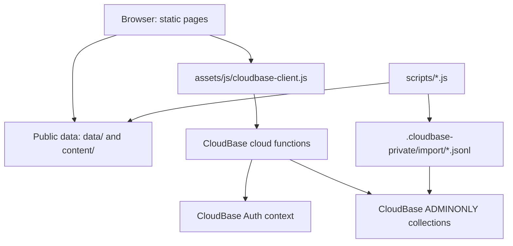

# 02 Architecture

> This document explains how Mr. Cat Academy is built and why the pieces are arranged this way.
> Update it when architecture, deployment shape, directory structure, backend boundaries, or major dependencies change.

## 1. Current Architecture Summary

Mr. Cat Academy is a static web application with a CloudBase backend.

The current design is intentionally simple:

- Static HTML pages provide the user interface.
- Vanilla JavaScript handles page behavior.
- Public JSON files provide browser-readable lesson content.
- CloudBase Authentication handles login.
- CloudBase cloud functions are the only trusted data access layer.
- CloudBase database collections are private and `ADMINONLY`.
- Correct answers, explanations, accepted variants, student data, assignments, attempts, and disputes live behind cloud functions.

This is a good fit for the current project because the owner needs a maintainable teaching system, not a large custom backend platform.

## 2. Technology Stack

| Layer | Current choice |
| --- | --- |
| Frontend | Static HTML, CSS, vanilla JavaScript |
| Hosting | GitHub Pages / static web hosting |
| Backend | Tencent CloudBase cloud functions |
| Auth | CloudBase username/password Authentication |
| Database | CloudBase database collections |
| Runtime data | `data/*.json`, `content/**/*.json`, JS fallback files |
| Cloud functions | Node.js 18 |
| Build system | No frontend build step |
| Deployment package | ZIP files under `deploy-packages/` |

## 3. High-Level System Flow

## 4. Frontend Structure

Important pages:

- `index.html`: login and public entry
- `dashboard.html`: student dashboard
- `teacher.html`: teacher interface
- `library.html`: public/learning library surface
- `bbc.html`: BBC listening runtime
- `ielts-reading.html`: IELTS Reading runtime
- `ielts-listening.html`: IELTS Listening runtime
- `vocabulary.html`: Vocabulary runtime
- `attempt-review.html`: attempt history/review helper
- `dse-topic-bank.html`: public preview shell and authenticated full-report reader

Shared frontend assets:

- `assets/css/app.css`
- `assets/css/liquid-glass-shell.css`
- `assets/css/spatial-workspace.css`
- `assets/js/config.public.js`
- `assets/js/cloudbase-client.js`
- `assets/js/auth.js`
- `assets/js/dashboard.js`
- `assets/js/liquid-glass-shell.js`
- `assets/js/teacher.js`
- `assets/js/practice-session.js`
- `assets/js/personal-vocab.js`

The shared Liquid Glass layer is presentation-only on login and public Library.
The authenticated Student Dashboard and Teacher desk additionally use the
spatial workspace layer for their current header, navigation, matrix, progress,
and page-level modal layouts. These layers remain ordinary static CSS and
vanilla JavaScript; they do not introduce a frontend framework or move trusted
state out of CloudBase functions.

Current frontend philosophy:

- Reuse shared practice pages.
- Do not create a permanent standalone HTML page for each exercise.
- Temporary classroom pages may remain standalone.
- Keep isolated design previews, such as `my-words-modal-preview.html`, clearly
  unlinked from production navigation and free of real student/backend data.
- Preserve cache query strings on changed scripts.

### Teacher Workspace Return and Local Cache

Teacher practice entry remains a normal same-origin history navigation. Before
opening a practice runtime, `teacher.js` stores a compact workspace snapshot in
the current `history.state` entry and a tab-scoped `sessionStorage` fallback.
The snapshot contains only UI state: active destination, View filters, matrix
density, grouped-progress expansion, Library filters/search, document scroll,
matrix scroll, and stable visible anchors. Practice `Back` uses the shared
validated history return, so bfcache can restore the live page. If bfcache is
unavailable, the history/session snapshot is applied after asynchronous matrix
rendering. Practice-entry confirmation and teacher detail modals are excluded.

After teacher authentication, `teacher.js` may render a private-device
IndexedDB snapshot while live CloudBase reads continue. The cache is scoped by
teacher Login ID, expires after 24 hours, and stores only student display
profiles, public set metadata, assignment summaries, and progress summaries
with nested attempts/answers removed. It never stores credentials, auth tokens,
correct answers, explanations, or grading keys, and explicit logout deletes the
account cache. Live CloudBase results replace the snapshot, remain authoritative,
and are refreshed periodically while View is visible. Re-rendering preserves
the current matrix column anchor, grouped-progress anchor, and scroll offsets.

## 5. Backend Structure

Cloud function source lives in `cloudfunctions/<function>/`.

Active or relevant functions:

- `getCurrentStudent`: authenticated profile lookup
- `getResources`: visible set catalog for authenticated surfaces
- `getDashboard`: student assignments, history, latest attempt lookup, all
  resolved teacher replies plus their read state, reveal, STAR fallback, and
  newest-first unified Yellow/Blue STAR provenance views for Personal Center,
  plus the current student's wallet, Cash requests, cancellation, evidence
  upload registration, and redemption read-state actions. Its
  independent student collections are read concurrently, and visible `sets`
  metadata is fetched in bounded `set_id` batches rather than one query per
  historical task so large student histories remain inside the function limit.
- `submitAttempt`: trusted grading and attempt storage
- `teacherAdmin`: teacher-only student account deletion/admin, assignment,
  progress, disputes, answer-key access, shared dictionary review, and
  read-only student vocabulary inspection. It also lists and processes Cash
  requests, issues teacher evidence-upload metadata, and returns authorized
  temporary evidence URLs
- `studentVocabulary`: personal My Words editing/merge/export data, dictionary
  enrichment, bounded AI fallback, and dictionary issue reporting
- `changePassword`: authenticated student password change
- `getProtectedResource`: authenticated, chunked delivery of private reference
  artifacts, with per-resource role policies after active-profile validation
- `resetStudentPassword`: currently disabled; reset is handled by `teacherAdmin`

Generated deployment ZIPs live in `deploy-packages/`. They are ignored by Git
but still required for CloudBase upload. `package:functions` uses locked
dependencies and esbuild to include only reachable runtime code, so deployed
functions do not depend on CloudBase resolving npm ranges during an update.

Protected report payloads use a separate private build boundary. The reviewed
full HTML stays outside the public repository. `scripts/prepare-protected-resource.js`
gzip-compresses it into the ignored
`cloudfunctions/getProtectedResource/protected-payloads.private.js`; the normal
function packager bundles that private module into the ignored deployment ZIP.
GitHub Pages contains only the preview shell. After CloudBase authorization,
the browser fetches bounded chunks, decompresses them locally, verifies the
SHA-256 manifest, and renders the report in a sandboxed `srcdoc` iframe.
The private module may contain multiple named resources. Each resource can
declare `allowed_roles`; the JUPAS weighting report is student-only while the
existing HKDSE topic bank retains student/teacher access.

My Words enrichment uses a dictionary-first cascade inside `studentVocabulary`:
the shared `vocabulary_lexicon` collection is checked first, then the fixed
`dictionaryapi.dev` endpoint is used only for a cache miss. Saving the personal
word completes before the browser starts enrichment. Curated/ECDICT hits are
shared across students; external results are normalized and cached once. API
access never comes directly from the browser.

After a confirmed external miss, an optional provider-neutral OpenAI-compatible
request may generate a student preview from the word and one saved context. The
student must confirm it before it becomes the single shared AI draft. Teacher
publication replaces that current shared record, first writing the previous
record to `vocabulary_lexicon_history`. Reports are stored separately in
`vocabulary_dictionary_reports`. Personal Notes never enter the AI request or
the shared lexicon.

Word List export is browser-side. `assets/js/my-words-export.js` builds a real
OpenXML `.xlsx` without a third-party runtime dependency and creates a
print-ready HTML table for browser Save as PDF. Neither format contains private
data beyond the rows and columns the current student explicitly selects.

## 6. Database and Storage

CloudBase collections are `ADMINONLY`. Browsers should not directly read or write them.

Main collections:

- `students`
- `sets`
- `assignments`
- `attempts`
- `grading_keys`
- `system_config`
- `student_set_achievements`
- `star_reward_ledger`
- `star_redemption_requests`
- `star_redemption_evidence`
- `answer_disputes`
- `grading_key_history`
- `student_vocabulary_items`
- `vocabulary_lexicon`
- `vocabulary_lexicon_history`
- `vocabulary_dictionary_reports`
- `vocabulary_test_sessions`

See [04_DATA_MODEL.md](04_DATA_MODEL.md) for fields and relationships.

`student_set_achievements` remains the source of STAR provenance. Yellow STARs
are protected and redeemable; active or converted Blue STARs are stable but
non-redeemable. New Yellow STARs are unique by student and set, while historical
assignment-keyed duplicates remain valid. Personal Center reads a redacted
unified view through `getDashboard` rather than querying the collection directly.

Reward spending is a separate boundary. `star_reward_ledger` is append-only and
references exact Yellow `achievement_id` values for credit, reserve, release,
redeem, and refund events. `star_redemption_requests` is the workflow aggregate;
`star_redemption_evidence` stores private file metadata separately so images do
not inflate request documents. Achievement rows are never marked spent.

Evidence upload uses a two-phase storage flow. An authenticated student or
teacher asks the appropriate cloud function for single-use upload metadata for
a request-scoped path. The browser uploads the original and compressed display
image directly to CloudBase Storage, then the function verifies file IDs, path,
type, size, ownership, request state, and the three-image limit before appending
evidence metadata. Read actions return short-lived URLs only after student-owner
or active-teacher authorization. Storage remains private.

The student Dashboard renders teacher replies as a dedicated inbox opened from
the speech-bubble control in the To Do List modal header. `getDashboard`
returns resolved `answer_disputes` regardless of
`student_seen`; the browser derives the unread badge from that read state and
`markTeacherRepliesSeen` updates the state without deleting reply history.

## 7. Auth and Permissions

Authentication has two linked records:

1. CloudBase Authentication end user
2. `students` collection profile

The link is `students.auth_uid`.

Rules:

- Student ownership checks use authenticated `auth_uid`.
- `student_id` is a human-facing Login ID, not an authorization key.
- A completed teacher deletion archives the old profile's `student_id`, keeps
  the original value in `deleted_student_id_snapshot`, and releases that Login
  ID for a new auth user/profile. The new `auth_uid` does not inherit records
  owned by the deleted UID.
- Teacher authority comes from a `students` document with `role: "teacher"` and `active: true`.
- Frontend role flags are never trusted.
- Visitors are frontend-only browsing state and cannot write CloudBase data.
- During an active countable Vocabulary Test, student cloud-function surfaces
  reject requests from other browser page instances for the same student.

## 8. Main Data Flows

### Student Login

1. Student signs in with CloudBase username/password.
2. Browser calls `getCurrentStudent`.
3. Function resolves authenticated UID to `students.auth_uid`.
4. Safe profile is returned to the browser.

### Assignment Submit

1. Practice page submits answers to `submitAttempt`.
2. Function verifies student and set visibility.
3. If an `assignment_id` is present, the function verifies ownership.
4. If no `assignment_id` is present, the function auto-binds the student's open assignment for the same `set_id`, when one exists.
5. Function loads private `grading_keys`.
6. Function grades on the server.
7. Function writes an immutable `attempts` record.
8. Function recomputes assignment latest/best/status summary from assignment-bound attempts.
9. Function creates or repairs STAR if mastered.

### Vocabulary Test Integrity Session

1. `vocabulary.html` creates a `vocabulary_test_sessions` record before a
   countable 5+ group Vocabulary Test starts.
2. The browser sends the public unit `contentVersion`; the function verifies it
   against private `grading_keys.grading_version` before creating the session.
3. The session stores selected group IDs, graded question IDs, the grading
   version, private answer/explanation snapshots, server start and expiry times
   based on 90 seconds per selected group, an in-memory page-instance ID
   generated on each page load, and heartbeat state.
4. The page heartbeats every 10 seconds while visible and active. A transient
   network failure enters a 60-second recovery window with bounded retries;
   the current answers remain in place and the page shows a reconnecting
   status. Explicit session/auth/content errors remain terminal.
5. `submitAttempt` validates `test_session_id` and grades from the session's
   locked snapshots, treating missing answers as blanks. A grading-key update
   during the test therefore cannot change that test's result.
6. Switching apps/tabs, leaving the page, 60 seconds without a successful
   heartbeat, or time expiry
   closes the session as `abandoned` without creating an attempt or changing
   assignment status.

Teacher progress and student dashboard reads use paginated CloudBase reads for
owned or relevant records instead of assuming the first page contains every
assignment, attempt, set, student, dispute, or STAR. Teacher progress also uses
linked attempts as a display fallback when an assignment summary is stale.

### Teacher Assignment

1. Teacher page calls `teacherAdmin`.
2. Function verifies active teacher profile.
3. Function checks set and student eligibility.
4. Open duplicate assignments are skipped.
5. Completed/passed/mastered history can be reassigned with a new `assignment_id`.
   Assignments created for the same set in one teacher Assign action also share
   an `assignment_batch_id` for teacher matrix grouping.
6. Every new assignment requires a due week. The browser sends `due_at`, and
   `teacherAdmin` normalizes it to that Shanghai-time week's Sunday 23:59:59.
   Existing assignments can be edited by explicit `assignment_id` selections
   for due week, passing percentage, and mastery percentage. Due-week edits
   immediately drive Teacher View Wxx grouping/date filters and the student
   Overdue / This Week / Upcoming model. `assigned_at` remains only as a legacy
   compatibility mirror; `created_at` is the creation audit timestamp.
   The View matrix task header builds this explicit ID list from the currently
   filtered column, so one save can update every matching student in the
   selected class/scope without affecting hidden classes; a student-detail edit
   sends only that student's assignment ID. The UI submits Due week and Passing
   % directly on every save. Mastery % is submitted only when `mastery_enabled`
   is true, and server validation applies `passing <= mastery` only in that
   enabled state.
7. Open assignments can be soft-cancelled through `teacherAdmin`; cancellation
   sets `status: "cancelled"` with audit fields, hides the item from the
   student dashboard, and prevents old assignment links from recording new
   submissions against that assignment.

### Teacher Attempt Notifications

The teacher notification bell derives unread state from two server-owned
markers on the authenticated teacher profile. Individually opened threads add
their attempt IDs to `teacher_activity_attempt_reviewed_ids`; `Read all` writes
`teacher_activity_attempts_read_all_at`. Attempts at or before that timestamp
are read, while later submissions become unread without growing an unbounded
list of historical IDs.

### STAR Cash Redemption

1. `getDashboard` synchronizes missing Yellow STAR credit entries idempotently
   and projects available, reserved, spent, and lifetime values.
2. The student creates one Cash request by choosing `1..available`; a database
   transaction locks explicit Yellow achievement IDs and appends reserve entries.
3. Student or teacher uploads at least one request-scoped private Evidence Photo.
4. `teacherAdmin` lists every pending request for the current single-teacher V1,
   oldest first. The header badge includes both awaiting-proof and
   awaiting-teacher requests.
5. Teacher confirmation atomically settles reserved credits as redeemed.
   Cancellation, rejection, and seven-day expiry append release entries; refund
   appends a compensating entry without editing the completed redemption.
6. Student and teacher history reads project request status and authorized
   evidence without exposing cash amount, exchange rate, ownership internals, or
   permanent public file URLs.

### Argue

1. Student submits a dispute for one wrong recorded question.
2. Teacher resolves with `keep`, `add`, or `replace`.
3. `add`/`replace` updates private `grading_keys`.
4. A `grading_key_history` record is written.
5. `teacherAdmin` scans historical attempts for the same set/question and
   regrades matching submitted answers upward.
6. Assignment summaries are improved but never downgraded.
7. STAR is created or improved if a regraded attempt reaches mastery.

For older approved grading changes, `teacherAdmin.backfillAcceptedAnswerRegrades`
can be run by an authenticated teacher in bounded batches. It compares
historical wrong answers against current `grading_keys`, then applies the same
upward-only attempt, assignment, and STAR repair logic.

## 9. Content Pipeline

Public source layers:

- `content/`: canonical metadata and vocabulary source content
- `data/`: browser-readable runtime lesson data and generated home catalog
- `bbc-audio/`, `assets/audio/`: audio assets

Private generated layer:

- `.cloudbase-private/import/sets-cloudbase.json`
- `.cloudbase-private/import/grading-keys-cloudbase.json`
- `.cloudbase-private/import/system-config-cloudbase.json`

Important scripts:

- `scripts/build-home-catalog.js`
- `scripts/prepare-cloudbase-data.js`
- `scripts/import-bbc-lessons.js`
- `scripts/import-vocabulary-unit.js`
- `scripts/import-ngsl-bc.js`

See [09_CONTENT_WORKFLOW.md](09_CONTENT_WORKFLOW.md).

## 10. Deployment

Static site deployment and CloudBase deployment are separate.

Static site:

- Publish committed HTML/CSS/JS/data/audio changes.
- Bump script query strings when shared JS changes.

CloudBase functions:

- Edit function source in `cloudfunctions/<name>/`.
- Rebuild `deploy-packages/<name>.zip`.
- Upload ZIP to the development CloudBase environment.

CloudBase data:

- Run `node scripts/prepare-cloudbase-data.js`.
- Dry-run and apply the owner-run CLI import:
  `npm run cloudbase:import:content` and
  `npm run cloudbase:import:content -- --apply`.
- The CLI import inserts missing `sets` and `grading_keys` records by default.
  JSON Lines console import remains a fallback.

See [10_DEPLOYMENT.md](10_DEPLOYMENT.md).

## 11. Security Notes

Never commit:

- Tencent Cloud `SecretId` or `SecretKey`
- admin credentials
- access tokens
- private keys
- student passwords
- initial/reset password
- private grading answers

Keep collections `ADMINONLY`.

## 12. Current Architecture Limits

- Backend domain logic is still partly duplicated across cloud functions.
- There is no automated backend test suite yet.
- Some public legacy data still contains answers from before the private grading migration.
- CloudBase function deployment is manual.
- Grading-key reconciliation after teacher Argue corrections is not fully automated.
- Multi-teacher/student ownership and per-teacher STAR redemption authority are
  deferred; the first Cash release assumes the current single active teacher.

## 13. Recommended Next Architecture Work

High-value next steps:

- Extract shared backend logic under `cloudfunctions/_shared/`.
- Add pure rule tests for assignment status, STAR, Argue, and Vocabulary boundaries.
- Add grading key reconcile workflow before large imports.
- Keep `AGENTS.md` short and move product/architecture detail into `docs/`.
